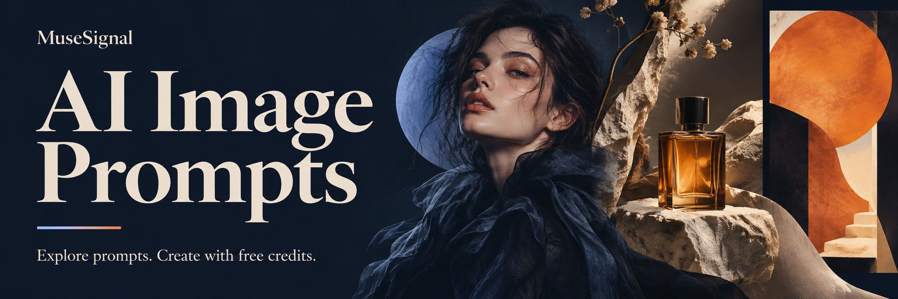

[](https://musesignal.com/?utm_source=github&utm_medium=repository&utm_campaign=awesome-ai-image-prompts&utm_content=banner)

# Awesome AI Image Prompts

**by [MuseSignal](https://musesignal.com/?utm_source=github&utm_medium=repository&utm_campaign=awesome-ai-image-prompts&utm_content=brand)**

[English](README.md) · [简体中文](README.zh-CN.md)

Complete prompts, real example images, original creators and sources. Curated by MuseSignal for product photography, portraits, posters and more.

**Adobe Firefly · GPT Image · GPT Image 2 · Grok · Ideogram · Leonardo · Midjourney · Nano Banana · Nano Banana 2 · Nano Banana Pro**

> **Try leading AI image models — no top-up required to get started.**
>
> Sign up and claim free credits on MuseSignal. Generation uses credits; usage varies by model and settings.

**[Start creating with free credits](<https://musesignal.com/?utm_source=github&utm_medium=repository&utm_campaign=awesome-ai-image-prompts&utm_content=hero>) · [Explore selected prompts ↓](<#selected-prompts>)**

| Public prompts in this repository | Complete examples on this page | Dataset updated |
| ---: | ---: | --- |
| **601** | **100** | 2026-09-23 |

This repository shares a selection from MuseSignal. The counts distinguish JSON records from examples on this page, not the full website library. Model collections are subsets of the catalog.

## Browse by use case

Open a filtered MuseSignal gallery. Counts refer to this repository's JSON; model collections offer separate version filters.

| Browse by use case | In JSON | MuseSignal |
| --- | ---: | --- |
| [Portrait](<https://musesignal.com/?category=portrait&utm_source=github&utm_medium=repository&utm_campaign=awesome-ai-image-prompts&utm_content=category_portrait>) | 186 | [Browse on MuseSignal](<https://musesignal.com/?category=portrait&utm_source=github&utm_medium=repository&utm_campaign=awesome-ai-image-prompts&utm_content=category_portrait>) |
| [Commercial &amp; Product](<https://musesignal.com/?category=commercial-product&utm_source=github&utm_medium=repository&utm_campaign=awesome-ai-image-prompts&utm_content=category_commercial-product>) | 115 | [Browse on MuseSignal](<https://musesignal.com/?category=commercial-product&utm_source=github&utm_medium=repository&utm_campaign=awesome-ai-image-prompts&utm_content=category_commercial-product>) |
| [Poster &amp; Graphic](<https://musesignal.com/?category=poster-graphic&utm_source=github&utm_medium=repository&utm_campaign=awesome-ai-image-prompts&utm_content=category_poster-graphic>) | 115 | [Browse on MuseSignal](<https://musesignal.com/?category=poster-graphic&utm_source=github&utm_medium=repository&utm_campaign=awesome-ai-image-prompts&utm_content=category_poster-graphic>) |
| [Food &amp; Drink](<https://musesignal.com/?category=food-drink&utm_source=github&utm_medium=repository&utm_campaign=awesome-ai-image-prompts&utm_content=category_food-drink>) | 22 | [Browse on MuseSignal](<https://musesignal.com/?category=food-drink&utm_source=github&utm_medium=repository&utm_campaign=awesome-ai-image-prompts&utm_content=category_food-drink>) |
| [Character &amp; Art](<https://musesignal.com/?category=character-art&utm_source=github&utm_medium=repository&utm_campaign=awesome-ai-image-prompts&utm_content=category_character-art>) | 119 | [Browse on MuseSignal](<https://musesignal.com/?category=character-art&utm_source=github&utm_medium=repository&utm_campaign=awesome-ai-image-prompts&utm_content=category_character-art>) |
| [Scene &amp; Space](<https://musesignal.com/?category=scene-space&utm_source=github&utm_medium=repository&utm_campaign=awesome-ai-image-prompts&utm_content=category_scene-space>) | 44 | [Browse on MuseSignal](<https://musesignal.com/?category=scene-space&utm_source=github&utm_medium=repository&utm_campaign=awesome-ai-image-prompts&utm_content=category_scene-space>) |

<a id="selected-prompts"></a>

## Selected prompts: examples & complete text

[Portrait](<#selected-portrait>) · [Commercial &amp; Product](<#selected-commercial-product>) · [Poster &amp; Graphic](<#selected-poster-graphic>) · [Food &amp; Drink](<#selected-food-drink>) · [Character &amp; Art](<#selected-character-art>) · [Scene &amp; Space](<#selected-scene-space>)

Expand Full prompt to copy the original text. Try on MuseSignal opens the case; use its prompt action to open the creation workspace. Images are the original creators’ examples, and model versions retain their source attribution.

<a id="selected-portrait"></a>

### Portrait · 17

[Browse on MuseSignal](<https://musesignal.com/?category=portrait&utm_source=github&utm_medium=repository&utm_campaign=awesome-ai-image-prompts&utm_content=category_portrait>)

<a id="prompt-50114a08-4de1-4e5c-8df1-fa5ed862fa2e"></a>

#### Minimalist Fashion Portrait with Cool Gaze

<a href="https://musesignal.com/prompt/50114a08-4de1-4e5c-8df1-fa5ed862fa2e?utm_source=github&amp;utm_medium=repository&amp;utm_campaign=awesome-ai-image-prompts&amp;utm_content=case_image"></a>

**GPT Image 2** · Creator: serein

Use case: Portrait

<details>
<summary>Full prompt</summary>

```text
使用上传人物照片作为人像参考，保留人物的五官比例、脸型轮廓、眼神气质、发型特征与整体辨识度，不要生成陌生人脸，不要过度美颜，不要塑料皮肤。

生成一张高端极简时尚杂志封面海报，画面为竖版 3:4 或 9:16 构图。主体是一位成年东方女性，长黑发，自然微乱发丝，清冷温柔的眼神，淡妆，气质高级安静。

人物坐在深黑色极简长凳上，身体微微侧坐，双腿自然交叠并向前延伸，一只手轻轻扶在脸侧或头发旁，另一只手自然撑在座椅或放在腿上。姿态优雅松弛，有高级时装大片的从容感。

服装为黑色高级定制感西装外套裙，剪裁利落，肩线挺括，深色内搭，搭配黑色丝袜与黑色尖头高跟鞋。整体造型冷淡、克制、精致，不要夸张性感，不要低俗。

背景为浅灰白色极简摄影棚，干净留白，柔和棚拍灯光，轻微胶片颗粒质感，暗部细节丰富，整体色调为黑、灰、米白，画面高级、安静、有杂志封面感。

加入英文高级排版，不要中文。左侧使用大号竖排衬线字体标题：
SERENE
ELEGANCE

右上角小字：
2026
NEW COLLECTION

左下角小字：
BEAUTY
IS POWER
ELEGANCE
IS ATTITUDE

右下角小字：
SPRING / SUMMER
2026 COLLECTION

英文排版要简洁、高级、留白充足，不遮挡人物脸部和身体主体。整体风格参考高端时尚杂志封面、极简摄影棚人像、黑色西装女性大片、冷淡优雅广告海报。高清细节，真实皮肤质感，真实人体比例，优雅自然的手部和腿部结构。
```

</details>

**[Try on MuseSignal →](<https://musesignal.com/prompt/50114a08-4de1-4e5c-8df1-fa5ed862fa2e?utm_source=github&utm_medium=repository&utm_campaign=awesome-ai-image-prompts&utm_content=readme_case_cta>)** · [Original post](<https://x.com/you1873118/status/2067166621253476463>)

---

<a id="prompt-3336e049-b5ee-454c-9e52-15918181db5b"></a>

#### Sadie Sink with Disco Ball in Pink

<a href="https://musesignal.com/prompt/3336e049-b5ee-454c-9e52-15918181db5b?utm_source=github&amp;utm_medium=repository&amp;utm_campaign=awesome-ai-image-prompts&amp;utm_content=case_image"></a>

**Nano Banana Pro** · Creator: manolya

Use case: Portrait

<details>
<summary>Full prompt</summary>

```text
Disco Ball and Sadie Sink
Pink Aesthetic Nano Banana Pro:
{
"style_summary": "Retro-modern disco-pop aesthetic with high-saturation monochromatic tones.",
"pose": {
"orientation": "Over-the-shoulder look",
"description": "The subject is positioned with her back to the camera, twisting her torso to look back. She is holding a large silver disco ball at chest height, creating a focal point in the upper half of the frame.",
"stance": "High-cut silhouette emphasizing the hips and back."
},
"colors": {
"primary_palette": ["Bubblegum Pink", "Fuchsia", "Hot Pink"],
"accent_colors": ["Metallic Silver", "White"],
"skin_tones": "Warm, natural tan with highlights",
"vibe": "Monochromatic and high-energy."
},
"composition": {
"framing": "Vertical, medium-full shot",
"subject_placement": "Centered silhouette",
"background": "Minimalist, solid-colored flat wall",
"depth": "Shallow, with a sharp drop-off shadow on the background to create a 3D pop effect."
},
"outfits_and_props": {
"clothing": "High-leg pink spandex bodysuit with white piping/trim",
"accessories": "Rose-tinted transparent aviator-style sunglasses",
"key_prop": "A large, multi-faceted metallic silver disco ball",
"hair": "High ponytail, sleek and brunette."
},
"lighting": {
"type": "Hard studio lighting",
"direction": "Side-lit from the left",
"shadows": "Sharp, defined shadows on the wall and body contours",
"highlights": "Specular highlights on the bodysuit and disco ball facets",
"special_lighting": "Caustic light reflections (small squares of light) projected onto the subject's skin from the disco ball."
},
"effects_and_texture": {
"finish": "Glossy and high-contrast",
"texture": "Reflective surfaces (disco ball), matte background, and smooth spandex sheen",
"saturation": "High",
"grain": "Clean, digital finish with minimal noise."
```

</details>

**[Try on MuseSignal →](<https://musesignal.com/prompt/3336e049-b5ee-454c-9e52-15918181db5b?utm_source=github&utm_medium=repository&utm_campaign=awesome-ai-image-prompts&utm_content=readme_case_cta>)** · [Original post](<https://x.com/manolyaai/status/2020561374217126145>)

---

<a id="prompt-19ec0972-2a78-4dc6-84e1-dcfadf2cb6a0"></a>

#### Platinum blonde woman with bright blue eyes

<a href="https://musesignal.com/prompt/19ec0972-2a78-4dc6-84e1-dcfadf2cb6a0?utm_source=github&amp;utm_medium=repository&amp;utm_campaign=awesome-ai-image-prompts&amp;utm_content=case_image"></a>

**Grok** · Creator: Mila Rae

Use case: Portrait

<details>
<summary>Full prompt</summary>

```text
Cute & fast 😈🚗
Grok Imagine
{
"subject": {
"type": "adult woman",
"age": "mid-20s",
"identity_outline": "athletic gym-trained body (toned shoulders/arms, slim waist), fair skin with light warm tan, soft feminine face with defined jawline + high cheekbones, long platinum-blonde hair",
"face": {
"angle": "front-facing selfie, slight head tilt, chin subtly forward",
"eyes": "bright blue eyes with sharp catchlights, direct gaze",
"brows": "full brows with clean arch",
"nose": "straight refined bridge with strong center highlight",
"lips": "full glossy nude-pink lips, slightly parted",
"skin": "visible pores + faint freckles across nose/upper cheeks, warm blush, soft glam lashes/contour"
},
"hair": {
"color": "platinum-blonde with warm sun tones",
"style": "long smooth blowout with slight wave, side part; hair draped over right shoulder and across chest",
"length_rule": "keep hair long"
},
"body": {
"build": "athletic but curvy",
"bust": "very large, heavy bust with deep cleavage; realistic weight and gravity (not cartoon), rounded natural shape",
"fit_behavior": "bikini cups visibly under-sized for the bust; strong lift + compression; straps show noticeable tension; slight skin compression at cup edges while staying tasteful",
"skin_finish": "sunlit sheen on chest/shoulders with soft shadow falloff"
}
},
"wardrobe": {
"bikini_set": {
"top": "dusty blue/grey triangle bikini top with white lace trim framing each cup; thin halter straps; ruched fabric; tight supportive look due to very large bust",
"bottom": "matching dusty blue/grey bikini bottom with white lace trim panel; thin side straps"
},
"jewelry": [
"thin chain necklace with small seahorse-style pendant",
"small dangling earring"
],
"piercing": "small belly-button stud"
},
"pose_action": {
"shot_type": "car-seat selfie",
"pose": "reclining diagonally across the passenger seat, torso angled toward camera",
"arms": {
"right_arm": "raised overhead with hand in hair",
"left_arm": "resting down along the seat/hip line"
},
"framing": "crop from head to upper-hips; subject centered; chest and bikini straps clearly visible; natural perspective"
},
"scene": {
"location": "car interior",
"background": [
"red leather seats with stitched panels",
"headrest with faint embroidered script (not readable)",
"dark cabin roof and window frame",
"daylight + greenery through side window"
]
},
"lighting": {
"type": "strong daylight from left window",
"look": "warm highlights on face and chest, gentle shadows on far side, no flash, no heavy grading"
},
"camera": {
"device_vibe": "iPhone 17 Pro",
"lens_feel": "1x main camera feel, controlled distortion",
"handheld": "stable selfie with slight micro-tilt",
"focus": "eyes + freckles tack sharp; bikini fabric and lace trim sharp; background slightly softer",
"exposure": {
"metering": "face/skin priority",
"ev_comp": -0.2,
"white_balance": "daylight neutral-warm"
```

</details>

**[Try on MuseSignal →](<https://musesignal.com/prompt/19ec0972-2a78-4dc6-84e1-dcfadf2cb6a0?utm_source=github&utm_medium=repository&utm_campaign=awesome-ai-image-prompts&utm_content=readme_case_cta>)** · [Original post](<https://x.com/milaraeai/status/2015833579813589052>)

---

<a id="prompt-62bd44c9-5d50-4c07-804f-33e8f1a2af60"></a>

#### 3D Realistic Portraits of China&#39;s Founding Pillars

<a href="https://musesignal.com/prompt/62bd44c9-5d50-4c07-804f-33e8f1a2af60?utm_source=github&amp;utm_medium=repository&amp;utm_campaign=awesome-ai-image-prompts&amp;utm_content=case_image"></a>

**GPT Image 2** · Creator: Larus Canus

Use case: Portrait

<details>
<summary>Full prompt</summary>

```text
请创作一张竖版 3:4「现代人物3D立像档案海报」。

主题人物：【人物姓名】
人物身份：【科学家 / 企业家 / 艺术家 / 作家 / 教育家 / 医学家等】
核心成就：【一句话概括他/她改变了什么】
代表道具：【最能代表这个人物的物品】
主色调：【根据人物领域选择，例如金黄稻田 / 科技蓝 / 戈壁灰 / 医学青绿等】

画面中央是一位高度写实的现实主义人物主视觉，人物要像真实站在镜头前，具有纪实摄影质感、电影级光影、真实皮肤纹理、真实服装材质和清晰面部细节。

人物一只手将【代表道具】朝镜头前伸，形成强烈近大远小、破框而出的 3D 视觉冲击。道具必须完整可见、清晰真实、有材质细节，不能被裁切，不能变形，不能糊掉。

四周加入 6-8 个轻质悬浮的信息切片，每个切片包含关键年份、事件标题、小图像和简短说明，用来呈现人物的重要经历、代表成就和时代影响。信息切片要半透明、轻盈、有细线连接，不要厚重卡片感，不要喧宾夺主。

左侧设置人物大标题【人物姓名】，搭配身份说明和一句简短精神概括。底部设置一条轻量时间轴，串联人物一生的重要节点，使用细线、小圆点和简洁年份，不要做成厚重底栏。

整体风格：现实主义人物摄影 + 电影海报 + 人物传记档案 + 现代信息设计。
重点：人物要真实，道具要冲出来，信息要轻，时间线要清楚。
```

</details>

**[Try on MuseSignal →](<https://musesignal.com/prompt/62bd44c9-5d50-4c07-804f-33e8f1a2af60?utm_source=github&utm_medium=repository&utm_campaign=awesome-ai-image-prompts&utm_content=readme_case_cta>)** · [Original post](<https://x.com/MrLarus/status/2069070973018550356>)

---

<a id="prompt-e9496853-ff93-4817-a020-032fe8285cb3"></a>

#### Sweet Costume, Powerful Aura

<a href="https://musesignal.com/prompt/e9496853-ff93-4817-a020-032fe8285cb3?utm_source=github&amp;utm_medium=repository&amp;utm_campaign=awesome-ai-image-prompts&amp;utm_content=case_image"></a>

**Nano Banana Pro** · Creator: manolya

Use case: Portrait

<details>
<summary>Full prompt</summary>

```text
{
"visual_style": {
"pose": {
"action": "Relaxed reclining on a textured surface",
"leg_position": "One leg gently raised and extended, the other comfortably bent",
"interaction": "Hands resting naturally on clothing or adjusting fabric casually",
"expression": "Soft, calm expression looking downward or sideways"
},
"colors": {
"palette": "Monochromatic Pink and White",
"primary": "#E18982 (Dusty Rose background)",
"secondary": "#F4A7B9 (Pastel Pink faux fur)",
"accents": [
"#FFFFFF (White clothing and accessories)",
"#F2DADA (Neutral skin tone balance)"
]
},
"composition": {
"framing": "Wide shot with significant negative space at the top",
"subject_placement": "Centered horizontally, weighted in the lower half of the frame",
"depth": "Layered textures with foreground and midground dominated by soft fur texture",
"angle": "Eye-level to slightly high-angle"
},
"outfits": {
"clothing": "White fashion bodysuit or fitted studio outfit (non-lingerie)",
"legwear": "Opaque or semi-opaque white tights or stockings",
"accessories": "Plush white bunny ear headband (playful fashion styling)",
"makeup": "Soft monochromatic pink tones on eyes and cheeks"
},
"lighting": {
"type": "High-key studio lighting",
"quality": "Soft and diffused with minimal harsh shadows",
"effect": "Even illumination emphasizing texture and color harmony"
},
"mood_and_style": {
"theme": "Playful Editorial, Whimsical Fashion",
"vibe": "Dreamy, lighthearted, soft, magazine-style",
"textures": "Contrast between smooth fabric and soft faux fur"
},
"environment": {
"setting": "Minimalist studio",
"props": "Large oversized pink faux-fur sofa or seating surface",
"background": "Solid seamless paper backdrop"
```

</details>

**[Try on MuseSignal →](<https://musesignal.com/prompt/e9496853-ff93-4817-a020-032fe8285cb3?utm_source=github&utm_medium=repository&utm_campaign=awesome-ai-image-prompts&utm_content=readme_case_cta>)** · [Original post](<https://x.com/manolyaai/status/2021333957594243367>)

---

<a id="prompt-f37dc22f-6da4-467c-90ff-33ecef1b5cd5"></a>

#### Balance and Beauty in Practice

<a href="https://musesignal.com/prompt/f37dc22f-6da4-467c-90ff-33ecef1b5cd5?utm_source=github&amp;utm_medium=repository&amp;utm_campaign=awesome-ai-image-prompts&amp;utm_content=case_image"></a>

**Not specified** · Creator: Bethany

Use case: Portrait

<details>
<summary>Full prompt</summary>

```text
Photorealistic full-body portrait of [CHARACTER NAME], a slim athletic female ballet dancer with [HAIR COLOR], [EYE COLOR], [SKIN TONE], and [FACIAL FEATURES]. Hair styled in a neat center-parted ballet bun, natural makeup, calm and focused expression.

Classical arabesque pose, three-quarter profile, straight supporting leg, back leg extended at hip height, elongated torso, one arm raised gracefully overhead and the other extended to the side. Elegant posture, refined ballet technique, soft classical hand positions.

Wearing a [OUTFIT COLOR] ballet leotard with thin straps and matching ballet tights. Professional ballet studio setting with a wooden barre, off-white walls, light flooring, and a clean uncluttered background.

Soft diffused studio lighting, neutral color tones, high detail, photorealistic dance photography, 85mm lens, full-body vertical composition, sharp focus, natural proportions, minimal retouching.

Negative prompt: extra limbs, extra fingers, deformed hands, bad anatomy, incorrect ballet alignment, poor posture, stage costume, busy background, crowd, motion blur, fisheye distortion, oversaturated colors, cartoon, anime, low resolution, low detail.
```

</details>

**[Try on MuseSignal →](<https://musesignal.com/prompt/f37dc22f-6da4-467c-90ff-33ecef1b5cd5?utm_source=github&utm_medium=repository&utm_campaign=awesome-ai-image-prompts&utm_content=readme_case_cta>)** · [Original post](<https://x.com/JustBethanyai/status/2067227759374401545>)

---

<a id="prompt-a5af9c91-fa00-4445-a905-1fa900e0d876"></a>

#### Low Angle Portrait of a Woman in Silk

<a href="https://musesignal.com/prompt/a5af9c91-fa00-4445-a905-1fa900e0d876?utm_source=github&amp;utm_medium=repository&amp;utm_campaign=awesome-ai-image-prompts&amp;utm_content=case_image"></a>

**GPT Image 2** · Creator: こやす69＠AIプロンプト屋

Use case: Portrait

<details>
<summary>Full prompt</summary>

```text
A highly realistic photo of an adult East Asian woman in her early 20s, photographed from a dramatic low angle looking upward. She has a natural, elegant face, soft clear skin, light natural makeup, slightly tousled long dark brown hair, and a calm, subtly alluring expression while looking down toward the camera.
She is wearing a loose white silk shirt instead of a knit top. The shirt is lightweight, glossy, soft, and fluid, with a luxurious silk texture. She gently lifts and opens the hem of the white silk shirt with both hands, creating a flowing curve of fabric across the frame. The shirt catches the sunlight beautifully, showing delicate highlights, soft folds, and a refined semi-sheer quality. Her lower body is styled with relaxed white drawstring lounge pants.
Composition: extreme low-angle shot from around waist level, camera pointing upward toward her face and torso. The midriff is visible, with the fabric stretched lightly between her hands. Her face appears near the top of the frame, while the torso and silk shirt dominate the foreground. Vertical composition, intimate fashion editorial framing.
Lighting: strong natural sunlight streaming in from a window above and behind her, creating radiant sunbeams and scattered dappled light patterns across her skin, shirt, and the scene. Bright backlighting, glowing rim light on the hair, warm highlights, soft shadows, airy and luminous mood.
Background: minimal bright interior near a window, clean modern room, soft pale walls, morning or afternoon sunlight flooding the space. The environment should feel quiet, warm, and serene.
Style: ultra-realistic fashion photograph, cinematic sunlight, natural skin texture, premium editorial aesthetic, soft and airy mood, high detail, realistic color grading, elegant and sensual without explicit nudity, 4K quality.
Important details: white silk shirt, not knit, loose and glossy fabric, sunlight passing through and reflecting on the material, visible soft folds, low-angle perspective, luminous atmosphere, adult subject only.
```

</details>

**[Try on MuseSignal →](<https://musesignal.com/prompt/a5af9c91-fa00-4445-a905-1fa900e0d876?utm_source=github&utm_medium=repository&utm_campaign=awesome-ai-image-prompts&utm_content=readme_case_cta>)** · [Original post](<https://x.com/AI_money_club/status/2067731526448738460>)

---

<a id="prompt-cf27f8fd-9c22-4325-9185-6283d1bc76ea"></a>

#### Seated Portrait with Foreground Emphasis

<a href="https://musesignal.com/prompt/cf27f8fd-9c22-4325-9185-6283d1bc76ea?utm_source=github&amp;utm_medium=repository&amp;utm_campaign=awesome-ai-image-prompts&amp;utm_content=case_image"></a>

**Nano Banana 2** · Creator: sammy

Use case: Portrait

<details>
<summary>Full prompt</summary>

```text
{
"image_metadata": {
"style": "hyper-realistic smartphone photography",
"aspect_ratio": "4:5 vertical",
"resolution": "high resolution with subtle smartphone compression",
"camera": {
"device": "modern smartphone",
"lens": "wide-angle (~24mm equivalent)",
"angle": "slightly low, close perspective",
"framing": "full body seated portrait with strong foreground emphasis on legs and feet",
"focus": "sharp on face and foreground feet, mild background softness"
}
},
"subject": {
"use_reference_image": true,
"override": false,
"pose": {
"position": "seated deep into a cushioned armchair",
"torso": "slightly reclined into the backrest",
"legs": "both legs lifted and bent upward toward camera, creating strong foreshortening",
"arms": "wrapped casually around shins, holding legs in place",
"hips_and_glutes": {
"visibility": "partially visible",
"description": "subtle outline visible due to seated compression against chair cushion; fabric slightly stretched and creased around hip area",
"interaction_with_chair": "pressed into seat, creating natural flattening and fabric tension"
},
"feet": {
"position": "dominant foreground element, closest to lens",
"orientation": "soles facing camera at slight angles",
"detail": "natural skin texture, visible creases, relaxed toes"
}
},
"face": {
"expression": "neutral, slightly serious/pensive",
"gaze": "direct eye contact with camera"
}
},
"clothing": {
"type": "casual loungewear set",
"top": {
"item": "sweatshirt",
"color": "light grey",
"fit": "loose, slightly oversized",
"fabric_behavior": "soft folds around torso and arms"
},
"bottom": {
"item": "jogger sweatpants",
"color": "light grey",
"fit": "relaxed but slightly fitted around hips and thighs",
"details": "elastic ankle cuffs, visible creases from bent legs and seated compression"
}
},
"environment": {
"setting": "indoor, calm living space",
"chair": {
"type": "armchair",
"material": "brown leather",
"texture": "soft, slightly worn with natural creases",
"design": "rounded backrest with stitched geometric/sunburst pattern"
},
"background": {
"curtains": {
"color": "beige",
"material": "heavy fabric",
"style": "full-length, softly draped"
},
"floor": {
"type": "light patterned rug",
"visibility": "partially visible at bottom edge"
}
}
},
"lighting": {
"type": "natural daylight",
"source": "window from side/front",
"quality": "soft and diffused",
"shadow_behavior": "gentle shadows, no harsh contrast",
"tone": "warm-neutral"
},
"composition": {
"perspective": "strong foreshortening due to legs extending toward camera",
"focus_hierarchy": [
"feet in foreground",
"face and expression",
"body posture including seated compression"
],
"framing": "subject centered within chair",
"mood": "intimate, relaxed, candid"
},
"color_palette": {
"dominant": ["light grey", "warm brown", "beige"],
"secondary": ["neutral tones"],
"style": "muted, soft, warm"
},
"post_processing": {
"editing": "minimal, natural",
"contrast": "low to medium",
"saturation": "slightly muted",
"skin_retention": "realistic texture preserved"
```

</details>

**[Try on MuseSignal →](<https://musesignal.com/prompt/cf27f8fd-9c22-4325-9185-6283d1bc76ea?utm_source=github&utm_medium=repository&utm_campaign=awesome-ai-image-prompts&utm_content=readme_case_cta>)** · [Original post](<https://x.com/sumiturkude007/status/2045917845842776100>)

---

<a id="prompt-29aafeef-1401-49bb-9bbe-d92ab4dca94b"></a>

#### Cozy Bedroom Fashion Portrait with Soft Film Aesthetic

<a href="https://musesignal.com/prompt/29aafeef-1401-49bb-9bbe-d92ab4dca94b?utm_source=github&amp;utm_medium=repository&amp;utm_campaign=awesome-ai-image-prompts&amp;utm_content=case_image"></a>

**Not specified** · Creator: BubbleBrain

Use case: Portrait

<details>
<summary>Full prompt</summary>

```text
Photorealistic Korean female idol-inspired lifestyle fashion portrait, soft film photography aesthetic, cozy bedroom photoshoot, vertical 2:3 composition, eye-level to slightly low-angle medium-full body shot. A beautiful young adult Korean woman in her mid-20s with a curvy figure, natural S-shaped silhouette, slim waist, fuller hips, long legs, visible collarbones, luminous fair skin, and realistic skin texture. She has a messy high bun with soft loose strands framing her face, soft peach makeup, peach blush, glossy peach lips, subtle shimmer on the eyelids, and delicate dangling earrings. She is kneeling on a soft bed, leaning slightly forward toward the camera in a graceful and natural pose, with both hands visible, expressing a sweet, relaxed, and feminine mood. She wears a peach-pink satin camisole sleepwear set with thin straps and subtle lace trim, styled in an elegant and tasteful way. The room is warm and cozy, with white or cream bedding, a fluffy blanket, pillows, and a simple vanity corner in the background. Soft film look, warm tones, gentle grain, natural highlight bloom, and a refined, intimate, stylish atmosphere.
```

</details>

**[Try on MuseSignal →](<https://musesignal.com/prompt/29aafeef-1401-49bb-9bbe-d92ab4dca94b?utm_source=github&utm_medium=repository&utm_campaign=awesome-ai-image-prompts&utm_content=readme_case_cta>)** · [Original post](<https://x.com/BubbleBrain/status/2066770883260318074>)

---

<a id="prompt-1ea1c1e0-71ab-4674-bd76-9d500544b282"></a>

#### Stadium Supporter in World Cup Crowd

<a href="https://musesignal.com/prompt/1ea1c1e0-71ab-4674-bd76-9d500544b282?utm_source=github&amp;utm_medium=repository&amp;utm_campaign=awesome-ai-image-prompts&amp;utm_content=case_image"></a>

**GPT Image 2** · Creator: Eesha

Use case: Portrait

<details>
<summary>Full prompt</summary>

```text
16:9 ultra-realistic live World Cup broadcast crowd cutaway inside a packed football stadium. Beautiful elegant female supporter wearing a [COUNTRY-COLOR] football jersey and scarf, naturally watching the match from the stands, not looking at the camera, not posing, not waving. Medium crowd shot (waist-up), surrounded by passionate fans, authentic stadium atmosphere. Realistic floodlights, telephoto sports lens, shallow depth of field, cinematic realism, natural skin texture, premium 4K TV broadcast quality.
Top-left scoreboard: [MATCH TIME] [TEAM A] [SCORE]-[SCORE] [TEAM B]
Top-right live bug: WC LIVE 1
Avoid: eye contact, posing, waving, anime, illustration, plastic skin, extreme close-up, empty background, official logos, distorted faces, fake crowd, messy graphics.
```

</details>

**[Try on MuseSignal →](<https://musesignal.com/prompt/1ea1c1e0-71ab-4674-bd76-9d500544b282?utm_source=github&utm_medium=repository&utm_campaign=awesome-ai-image-prompts&utm_content=readme_case_cta>)** · [Original post](<https://x.com/MissDelulu9/status/2064553143288172582>)

---

<a id="prompt-f5935f6b-d62f-4cb5-a133-8cc9087a1c24"></a>

#### Sabrina Carpenter in a Stunning Portrait

<a href="https://musesignal.com/prompt/f5935f6b-d62f-4cb5-a133-8cc9087a1c24?utm_source=github&amp;utm_medium=repository&amp;utm_campaign=awesome-ai-image-prompts&amp;utm_content=case_image"></a>

**Nano Banana 2** · Creator: Pinodi

Use case: Portrait

<details>
<summary>Full prompt</summary>

```text
An eye-level, medium-shot lifestyle portrait of [NAME] with an athletic hourglass physique, standing confidently and relaxed in a casual, sporty mood. She is facing the camera but slightly angled to the side, with her right hand resting on her hip and her left hand lightly holding the edge of her tied shirt. Her hair is styled in a high, wavy ponytail with loose strands framing her face, and she looks directly into the lens with a subtle, soft smile.
She wears a 2026 Portugal national football team short-sleeve jersey, with the front tied in a central knot to create a cropped look above her waist, paired with tight, maroon athletic spandex shorts and small gold hoop earrings. Her makeup is natural, featuring defined eyebrows, soft eyeshadow, and nude lipstick.
The setting is an off-white bedroom; a bed with a textured white quilt is visible to the right, next to a dark headboard with warm, built-in accent lighting glowing behind it.
The scene is captured with high-key flat beauty lighting, creating a bright, airy atmosphere with even illumination on her face and extremely soft, low-contrast shadows. Photographed with an 85mm f/1.4 lens, the image features tack-sharp focus on her eyes and a shallow depth of field that elegantly blurs the background into a soft bokeh. The photo maintains real skin texture with visible pores and no artificial smoothing, ensuring high sharpness in the fabric and hair textures, accurate white balance, and a professional high-resolution quality. Aspect Ratio 9:16.
```

</details>

**[Try on MuseSignal →](<https://musesignal.com/prompt/f5935f6b-d62f-4cb5-a133-8cc9087a1c24?utm_source=github&utm_medium=repository&utm_campaign=awesome-ai-image-prompts&utm_content=readme_case_cta>)** · [Original post](<https://x.com/PinodiArt/status/2067587675360506344>)

---

<a id="prompt-96d194b8-1ba5-45cb-baca-7aa064d6e906"></a>

#### Playful High Kick with Sparkling Eyes

<a href="https://musesignal.com/prompt/96d194b8-1ba5-45cb-baca-7aa064d6e906?utm_source=github&amp;utm_medium=repository&amp;utm_campaign=awesome-ai-image-prompts&amp;utm_content=case_image"></a>

**Not specified** · Creator: AI Muse

Use case: Portrait

<details>
<summary>Full prompt</summary>

```text
Caught between two thoughts.
9:16 format, a young East Asian woman flashes a bright playful smile showing teeth with sparkling eyes direct to viewer, head tilted in joyful expression with natural blush and cute mischievous charm. Her long glossy jet-black hair flows in twin pigtails with straight bangs, silky strands catching light in motion. She executes a high kick balanced on right leg planted on the floor, left leg raised high knee bent foot lifted, torso leaning right, right fist near chin, left arm extended for balance. She wears white short-sleeve collared blouse and blue-white gingham pleated skirt hiked by kick revealing white shorts, white socks and black buckled loafers in Japanese seifuku. Her fair smooth East Asian skin glows in daylight with sheen and highlights on legs arms and face, even fresh tone. She radiates vibrant playful energetic schoolgirl aura of innocent charm, joyful vitality, spontaneous fun and cute lively presence. In the foreground she dominates high kick with raised leg and flared skirt focal point. Light tiered steps rise in midground creating geometric layers and depth. Background shows arched wood-frame windows pouring daylight, off-white walls, subtle wall art and pale wood flooring. High-key daylight from arched windows gives soft even light, minimal shadows and bright overexposed panes for airy clean illumination. Vertical 9:16 full body composition uses strong diagonal energy from kicking leg, subject for motion and balance. Low smartphone angle full body handheld emphasizes leg length and action with realistic depth. Bright high-key natural color grading delivers soft woods whites, clean blues in skirt and lifelike skin for fresh modern look — this frame freezes mid-action playful high kick bursting with youthful energy, fun and carefree joy in positive lively narrative beat.
Negative: bad anatomy, distorted face, extra fingers, blurry, low quality, watermark, text, ui, phone bar, western, mature, child, cartoon, 3d, anime.
```

</details>

**[Try on MuseSignal →](<https://musesignal.com/prompt/96d194b8-1ba5-45cb-baca-7aa064d6e906?utm_source=github&utm_medium=repository&utm_campaign=awesome-ai-image-prompts&utm_content=readme_case_cta>)** · [Original post](<https://x.com/Kunda623270/status/2066011063636951386>)

---

<a id="prompt-494fcfc3-aa56-41e8-b043-20ccf3c077e7"></a>

#### Exaggerated Anime Character in Distant Shot

<a href="https://musesignal.com/prompt/494fcfc3-aa56-41e8-b043-20ccf3c077e7?utm_source=github&amp;utm_medium=repository&amp;utm_campaign=awesome-ai-image-prompts&amp;utm_content=case_image"></a>

**GPT Image 2** · Creator: BubbleBrain

Use case: Portrait

<details>
<summary>Full prompt</summary>

```text
Photorealistic Japanese gal fashion portrait, soft CCD flash aesthetic, strong HDF highlight bloom, vertical 9:16 composition, close-up three-quarter body portrait, eye-level intimate camera distance, cinematic Japanese photobook mood.

A beautiful young adult Chinese internet celebrity woman in her mid-20s, standing very close to the camera. The framing is tighter than a full-body shot, from upper thighs / waist-up to head, making her face large and clearly visible. She has a fuller curvy feminine figure, pronounced S-shaped body curve, defined waist, elegant waist-to-hip contour, fuller bust and hips, long slender legs, realistic anatomy, visible collarbones, natural skin texture, fair porcelain skin, luminous smooth highlights, and a confident bold presence.

She has long slightly tousled dark brown hair with soft messy volume, loose strands framing her face, glossy lips, delicate Japanese gal eye makeup, subtle blush, thin eyeliner, small hoop earrings, and a fashionable gyaru-inspired beauty look.

Expression: she is making a clearly readable angry-cute “😠” expression. Her eyebrows are slightly furrowed and pulled inward, her eyes are subtly narrowed with intense direct eye contact, her lips are softly pouting and pushed forward a little, her cheeks are faintly tightened, and her face shows an annoyed, jealous, sulky, playful girlfriend mood. The expression should feel realistic, stylish, cute, irritated, and slightly confrontational, not cartoonish, not exaggerated.

Outfit: fashionable Japanese gal / spicy streetwear outfit, fitted cropped black leather jacket, tight white ribbed crop top, low-rise fitted denim mini skirt with decorative chain belt, glossy white sheer pantyhose with pearlescent shine, slim waist chain, delicate necklace, small white handbag, and glossy white platform ankle boots. The styling should feel bold, trendy, feminine, sexy but tasteful, non-explicit, fashion-forward, and flattering to her S-shaped curve.

Pose: standing close to the camera with one hip pushed to the side to emphasize the S-curve, upper body subtly leaning toward the camera, one hand on her waist, the other hand lightly pulling the jacket collar or holding the handbag strap near her shoulder. Her posture feels confident, annoyed, stylish, and slightly confrontational, like a late-night fashion magazine snapshot with attitude.

Scene: late-night Japanese city street outside a small boutique hotel or convenience store, wet pavement reflecting neon lights, vending machine glow, distant taxi lights, soft urban background blur, subtle signage, quiet private nighttime atmosphere, cinematic street-fashion realism.

Lighting and aesthetic: very soft CCD flash lighting on the subject, dreamy highlight bloom, strong HDF-like halation, glowing overexposed highlights on skin, hair edges, pantyhose, leather jacket, and metal accessories. Warm neon reflections mixed with cool night ambience, soft haze, smooth tonal transitions, luminous fair skin, glossy texture, realistic shadows, natural lighting falloff, realistic hair strands, subtle pores and natural skin detail, clean polished photorealistic image quality. The image should feel soft, glowing, cinematic, and highly realistic, with no harsh digital sharpness.

Mood: stylish, sulky, cute-angry, confident, intimate, fashionable, glamorous, late-night Japanese street romance, soft but powerful feminine energy, cinematic realistic fashion editorial.

Negative prompt: full-body distant shot, face too small, unclear expression, neutral expression, smiling, cartoon anger, exaggerated anime face, extra fingers, distorted hands, unrealistic anatomy, bad proportions, deformed feet, awkward pose, plastic skin, waxy skin, explicit nudity, vulgar styling, blurry face, low quality, harsh digital sharpness, heavy noise, gritty texture, visible film grain.
```

</details>

**[Try on MuseSignal →](<https://musesignal.com/prompt/494fcfc3-aa56-41e8-b043-20ccf3c077e7?utm_source=github&utm_medium=repository&utm_campaign=awesome-ai-image-prompts&utm_content=readme_case_cta>)** · [Original post](<https://x.com/BubbleBrain/status/2065815868349849630>)

---

<a id="prompt-b0203a6a-e6b1-4a0e-881a-354a1cdf4ff6"></a>

#### Sabrina Carpenter in Radiant Portrait

<a href="https://musesignal.com/prompt/b0203a6a-e6b1-4a0e-881a-354a1cdf4ff6?utm_source=github&amp;utm_medium=repository&amp;utm_campaign=awesome-ai-image-prompts&amp;utm_content=case_image"></a>

**Nano Banana Pro** · Creator: Sadia

Use case: Portrait

<details>
<summary>Full prompt</summary>

```text
{
"nano_banana_pro_system_v6.0": {
"global_master_rendering_specifications": {
"resolution": "8K Ultra-HD / 7680x4320 native upscale",
"lighting_engine": "Unreal Engine 5.4 Lumen + Nanite, Path Traced global illumination",
"post_processing": "Subsurface scattering (SSS), chromatic aberration (0.02), film grain (0.1), ACES color grading",
"branding_overlay": "Digital watermark text '@emer_web3' in bottom right corner, 20% opacity"
},
"asset_profile_01_sabrina_yellow": {
"subject": "Sabrina Carpenter",
"physique_metadata": {
"hair": "Voluminous long blonde wavy hair, warm honey highlights, soft curtain bangs",
"complexion": "Radiant, sun-kissed skin texture with natural specular highlights"
},
"wardrobe_specifications": {
"material": "High-elasticity performance spandex, matte lemon yellow finish",
"top": "Cropped tank with intricate multi-strap criss-cross back design",
"bottom": "High-waisted matching leggings, ruched seam 'scrunch' detail on posterior"
},
"scene_coordinates": [
"Pose: Prone on mat, knees bent at 90 degrees, feet raised, looking over shoulder with soft smile",
"Pose: Kneeling lunge, hands clasped above head, torso twisted toward lens",
"Pose: Kneeling, rear-facing torso twist, hands resting on thighs",
"Environment: Seamless white photography cyclorama with a single black rectangular rubber yoga mat"
]
},
"asset_profile_02_sadie_sink_multiverse": {
"subject": "Sadie Sink",
"hair": "Vibrant wavy copper-red hair, textured finish",
"variant_01_lounge": {
"outfit": "Blue 'HAWAIIAN Tropic' strapless tube top with yellow floral logo, matching blue high-waisted shorts",
"environment": "Modern grey-walled interior, KAWS Companion pop-art red canvas, warm wall sconce lighting",
"jewelry": "Gold circular pendant, silver navel piercing"
},
"variant_02_cosplay": {
"outfit": "Red wide-brimmed cowboy hat, tricolor (blue/gold/white) strapless top with silver ring connector, denim shorts, white chaps",
"accessories": "Brown leather belt with gold buckle, yellow armbands with red ribbon ties",
"prop": "Elegant wine glass with dark red liquid"
},
"variant_03_fitness": {
"outfit": "Black 'HAWKINS ATHLETICS' spaghetti strap top, deep cobalt blue high-waisted compression leggings, white crew socks",
"environment": "Gym locker room, full-length mirror reflection, industrial lighting, visible fitness equipment in background"
}
},
"asset_profile_03_sweeney_blue": {
"subject": "Sydney Sweeney",
"outfit_specs": "Premium cobalt blue performance activewear set, high-neck racerback top, high-rise leggings",
"yoga_sequence": [
"Tabletop pose (all-fours) on black mat, focused neutral expression, concrete wall background",
"Seated resting pose, torso leaning back, weight supported by straight arms behind back",
"Prone sphinx variation, chest lifted by forearms, lower legs elevated vertically",
"Vertical leg extension stretch, grasping ankles, intense focus"
]
},
"asset_profile_04_editorial_red": {
"wardrobe": "Vibrant crimson red high-performance gym wear, multi-lattice strap bra, matching leggings",
"visual_highlights": [
"Back view showing intricate lattice strap pattern and tied bow detail",
"Prone pose on black mat against high-key white background, accentuating fabric tension",
"Kneeling pose showing rear scrunch-seam detail and bare feet on mat"
```

</details>

**[Try on MuseSignal →](<https://musesignal.com/prompt/b0203a6a-e6b1-4a0e-881a-354a1cdf4ff6?utm_source=github&utm_medium=repository&utm_campaign=awesome-ai-image-prompts&utm_content=readme_case_cta>)** · [Original post](<https://x.com/SadiaMalik182/status/2060595724510015717>)

---

<a id="prompt-d1a88a03-e66c-4ada-9889-1278feca225a"></a>

#### Linda Cardellini as Velma

<a href="https://musesignal.com/prompt/d1a88a03-e66c-4ada-9889-1278feca225a?utm_source=github&amp;utm_medium=repository&amp;utm_campaign=awesome-ai-image-prompts&amp;utm_content=case_image"></a>

**Not specified** · Creator: Bethany

Use case: Portrait

<details>
<summary>Full prompt</summary>

```text
{
  "character": {
    "identity": "reference_character",
    "source": "use uploaded reference image as primary identity source",
    "gender_presentation": "match reference image",
    "age_appearance": "match reference image",
    "body_type": "preserve reference body proportions",
    "skin_tone": "preserve reference skin tone",
    "expression": "neutral, slightly confident"
  },
  "hair": {
    "style": "soft layered waves",
    "length": "shoulder length",
    "cut": "layered",
    "parting": "center",
    "texture": "smooth wavy",
    "color": "golden blonde"
  },
  "accessories": {
    "eyewear": {
      "type": "none"
    },
    "jewelry": "minimal delicate jewelry",
    "headwear": "none"
  },
  "face": {
    "identity_preservation": {
      "enabled": true,
      "priority": "maximum",
      "preserve_facial_structure": true,
      "preserve_eye_shape": true,
      "preserve_nose_shape": true,
      "preserve_lip_shape": true,
      "preserve_distinguishing_features": true
    },
    "makeup": {
      "style": "natural glam",
      "eyes": "soft defined eye makeup",
      "lips": "natural pink"
    },
    "expression": "calm confidence"
  },
  "gaze": {
    "direction": "directly at camera",
    "eye_contact": true,
    "intensity": "soft"
  },
  "pose": {
    "stance": "standing",
    "weight_distribution": "balanced",
    "hips": "slightly angled",
    "torso": "facing camera",
    "arms": {
      "left_hand": "lightly touching skirt hem",
      "right_hand": "lightly holding skirt hem"
    },
    "legs": {
      "position": "close together",
      "alignment": "straight"
    }
  },
  "outfit": {
    "top": {
      "type": "cropped fitted top",
      "color": "bright orange",
      "sleeves": "cap sleeves",
      "fit": "tight"
    },
    "bottom": {
      "type": "micro pleated skirt",
      "color": "bright red",
      "waist": "low rise appearance"
    },
    "legwear": {
      "type": "thigh-high stockings",
      "color": "orange",
      "material": "opaque"
    },
    "footwear": {
      "type": "pointed-toe high heels",
      "color": "orange"
    }
  },
  "tattoos": {
    "visibility": "preserve from reference image if present",
    "style": "match reference image"
  },
  "camera": {
    "shot_type": "full body portrait",
    "framing": "subject centered",
    "camera_height": "slightly below waist level",
    "lens_equivalent": "50mm",
    "distance": "medium full-body distance",
    "perspective": "slight low angle",
    "focus": "sharp subject focus"
  },
  "composition": {
    "orientation": "vertical",
    "subject_position": "center",
    "negative_space": "large empty wall around subject",
    "symmetry": "mostly symmetrical"
  },
  "lighting": {
    "type": "direct frontal flash",
    "source": "on-camera flash",
    "contrast": "medium-high",
    "shadow_quality": "soft wall shadows",
    "color_temperature": "neutral"
  },
  "environment": {
    "location": "minimal indoor room",
    "wall_color": "white",
    "floor": "light wood",
    "door_visible": true,
    "decor": "none"
  },
  "background": {
    "style": "plain",
    "clutter": "none",
    "depth": "shallow to moderate"
  },
  "mood": {
    "overall": "playful, fashion-focused, confident",
    "energy": "calm"
  },
  "rendering": {
    "photorealism": "high",
    "detail_level": "high",
    "skin_texture": "natural",
    "color_saturation": "vibrant",
    "editing": "minimal"
  },
  "reference_image_rules": {
    "use_reference_face": true,
    "use_reference_identity": true,
    "preserve_recognizability": true,
    "preserve_unique_features": true,
    "allow_outfit_change": true,
    "allow_pose_change": true,
    "allow_hairstyle_change": true,
    "identity_strength": 1.0
  },
  "prompt_template": "[REFERENCE CHARACTER FROM UPLOADED IMAGE], preserve facial identity and recognizable features from reference image, direct eye contact with camera, confident neutral expression, standing indoors against a plain white wall, bright orange fitted crop top, red pleated mini skirt, orange thigh-high stockings, orange pointed high heels, centered full body portrait, hands lightly touching skirt hem, frontal flash photography, slight low angle, minimal room, wooden floor, clean background, photorealistic, high detail, fashion photography, sharp focus, vibrant colors, strong identity preservation"
}
```

</details>

**[Try on MuseSignal →](<https://musesignal.com/prompt/d1a88a03-e66c-4ada-9889-1278feca225a?utm_source=github&utm_medium=repository&utm_campaign=awesome-ai-image-prompts&utm_content=readme_case_cta>)** · [Original post](<https://x.com/JustBethanyai/status/2066639578635579596>)

---

<a id="prompt-d3f6b406-8198-4410-9e13-b0593cb98ac7"></a>

#### Candid Street Portrait in Natural Light

<a href="https://musesignal.com/prompt/d3f6b406-8198-4410-9e13-b0593cb98ac7?utm_source=github&amp;utm_medium=repository&amp;utm_campaign=awesome-ai-image-prompts&amp;utm_content=case_image"></a>

**GPT Image 2** · Creator: Mira

Use case: Portrait

<details>
<summary>Full prompt</summary>

```text
Ultra-realistic candid street portrait of a beautiful young woman with naturally textured skin, minimal makeup, soft facial features, deep brown eyes, and long slightly messy dark hair, standing outside a modern café in daylight. She wears an oversized dark charcoal sweatshirt, loose white pants, and a black shoulder tote bag. Slight natural side pose with her body turned softly away from camera while face looks slightly sideways, relaxed hands in pockets, calm expression, authentic human look, no AI beauty filter, no artificial skin smoothing, realistic imperfections, cinematic natural lighting, shallow depth of field, urban reflections on glass windows, casual lifestyle photography, iPhone 15 Pro photo style, realistic shadows, cozy café atmosphere, highly detailed, photorealistic, 4K.
```

</details>

**[Try on MuseSignal →](<https://musesignal.com/prompt/d3f6b406-8198-4410-9e13-b0593cb98ac7?utm_source=github&utm_medium=repository&utm_campaign=awesome-ai-image-prompts&utm_content=readme_case_cta>)** · [Original post](<https://x.com/miratechtool/status/2062398444346438060>)

---

<a id="prompt-f606725d-5ba0-4fed-94fe-4f1fbc09b3e0"></a>

#### Effortless Street-Style Elegance in Summer Sun

<a href="https://musesignal.com/prompt/f606725d-5ba0-4fed-94fe-4f1fbc09b3e0?utm_source=github&amp;utm_medium=repository&amp;utm_campaign=awesome-ai-image-prompts&amp;utm_content=case_image"></a>

**GPT Image 2** · Creator: Simply Ray

Use case: Portrait

<details>
<summary>Full prompt</summary>

```text
A high-end fashion magazine cover titled "VANTAGE" in a bold, black, minimalist sans-serif font across the top. The subtext reads "SUMMER EDITION" on the left and "2024" on the right.
The central subject is a stylish young woman with long, voluminous wavy hair, wearing a black baseball cap, oversized designer sunglasses, an oversized light-blue short-sleeved button-down shirt loosely tucked into baggy black jeans, a slim black tie, and chunky fashion sneakers. She leans confidently against an off-white concrete wall under bright summer sunlight, exuding effortless street-style elegance and modern fashion-editorial energy.
Flanking her on both sides are multiple heavily motion-blurred silhouettes of the same woman walking past, creating a striking sense of speed, movement, and urban rhythm. The blurred figures maintain the same outfit and hairstyle while remaining intentionally indistinct.
In the bottom left corner, sleek editorial typography reads:
"STREET REFINED: THE NEW CODE OF STYLE"
"MOTION CULTURE: MOVING FAST. LOOKING SHARP."
"SUMMER STATE OF MIND: LIGHTER DAYS. BOLDER MOVES."
Luxury fashion magazine aesthetic, realistic editorial photography, Vogue-quality cover design, sharp focus on the central subject, dynamic motion blur on the sides, high-contrast sunlight, crisp shadows, premium color grading, cinematic composition, urban sophistication, contemporary street fashion, photorealistic 8K, professional fashion photography, magazine-cover masterpiece.
```

</details>

**[Try on MuseSignal →](<https://musesignal.com/prompt/f606725d-5ba0-4fed-94fe-4f1fbc09b3e0?utm_source=github&utm_medium=repository&utm_campaign=awesome-ai-image-prompts&utm_content=readme_case_cta>)** · [Original post](<https://x.com/simplyfutureai/status/2066480589809856717>)

---

<a id="selected-commercial-product"></a>

### Commercial &amp; Product · 23

[Browse on MuseSignal](<https://musesignal.com/?category=commercial-product&utm_source=github&utm_medium=repository&utm_campaign=awesome-ai-image-prompts&utm_content=category_commercial-product>)

<a id="prompt-1d5e09a2-bb8d-4c9d-bdca-b9d0310b08d1"></a>

#### 云栖天境：城市封面湖居公园广告

<a href="https://musesignal.com/prompt/1d5e09a2-bb8d-4c9d-bdca-b9d0310b08d1?utm_source=github&amp;utm_medium=repository&amp;utm_campaign=awesome-ai-image-prompts&amp;utm_content=case_image"></a>

**GPT Image 2** · Creator: Larus Canus

Use case: Commercial &amp; Product

<details>
<summary>Full prompt</summary>

```text
请生成一张【高端地产超宽横幅广告】，单张图片，不要拼图，不要多宫格。
尺寸：横版 3:1，约 2109×745 像素，适合楼盘围挡、户外大牌、售楼部物料、地产项目价值点海报。
【项目名称】：云栖天境
【主标题】：填写一句高级地产广告标题
【副标题】：填写一句项目价值说明
【核心卖点】：城市封面 / 湖居公园 / 教育配套 / 户型舒居 / 商业配套 / 山景资源
【主视觉】：建筑立面 / 城市天际线 / 湖面公园 / 校园操场 / 室内样板间 / 社区景观
【主色调】：米白、雾蓝、浅灰、淡青绿、香槟金，低饱和高级配色
整体风格为高端地产广告、商业提案 KV、现代东方极简、轻奢克制、大面积留白、低饱和色彩、真实商业物料质感。
画面采用超宽横向构图，主标题作为第一视觉中心，主视觉场景作为第二视觉中心，底部保留一条细长信息栏，用于放置项目名、面积段、热线电话、区域信息等。
主视觉不要简单贴图，要有设计感：可以通过半透明玻璃面、弧形空间窗口、流体曲线、纸张折页、浅金细线、极淡网格、建筑线稿、等高线纹理、水波线条等元素，把建筑、景观或空间包装成高端地产提案视觉。
文字排版要克制高级：中文大标题疏朗，副标题细小，英文小字点缀，信息栏轻薄，不要文字堆满。整体像真实地产围挡广告 / 售楼部主视觉 / 户外横幅 KV。
避免：普通促销海报、低端楼盘传单、红金土豪风、杂乱拼贴、信息过多、过度饱和、廉价模板感、图片生硬贴上去、文字拥挤、卡通感、低清晰度。
```

</details>

**[Try on MuseSignal →](<https://musesignal.com/prompt/1d5e09a2-bb8d-4c9d-bdca-b9d0310b08d1?utm_source=github&utm_medium=repository&utm_campaign=awesome-ai-image-prompts&utm_content=readme_case_cta>)** · [Original post](<https://x.com/MrLarus/status/2067562275666334068>)

---

<a id="prompt-c6beb52d-34fd-45cb-9e49-229af4ce108c"></a>

#### Nano Banana 2 Enamel Pin on Desk

<a href="https://musesignal.com/prompt/c6beb52d-34fd-45cb-9e49-229af4ce108c?utm_source=github&amp;utm_medium=repository&amp;utm_campaign=awesome-ai-image-prompts&amp;utm_content=case_image"></a>

**Nano Banana 2** · Creator: Nano Banana 2

Use case: Commercial &amp; Product

<details>
<summary>Full prompt</summary>

```text
You can use Nano Banana 2 to turn anything into an enamel pin. In @GeminiApp you can select the "Enamel pin" style, or you can use a prompt like this:
Turn just the subject into a gold enamel pin. It's a minimal photo of the pin on a desk, no other items.
```

</details>

**[Try on MuseSignal →](<https://musesignal.com/prompt/c6beb52d-34fd-45cb-9e49-229af4ce108c?utm_source=github&utm_medium=repository&utm_campaign=awesome-ai-image-prompts&utm_content=readme_case_cta>)** · [Original post](<https://x.com/NanoBanana/status/2027716950705521054>)

---

<a id="prompt-996b1ac0-e7d8-4b09-acaa-dee678574969"></a>

#### Minimalist Heart Bikini in Bold Red

<a href="https://musesignal.com/prompt/996b1ac0-e7d8-4b09-acaa-dee678574969?utm_source=github&amp;utm_medium=repository&amp;utm_campaign=awesome-ai-image-prompts&amp;utm_content=case_image"></a>

**Grok** · Creator: こやす69＠AIプロンプト屋

Use case: Commercial &amp; Product

<details>
<summary>Full prompt</summary>

```text
black heart-detail minimalist string bikini, Japanese novelty swimwear aesthetic. Bandeau-style top made of two small opaque horizontal rectangular bust panels, each with a bold red heart appliqué, connected by slim black horizontal center straps for...
```

</details>

**[Try on MuseSignal →](<https://musesignal.com/prompt/996b1ac0-e7d8-4b09-acaa-dee678574969?utm_source=github&utm_medium=repository&utm_campaign=awesome-ai-image-prompts&utm_content=readme_case_cta>)** · [Original post](<https://x.com/AI_money_club/status/2091074591875895787>)

---

<a id="prompt-514ec371-bc9c-4ebe-9bf6-f61d42fa9183"></a>

#### DUNE Sneaker Poster: Walk with Confidence

<a href="https://musesignal.com/prompt/514ec371-bc9c-4ebe-9bf6-f61d42fa9183?utm_source=github&amp;utm_medium=repository&amp;utm_campaign=awesome-ai-image-prompts&amp;utm_content=case_image"></a>

**GPT Image 2** · Creator: Ozair AI

Use case: Commercial &amp; Product

<details>
<summary>Full prompt</summary>

```text
A warm editorial vertical lifestyle sneaker poster (9:16 ratio).
A young American white man with sharp jawline and defined facial features,
wearing oversized cream linen pants and a beige crewneck, casually mid-stride
with one foot forward — shot from below at a low ground-level angle,
confident and relaxed energy. Large earthy bold typography "WALK" in terracotta
brown behind the figure. Brand name "DUNE" at the bottom. Taglines:
"SLOW DOWN TO STAND OUT." / "MADE FOR THE JOURNEY." Sand-colored suede sneakers
with terracotta sole in sharp foreground. Warm sandy gradient background with
subtle dust particle atmosphere. Ultra photorealistic, 8K, no text overlays
on subject, cinematic color grading."
```

</details>

**[Try on MuseSignal →](<https://musesignal.com/prompt/514ec371-bc9c-4ebe-9bf6-f61d42fa9183?utm_source=github&utm_medium=repository&utm_campaign=awesome-ai-image-prompts&utm_content=readme_case_cta>)** · [Original post](<https://x.com/Ozayrr_irl/status/2050214923100368911>)

---

<a id="prompt-14d82000-1fd7-46ba-8140-79e10b46e271"></a>

#### Late-Night Selfie with Nano Banana Pro

<a href="https://musesignal.com/prompt/14d82000-1fd7-46ba-8140-79e10b46e271?utm_source=github&amp;utm_medium=repository&amp;utm_campaign=awesome-ai-image-prompts&amp;utm_content=case_image"></a>

**Nano Banana Pro** · Creator: Aria

Use case: Commercial &amp; Product

<details>
<summary>Full prompt</summary>

```text
Ultra-realistic indoor selfie portrait of a breathtakingly beautiful young woman sitting casually on a bed in a minimalist modern bedroom, captured with an iPhone-style front camera angle. Soft direct flash photography creates luminous glowing skin, realistic highlights, and subtle shadows, giving the image a candid late-night selfie atmosphere. Clean neutral-toned background, cozy modern bedroom aesthetic, natural composition, effortless feminine beauty with subtle IG baddie influence.
Face & Expression:
Soft oval face shape with delicate feminine features, large almond-shaped eyes, naturally flushed cheeks, small defined nose, and glossy pink lips slightly parted. Joyful and playful expression with a soft smile, sparkling eyes, and carefree feminine energy. Dreamy yet fun vibe, realistic skin texture with visible pores and natural glow.
Makeup — Soft IG Baddie Meets Clean Girl: Flawless hydrated glass skin with a soft matte balance and luminous highlights on the cheeks and nose. Soft pink blush concentrated across the cheeks and nose bridge for youthful warmth. Defined fluffy brows with clean shaping. Eyes enhanced with soft brown-pink eyeshadow, subtle eyeliner, wispy doll-like lashes, and bright under-eye highlights creating large innocent eyes. Lips are naturally overlined with a glossy pink tint. Makeup feels feminine, modern, effortless, photogenic, and subtly glamorous.
Hair: Long voluminous chestnut-brown layered blowout hairstyle with soft feathered curtain bangs framing the face naturally. Smooth silky texture with luxurious shine, large rounded bouncy curls at the ends, face-framing layers, airy movement, and salon-quality 90s supermodel blowout styling. Hair appears thick, healthy, soft, and dimensional with subtle warm brunette highlights. Elegant fluffy volume around the crown and sides, softly curled inward and outward layers creating glamorous movement. Slightly messy effortless styling with a few loose strands framing the cheeks naturally. One hand gently touching and adjusting the messy hair, enhancing the candid playful selfie vibe.
Outfit & Styling: Tight fitted white baby tee with soft fabric contours, casual feminine styling, minimalist jewelry, oversized round eyeglasses with subtle flash reflection on the lenses adding realism and cozy aesthetic charm.
Lighting & Atmosphere: Direct camera flash mixed with soft ambient room lighting, creating glossy skin reflections, natural facial depth, and realistic bedroom selfie vibes. Soft warm neutral color grading, intimate candid mood, cozy clean-girl aesthetic with luxury influencer photography feel.
Camera & Composition: Close-up to medium framing, slight low-angle selfie perspective with extended arm visible, shallow depth of field, ultra-realistic DSLR/iPhone hybrid quality, cinematic skin rendering, natural imperfections preserved, cozy candid framing, 8k ultra-detailed realism.
```

</details>

**[Try on MuseSignal →](<https://musesignal.com/prompt/14d82000-1fd7-46ba-8140-79e10b46e271?utm_source=github&utm_medium=repository&utm_campaign=awesome-ai-image-prompts&utm_content=readme_case_cta>)** · [Original post](<https://x.com/ariaxawan/status/2061324766901088571>)

---

<a id="prompt-3ae69a6e-b488-47d1-ad0c-6410d0215db1"></a>

#### Midjourney&#39;s Medical Hardware Launch

<a href="https://musesignal.com/prompt/3ae69a6e-b488-47d1-ad0c-6410d0215db1?utm_source=github&amp;utm_medium=repository&amp;utm_campaign=awesome-ai-image-prompts&amp;utm_content=case_image"></a>

**Midjourney** · Creator: 1LittleCoder💻

Use case: Commercial &amp; Product

<details>
<summary>Full prompt</summary>

```text
I'm surprised everyone surprised Midjourney has launched a Medical Hardware.
MJ founder @DavidSHolz was previously the co-founder of Leap Motion which was hardware, human hardware interface.
Leap motion was much cooler back in the day for computer controls and no wonder they're entering hardware again.
The thing about body scanners is that it just has to work. The mere fact that it works can print money!
It's a net positive that AI folks are getting into Health scanners!
```

</details>

**[Try on MuseSignal →](<https://musesignal.com/prompt/3ae69a6e-b488-47d1-ad0c-6410d0215db1?utm_source=github&utm_medium=repository&utm_campaign=awesome-ai-image-prompts&utm_content=readme_case_cta>)** · [Original post](<https://x.com/1littlecoder/status/2067458381401747934>)

---

<a id="prompt-4385109c-9158-4893-bf7b-99d65113f089"></a>

#### Dancer on SUV in Snowy Mountains

<a href="https://musesignal.com/prompt/4385109c-9158-4893-bf7b-99d65113f089?utm_source=github&amp;utm_medium=repository&amp;utm_campaign=awesome-ai-image-prompts&amp;utm_content=case_image"></a>

**GPT Image 2** · Creator: Sairah

Use case: Commercial &amp; Product

<details>
<summary>Full prompt</summary>

```text
"A wide, cinematic shot of a young woman with long dark hair, wearing a grey New York Yankees baseball cap, a grey cropped knit sweater, and matching grey sweatpants. She is confidently performing fluid, rhythmic dance movements while standing on the roof of a dark grey SUV. The setting is a majestic, snowy mountain range with jagged, snow-capped peaks in the background under a moody, overcast sky. The atmosphere is serene and cool-toned, with high-quality, professional photography style."
Prompt Breakdown
To get the best result if you are tweaking this for a specific tool, consider these key elements captured in the video:
Subject: Woman, long dark hair, wearing a New York Yankees cap, grey cropped knit sweater, matching grey sweatpants.
Action: Rhythmic, slow, fluid dancing.
Setting: High-altitude, snowy mountain landscape, epic scenery.
Object: Standing on the roof of a dark grey modern SUV.
Cinematography: Wide-angle, cinematic lifestyle photography, cool color grading, moody daylight.
```

</details>

**[Try on MuseSignal →](<https://musesignal.com/prompt/4385109c-9158-4893-bf7b-99d65113f089?utm_source=github&utm_medium=repository&utm_campaign=awesome-ai-image-prompts&utm_content=readme_case_cta>)** · [Original post](<https://x.com/Sairah_0/status/2066431422098018496>)

---

<a id="prompt-d1680c98-65ff-49df-84a9-10db1abf1568"></a>

#### Futuristic Sneakers Stepping Into Tomorrow

<a href="https://musesignal.com/prompt/d1680c98-65ff-49df-84a9-10db1abf1568?utm_source=github&amp;utm_medium=repository&amp;utm_campaign=awesome-ai-image-prompts&amp;utm_content=case_image"></a>

**Nano Banana 2** · Creator: Gem Alpha

Use case: Commercial &amp; Product

<details>
<summary>Full prompt</summary>

```text
Futuristic Sneakers
Step into tomorrow. 👟⚡
Innovation begins with every stride.
Created with Nano Banana 2 on @Lart_AI
Check the Stey bye step Tutorial here 👇🏻
```

</details>

**[Try on MuseSignal →](<https://musesignal.com/prompt/d1680c98-65ff-49df-84a9-10db1abf1568?utm_source=github&utm_medium=repository&utm_campaign=awesome-ai-image-prompts&utm_content=readme_case_cta>)** · [Original post](<https://x.com/Gemalpha_88/status/2073221972432199693>)

---

<a id="prompt-756cc5e2-7b4f-49e6-b19d-21feaa37775b"></a>

#### Fast &amp; Furious Vector Car Tribute

<a href="https://musesignal.com/prompt/756cc5e2-7b4f-49e6-b19d-21feaa37775b?utm_source=github&amp;utm_medium=repository&amp;utm_campaign=awesome-ai-image-prompts&amp;utm_content=case_image"></a>

**Midjourney** · Creator: Shams

Use case: Commercial &amp; Product

<details>
<summary>Full prompt</summary>

```text
[Car full description and movie-accurate details], three-quarter view, vector art style, clean bold lines with subtle gradients, lowered aggressive stance, detailed wheels and lights. Background solid [main car color] with soft glossy reflection on ground. Top center: [Brand] logo. Below logo: "[Model Name]" sleek modern font. Main car scaled huge dominating the frame, 16:9 aspect ratio, dynamic composition
```

</details>

**[Try on MuseSignal →](<https://musesignal.com/prompt/756cc5e2-7b4f-49e6-b19d-21feaa37775b?utm_source=github&utm_medium=repository&utm_campaign=awesome-ai-image-prompts&utm_content=readme_case_cta>)** · [Original post](<https://x.com/ShamsAmin56/status/2074587835051778152>)

---

<a id="prompt-31930789-95e4-4271-93d1-6904946588e9"></a>

#### Midnight Blue Lace Lingerie E-Commerce Atmosphere

<a href="https://musesignal.com/prompt/31930789-95e4-4271-93d1-6904946588e9?utm_source=github&amp;utm_medium=repository&amp;utm_campaign=awesome-ai-image-prompts&amp;utm_content=case_image"></a>

**GPT Image 2** · Creator: Larus Canus

Use case: Commercial &amp; Product

<details>
<summary>Full prompt</summary>

```text
【统一要求】
生成竖版9:16、2K高清电商详情页成交氛围图。整体风格为“红酒玫瑰夜”，主色：酒红、深红、黑色蕾丝、玫瑰金、暖肤色。画面高级、精致、有成交氛围，参考现有红色系列详情页风格，保持统一的暗红丝绒、玫瑰、金色线条、半透明深红信息框排版。所有文字必须为中文，清晰准确，不要英文、乱码、错字。人物必须是明确成年的中国女性模特，25-35岁，性感但高级，不裸露、不低俗。

负面要求：不要未成年人，不要校园制服，不要真实学校场景，不要裸露，不要色情，不要低俗姿势，不要英文，不要乱码，不要模糊，不要杂乱排版，不要廉价海报感。

【图1｜红酒玫瑰丝袜搭配图】
主题：红酒玫瑰丝袜搭配成交氛围图。
画面：成熟女性模特穿酒红蕾丝聚拢文胸和成套内裤，搭配透肤黑丝袜或酒红吊带丝袜，外披黑色蕾丝睡袍或酒红丝缎衬衫。背景为暗红丝绒沙发、复古镜面、玫瑰花、烛光暖光。重点突出腿部丝袜线条、酒红内衣、黑蕾丝边和轻熟约会氛围。
文字：
主标题：红酒玫瑰，氛围感更浓
副标题：酒红蕾丝配丝袜，轻熟又显型
卖点：酒红蕾丝文胸｜透肤黑丝袜｜玫瑰氛围感｜轻熟约会风
底部：显白｜显型｜显腿｜有氛围

【图2｜红黑蕾丝材质细节图】
主题：红黑蕾丝材质细节成交图。
画面：模特局部穿着展示，重点呈现肩颈、胸型、腰侧、酒红杯面、黑色蕾丝杯边、贴肤效果和承托感。加入4个精致放大细节框，分别展示：酒红杯面纹理、黑色蕾丝杯边、玫瑰金小吊坠与肩带五金、弹力下围。背景为暗红丝绒、玫瑰花瓣、暖光摄影棚。
文字：
主标题：红黑蕾丝，细节更显贵
副标题：柔软贴肤，精致不扎
卖点：细腻蕾丝｜酒红杯面｜玫瑰金吊坠｜弹力下围
底部：显白｜贴合｜承托｜久穿舒适

【图3｜背部与腰线展示图】
主题：背部与腰线展示成交图。
画面：模特背部到腰胯构图，穿酒红蕾丝文胸和成套内裤，半披黑色蕾丝睡袍或酒红丝缎衬衫，微侧身回眸或自然整理肩带。重点展示后背肩带、后扣、下围贴合、腰线、背部平整度。背景为暗红窗帘、复古镜面、玫瑰花、暖光。
文字：
主标题：背影也要显瘦显型
副标题：后背贴合，腰线更利落
卖点：肩带不滑｜后背平整｜下围贴合｜显腰不臃肿
底部：稳固｜贴合｜显腰｜精致

【图4｜红酒玫瑰产品平铺图】
主题：红酒玫瑰产品平铺成交图。
画面：无人物穿着，仅产品平铺。酒红蕾丝聚拢文胸、成套蕾丝内裤、透肤黑丝袜，摆放在暗红丝绒布或深咖皮质桌面上，搭配玫瑰、香水、珍珠、玫瑰金首饰、黑蕾丝手套或丝缎睡袍局部。要有高级礼盒感和品牌开箱感，产品完整清晰，蕾丝纹理、杯型、肩带、吊坠、丝袜质感都要可见。
文字：
主标题：一套红酒玫瑰夜
副标题：从内衣到丝袜，氛围完整
产品组合：酒红蕾丝文胸｜成套蕾丝内裤｜透肤黑丝袜｜玫瑰金点缀
风格卖点：轻熟性感｜显白提气色｜精致显型｜约会氛围感
```

</details>

**[Try on MuseSignal →](<https://musesignal.com/prompt/31930789-95e4-4271-93d1-6904946588e9?utm_source=github&utm_medium=repository&utm_campaign=awesome-ai-image-prompts&utm_content=readme_case_cta>)** · [Original post](<https://x.com/MrLarus/status/2068009878702915648>)

---

<a id="prompt-e1e22381-87bd-4252-85f4-b17970f0a1f0"></a>

#### Dynamic 3D Product Ad with Dramatic Lighting

<a href="https://musesignal.com/prompt/e1e22381-87bd-4252-85f4-b17970f0a1f0?utm_source=github&amp;utm_medium=repository&amp;utm_campaign=awesome-ai-image-prompts&amp;utm_content=case_image"></a>

**Nano Banana Pro** · Creator: Amira Zairi

Use case: Commercial &amp; Product

<details>
<summary>Full prompt</summary>

```text
Cinematic 3D action-packed advertisement for [INSERT PRODUCT/BRAND HERE], captured in an intense mid-motion moment with dramatic studio lighting, dynamic particle effects, and high-impact slow-motion energy. Ultra-hyperrealistic rendering, razor-sharp details, glossy commercial finish, atmospheric depth, and powerful contrast. Viral-ready composition with the brand logo seamlessly integrated into the scene and a sleek, modern slogan positioned cleanly beneath. High-end blockbuster commercial aesthetic
```

</details>

**[Try on MuseSignal →](<https://musesignal.com/prompt/e1e22381-87bd-4252-85f4-b17970f0a1f0?utm_source=github&utm_medium=repository&utm_campaign=awesome-ai-image-prompts&utm_content=readme_case_cta>)** · [Original post](<https://x.com/azed_ai/status/2069781855772233854>)

---

<a id="prompt-30231560-9dab-4296-b2f2-ce59c3297517"></a>

#### MOVE DIFFERENT: New Balance 9060 Luxury Campaign

<a href="https://musesignal.com/prompt/30231560-9dab-4296-b2f2-ce59c3297517?utm_source=github&amp;utm_medium=repository&amp;utm_campaign=awesome-ai-image-prompts&amp;utm_content=case_image"></a>

**GPT Image 2** · Creator: Hemayxn.ai

Use case: Commercial &amp; Product

<details>
<summary>Full prompt</summary>

```text
Create a hyper-realistic luxury footwear campaign poster for the New Balance 9060 titled:
"MOVE DIFFERENT."
IMPORTANT:
Do NOT create a traditional sneaker advertisement.
Do NOT imitate existing Nike campaign layouts.
Instead, create a bold fashion-meets-architecture campaign that celebrates the futuristic shape language of the New Balance 9060.
The shoe should feel less like footwear and more like a design object.
FORMAT:
Vertical premium poster.
Luxury editorial design.
Museum-quality product campaign.
Built for social media dominance.
MAIN SUBJECT:
A striking fashion-forward young adult captured mid-motion.
Not an athlete.
Not a runner.
A modern style icon.
Wardrobe:
oversized monochrome streetwear premium wide-leg trousers oversized bomber jacket minimalist accessories New Balance 9060 sneakers prominently featured
POSE:
Dynamic floating step.
The subject appears suspended between walking and levitating.
The movement should feel effortless.
The 9060 must remain the visual hero.
FOOTWEAR FOCUS:
Massively emphasize the sculptural qualities of the New Balance 9060:
exaggerated pod-like sole futuristic proportions layered materials suede texture mesh detailing premium craftsmanship
The sneaker should occupy a significant portion of the composition.
GRAPHIC CONCEPT:
Instead of giant typography in the background:
Create massive architectural forms inspired by the 9060 sole geometry.
Large flowing curves.
Layered shapes.
Futuristic structural elements.
These shapes emerge behind the subject like modern art installations.
Typography integrates into the architecture.
TYPOGRAPHY:
Massive condensed typography:
MOVE
DIFFERENT
The words stretch vertically across the composition.
Letters interact with the subject.
Parts hidden behind the figure.
Parts disappearing into architectural structures.
Additional micro typography:
"9060"
"DESIGNED FOR TOMORROW"
"FORM FOLLOWS MOTION"
"NB FUTURE SERIES"
"EST. 1906"
Include subtle blueprint-inspired annotations and technical callouts around the shoe.
COLOR PALETTE:
Choose one dominant colorway:
Option A: warm stone, cream, charcoal, silver.
Option B: soft sage green, off-white, graphite.
Option C: cool steel blue, light gray, black.
Keep everything premium and restrained.
LIGHTING:
Luxury fashion-editorial lighting.
Soft directional light.
Museum-grade product illumination.
Clean shadows.
Premium texture rendering.
CAMERA STYLE:
Blend:
New Balance global campaigns luxury fashion magazines architectural photography premium footwear editorials
Use:
realistic skin texture physically accurate fabric folds authentic sneaker materials medium-format photography quality subtle film grain shallow depth of field
DETAILS:
Add:
floating dust particles subtle motion trails design sketches sole cross-sections material callouts geometric overlays
All should feel sophisticated and intentional.
NO:
neon cyberpunk sports-arena aesthetics aggressive fitness advertising excessive logos cartoon effects graffiti
FINAL FEELING:
The poster should feel like New Balance hired a luxury fashion house, an architecture studio, and a world-class creative agency to launch the 9060 as the most desirable lifestyle sneaker of the year.
```

</details>

**[Try on MuseSignal →](<https://musesignal.com/prompt/30231560-9dab-4296-b2f2-ce59c3297517?utm_source=github&utm_medium=repository&utm_campaign=awesome-ai-image-prompts&utm_content=readme_case_cta>)** · [Original post](<https://x.com/hemayxn/status/2062371028819710321>)

---

<a id="prompt-fe49ff6c-3605-4f38-8055-3503200b0a15"></a>

#### Specialty Coffee Packaging Design Concept

<a href="https://musesignal.com/prompt/fe49ff6c-3605-4f38-8055-3503200b0a15?utm_source=github&amp;utm_medium=repository&amp;utm_campaign=awesome-ai-image-prompts&amp;utm_content=case_image"></a>

**Nano Banana** · Creator: Daria\_Surkova

Use case: Commercial &amp; Product

<details>
<summary>Full prompt</summary>

```text
Design Concept of the Day
Specialty Coffee Packaging Design
Midjourney + NanoBanana + Ps
```

</details>

**[Try on MuseSignal →](<https://musesignal.com/prompt/fe49ff6c-3605-4f38-8055-3503200b0a15?utm_source=github&utm_medium=repository&utm_campaign=awesome-ai-image-prompts&utm_content=readme_case_cta>)** · [Original post](<https://x.com/Dari_Designs/status/2043685636922806566>)

---

<a id="prompt-4fbd933d-e500-482b-bb9b-d1382412573d"></a>

#### Midnight Aurora: Luxury Perfume in Arctic Night

<a href="https://musesignal.com/prompt/4fbd933d-e500-482b-bb9b-d1382412573d?utm_source=github&amp;utm_medium=repository&amp;utm_campaign=awesome-ai-image-prompts&amp;utm_content=case_image"></a>

**GPT Image 2** · Creator: Snow

Use case: Commercial &amp; Product

<details>
<summary>Full prompt</summary>

```text
Create an ultra-premium luxury product photography scene in vertical format featuring a fictional niche perfume called “MIDNIGHT AURORA” as the hero product.
The perfume bottle has a sleek geometric silhouette crafted from deep sapphire-blue crystal glass with brushed platinum accents and a sculptural metallic cap. Place the bottle on a polished black obsidian pedestal surrounded by glowing crystal fragments and subtle mist.
The environment evokes a mystical Arctic night under the Northern Lights. In the background, vibrant aurora waves flow across the scene with soft green, blue, and violet light trails. Floating ice crystals, shimmering particles, and translucent frost textures create a magical atmosphere.
Lighting: dramatic cinematic rim lighting from behind, cool blue key light from the left, subtle platinum reflections on the bottle, volumetric light rays, luxury commercial lighting setup, high-end fragrance campaign aesthetic.
Color palette: midnight blue, emerald green, icy cyan, silver, violet.
Camera: Full-frame professional camera, 85mm macro lens, f/2.8 aperture, shallow depth of field, ultra-realistic glass reflections, premium product photography, razor-sharp bottle details, soft creamy bokeh.
Composition: clean centered composition, bottle occupying the visual focus, balanced negative space, luxury branding aesthetic, magazine-cover quality, photorealistic, 8K, masterpiece, commercial advertising campaign.
Important: Preserve the exact uploaded product shape and label placement while seamlessly integrating it into the luxury Arctic aurora environment.
```

</details>

**[Try on MuseSignal →](<https://musesignal.com/prompt/4fbd933d-e500-482b-bb9b-d1382412573d?utm_source=github&utm_medium=repository&utm_campaign=awesome-ai-image-prompts&utm_content=readme_case_cta>)** · [Original post](<https://x.com/iamrealsnow/status/2067815062144987542>)

---

<a id="prompt-21837dc1-2c06-4c26-8dea-a0a20e70fef2"></a>

#### Nano Banana Pro Mysterious Cinematic Reveal

<a href="https://musesignal.com/prompt/21837dc1-2c06-4c26-8dea-a0a20e70fef2?utm_source=github&amp;utm_medium=repository&amp;utm_campaign=awesome-ai-image-prompts&amp;utm_content=case_image"></a>

**Nano Banana Pro** · Creator: Max

Use case: Commercial &amp; Product

<details>
<summary>Full prompt</summary>

```text
Start with Nano Banana Pro || 8K Ultra-Realistic Promotional
A mysterious cinematic product reveal. A closed vintage Briefsuitcase rests motionless on a premium desk surface. Subtle vibrations begin, metal latches gently rattle
```

</details>

**[Try on MuseSignal →](<https://musesignal.com/prompt/21837dc1-2c06-4c26-8dea-a0a20e70fef2?utm_source=github&utm_medium=repository&utm_campaign=awesome-ai-image-prompts&utm_content=readme_case_cta>)** · [Original post](<https://x.com/Max__Build/status/2024279891915788402>)

---

<a id="prompt-9862a193-702b-4066-8017-0f0c2df4a27b"></a>

#### Lovart Soda Can Ultra-Realistic Render

<a href="https://musesignal.com/prompt/9862a193-702b-4066-8017-0f0c2df4a27b?utm_source=github&amp;utm_medium=repository&amp;utm_campaign=awesome-ai-image-prompts&amp;utm_content=case_image"></a>

**Nano Banana Pro** · Creator: Max

Use case: Commercial &amp; Product

<details>
<summary>Full prompt</summary>

```text
Nano Banana Pro || 4k
Ultra-Realistic Promotional
Create an ultra-premium, high-energy soda can product render that feels like a global beverage brand, featuring a tall slim aluminum can with rich metallic depth, a vibrant orange soda base color with dynamic gradients, bold flowing liquid waves, fizz-inspired curves, abstract citrus-energy patterns wrapping around the can, and embedded carbonation bubbles with subtle motion streaks; center the main brand text “Lovart” in bold high-contrast typography, place “Lovart Soda” directly below it, followed by the refined tagline: “Creativity, Carbonated.” with perfect alignment and zero distortion, use the primary Lovart logo centered and a secondary circular Lovart icon subtly repeated as micro-graphics or accents, ensure photoreal aluminum texture with varied condensation droplets and soft reflections that follow the graphic flow, light the scene with professional studio lighting, strong rim highlights, a soft glow halo behind the can, a clean background with a gentle gradient, and a soft natural shadow beneath, styled as high-end commercial soda advertising that feels energetic, refreshing, premium, billboard-ready, and supermarket-ready, rendered in 8K ultra-detailed photorealism using an 85mm lens, f/8, ISO 100, physically based rendering, in a 4:5 aspect ratio.
```

</details>

**[Try on MuseSignal →](<https://musesignal.com/prompt/9862a193-702b-4066-8017-0f0c2df4a27b?utm_source=github&utm_medium=repository&utm_campaign=awesome-ai-image-prompts&utm_content=readme_case_cta>)** · [Original post](<https://x.com/Max__Build/status/2022552052761608653>)

---

<a id="prompt-cebd0e42-6637-40e8-9791-fcc40797f8e4"></a>

#### Giant Banana Mascot in Glasses-Free 3D

<a href="https://musesignal.com/prompt/cebd0e42-6637-40e8-9791-fcc40797f8e4?utm_source=github&amp;utm_medium=repository&amp;utm_campaign=awesome-ai-image-prompts&amp;utm_content=case_image"></a>

**Nano Banana Pro** · Creator: Max

Use case: Commercial &amp; Product

<details>
<summary>Full prompt</summary>

```text
Nano Banana Pro || 8k
Ultra-Realistic Promotional
An enormous L shaped glasses free 3D LED screen situated prominently at a bustling urban intersection, designed in an iconic architectural style reminiscent of Shinjuku in Tokyo or Taikoo Li in Chengdu. The screen displays a captivating glasses free 3D animation featuring a giant hyper realistic banana mascot wearing stylish sunglasses and streetwear, playfully peeling itself open while smaller glowing bananas float outward toward the viewer. The characters and objects possess striking depth and appear to break through the screen’s boundaries, extending outward or floating vividly in mid air. Under realistic daylight conditions, these elements cast lifelike shadows onto the screen’s surface and surrounding buildings. Rich in intricate detail and vibrant colors, the animation seamlessly integrates with the urban setting and the bright sky overhead. Ultra realistic CGI, cinematic perspective, high dynamic range, sharp reflections, global illumination, volumetric lighting, extreme detail, Nano Banana Pro render quality, true 4K resolution, photorealistic, depth illusion, anamorphic perspective, HDR, professional CGI advertisement style, image size 4 5 .
```

</details>

**[Try on MuseSignal →](<https://musesignal.com/prompt/cebd0e42-6637-40e8-9791-fcc40797f8e4?utm_source=github&utm_medium=repository&utm_campaign=awesome-ai-image-prompts&utm_content=readme_case_cta>)** · [Original post](<https://x.com/Max__Build/status/2023241640849371231>)

---

<a id="prompt-fff7f965-982c-4d70-8366-c9070679f157"></a>

#### BLAZE Energy Drink Ad Layout with Hero Shot

<a href="https://musesignal.com/prompt/fff7f965-982c-4d70-8366-c9070679f157?utm_source=github&amp;utm_medium=repository&amp;utm_campaign=awesome-ai-image-prompts&amp;utm_content=case_image"></a>

**GPT Image 2** · Creator: Sarah

Use case: Commercial &amp; Product

<details>
<summary>Full prompt</summary>

```text
A professional energy drink advertising layout sheet for BLAZE Energy Drink. The layout is divided into two main sections:
LEFT SIDE — Hero Shot:
A young South Asian woman in her mid-20s with bold, confident look, dark hair loosely down with natural waves, wearing a white cropped football jersey and black shorts. She is holding a sleek matte black energy drink can labeled "BLAZE" with bold red and orange flame graphics toward the camera with a fierce, energetic smile. Background is a softly lit football stadium with blurred crowd and green pitch visible behind her. Dynamic golden and red ambient lighting. Text overlay on top-left reads "BLAZE" in large bold modern font, below it "Energy Drink" in smaller clean font. Cursive script reads "Real energy. Real game. Real fire." with a small flame icon. Bottom of hero shot has a rounded rectangle overlay with bold text: "Fuel the Fire. Own the Game."
RIGHT SIDE — Video Script & Visual Flow:
Bold heading at top: "VIDEO SCRIPT & VISUAL FLOW"
Six storyboard panels in a 2-column grid, each with a scene label badge in top-left corner (dark background, white text):
SCENE 1 – HOOK: Same woman on football pitch, stadium lights behind her, pointing at camera with intense expression. Caption below: "Want to play like a champion? This is my secret fuel."
SCENE 2 – PRODUCT INTRO: Woman holding the BLAZE can up near her face, stadium bokeh background, fierce smile. Caption: "This is BLAZE Energy Drink — pure fire in every sip."
SCENE 3 – DRINKING SHOT: Close-up of woman taking a bold sip from the BLAZE can after a match, sweat glistening, golden stadium lights. Caption: "Instant energy boost. Zero crash. All game."
SCENE 4 – LIFESTYLE SHOT: Woman sitting in stadium stands wearing football jersey, holding BLAZE can, crowd cheering behind her, confetti falling. Caption: "Perfect for match day energy, every single time."
SCENE 5 – RESULTS: Woman celebrating a goal on the pitch, arms raised, BLAZE can in hand, dynamic motion blur background, stadium roaring. Caption: "Feel the power. Play harder. Go further."
SCENE 6 – CALL TO ACTION: Woman smiling confidently holding BLAZE can with one hand and football with other hand, bold stadium lighting. Caption: "Grab BLAZE and fuel your game today."
BOTTOM SECTION — Two panels side by side:
LEFT — KEY INGREDIENTS box with 4 circle icons and ingredient names with short descriptions:
- Caffeine: Instant energy boost for peak performance
- B Vitamins: Supports stamina & endurance
- Electrolytes: Keeps you hydrated during intense play
- Taurine: Enhances focus & reaction speed
RIGHT — SAMPLE SHOTS / B-ROLL IDEAS with 5 small rectangular photos in a row:
1. BLAZE can close-up on wet grass football pitch
2. Can being cracked open with energy drink fizz splash
3. Woman drinking can on sideline during match
4. Stadium crowd celebrating goal at night with floodlights
5. BLAZE can flatlay with football, boots and grass props
Overall aesthetic: dark moody blacks, bold reds, electric oranges and stadium gold tones. High energy cinematic photography. Dynamic dramatic lighting throughout. Premium sports drink feel with FIFA World Cup atmosphere. All photos feature the same consistent South Asian woman model with athletic confident energy.
```

</details>

**[Try on MuseSignal →](<https://musesignal.com/prompt/fff7f965-982c-4d70-8366-c9070679f157?utm_source=github&utm_medium=repository&utm_campaign=awesome-ai-image-prompts&utm_content=readme_case_cta>)** · [Original post](<https://x.com/SyntheSarah/status/2063859070914998314>)

---

<a id="prompt-bd6ce446-9dfc-4266-b051-f42c75af307d"></a>

#### Gym Selfie with Adidas Sports Bra

<a href="https://musesignal.com/prompt/bd6ce446-9dfc-4266-b051-f42c75af307d?utm_source=github&amp;utm_medium=repository&amp;utm_campaign=awesome-ai-image-prompts&amp;utm_content=case_image"></a>

**Nano Banana Pro** · Creator: Lore

Use case: Commercial &amp; Product

<details>
<summary>Full prompt</summary>

```text
{
"prompt": "A highly detailed, realistic photograph of a beautiful young woman in her early 20s taking a gym selfie. She has fair skin with a light sweat sheen, striking blue-green eyes, subtle natural makeup, and light brown hair with darker roots tied in a messy high ponytail with loose strands framing her face. She is wearing a vibrant royal blue ribbed Adidas triangle sports bra with the black Adidas logo visible on the left side, and black leggings. She has a delicate pearl choker necklace and small gold hoop earrings. She is holding a smartphone with a black-and-white speckled/dalmatian-style case in her right hand, capturing her reflection. Confident slight smile, head slightly tilted, looking at the phone camera. Toned athletic physique with visible collarbones and abs. Gym setting with green artificial turf floor, treadmills, exercise balls, and large windows showing a city night view with lights in the background. Soft indoor lighting mixed with cool fluorescent gym lights, cinematic composition, sharp focus, photorealistic, 8k detail, natural skin texture, sweaty glow.",
"negative_prompt": "blurry, deformed, ugly, extra limbs, bad anatomy, watermark, text, overexposed, underexposed, cartoon, painting, illustration, low quality",
"aspect_ratio": "9:16",
"style": "photorealistic",
"quality": "high"
```

</details>

**[Try on MuseSignal →](<https://musesignal.com/prompt/bd6ce446-9dfc-4266-b051-f42c75af307d?utm_source=github&utm_medium=repository&utm_campaign=awesome-ai-image-prompts&utm_content=readme_case_cta>)** · [Original post](<https://x.com/l_w_lorenzen/status/2063872806111318170>)

---

<a id="prompt-cdbcdf29-df81-47b5-8d13-ad9c869a3416"></a>

#### Casual Tech and Style Portrait

<a href="https://musesignal.com/prompt/cdbcdf29-df81-47b5-8d13-ad9c869a3416?utm_source=github&amp;utm_medium=repository&amp;utm_campaign=awesome-ai-image-prompts&amp;utm_content=case_image"></a>

**Nano Banana Pro** · Creator: Picts by AI

Use case: Commercial &amp; Product

<details>
<summary>Full prompt</summary>

```text
Prompt 👇
A young adult male with short textured hair and a neatly trimmed short beard stands facing the camera, dressed in a black t-shirt and beige striped shorts, his eyes entirely concealed by dark sunglasses. He holds a serious, deliberately posed expression with a closed, neutral mouth and relaxed shoulders, leaning back comfortably against a dark wooden structure. His relaxed left hand rests casually on the edge of the wooden bar, displaying a sleek silver watch on his wrist, while his right hand gently grasps a black smartphone resting near his waist against the bar. He interacts seamlessly with the foreground of an outdoor beach club, supported by a deeply textured dark espresso brown slatted wooden bar that features a satin finish, patchy color variations, dust, scuffs, and slight weathered edge wear, rooted on a solid dark gray concrete floor. The deep spatial depth transitions into a beautifully blurred midground showcasing a thriving dominant palm tree with vibrant green fronds on the left, accompanied by worn, closed beige canvas patio umbrellas flanking both sides, subtle lounge beds, and DJ equipment boxes, before giving way to a tranquil background horizon where a calm ocean meets the sky. The relaxed dusk atmosphere is bathed in warm, golden twilight lighting softly diffused from multiple sources above, establishing a calm, low-contrast mood. Short, gray-toned shadows with delicately soft, gradual edges pool naturally under his chin and behind him on the bar, while subtle specular highlights catch gracefully on his forehead, skin, and the metallic face of his watch. The complementary color palette anchors the stark black of his primary attire and warm beige accents against a sweeping dusky peach and muted blue-gray background sky, maintaining moderate saturation and medium contrast. Captured with a straight-on perspective as a tack-sharp, realistic digital photograph using a 50mm lens at f/2.8, 1/100s, and ISO 400, the composition embraces a clean lifestyle social media aesthetic with medium depth of field and authentic digital noise grain, finalized with warm shadow tinting, reduced highlight clipping, and a slight contrast boost, all elegantly framed in a 3:4 aspect ratio.
```

</details>

**[Try on MuseSignal →](<https://musesignal.com/prompt/cdbcdf29-df81-47b5-8d13-ad9c869a3416?utm_source=github&utm_medium=repository&utm_campaign=awesome-ai-image-prompts&utm_content=readme_case_cta>)** · [Original post](<https://x.com/pictsbyai/status/2067517575810945483>)

---

<a id="prompt-a2efad8e-14fc-4890-be75-0f85c3d55b73"></a>

#### Gaudi-Inspired Perfume Bottles in Luxurious 3x3 Grid

<a href="https://musesignal.com/prompt/a2efad8e-14fc-4890-be75-0f85c3d55b73?utm_source=github&amp;utm_medium=repository&amp;utm_campaign=awesome-ai-image-prompts&amp;utm_content=case_image"></a>

**GPT Image 2** · Creator: Shams

Use case: Commercial &amp; Product

<details>
<summary>Full prompt</summary>

```text
Prompt for Perfumes
A highly detailed, luxurious product photography of 9 premium perfume bottles arranged in a perfect 3x3 grid, vertical 9:16 aspect ratio. Each perfume bottle is uniquely inspired by Antoni Gaudí's architectural style organic, biomorphic, and fluid forms with flowing curves, no straight lines, intricate mosaic patterns (trencadís), nature-inspired motifs like leaves, flowers, waves, and surreal organic shapes, vibrant yet elegant colored glass with gold and metallic accents.
Cinematic lighting with dramatic rim lighting, soft volumetric god rays, and luxurious highlights that make the glass bottles glow and sparkle. Minimal clean background in soft gradient off-white to light beige, keeping all focus on the products.
Each bottle features:
- A prominent, elegant name label with the perfume name clearly visible in sophisticated typography.
- A macro, highly detailed luxury label design by Shams on the front of every bottle — ornate, artistic, and premium with fine details, small decorative elements, and "by Shams" signature subtly integrated.
Perfume names (clearly visible on each bottle):
Top row:
1. "Sagrada Bloom"
2. "Gaudi's Muse"
3. "Trencadís Whisper"
Middle row:
4. "Casa Batlló"
5. "Organic Reverie"
6. "Mosaic Flame"
Bottom row:
7. "Park Güell"
8. "Curved Eternity"
9. "Barcelona Nocturne"
Ultra-realistic rendering, 4K product photography style, impeccable details, elegant and seductive mood, high-end commercial advertising aesthetic, sharp focus, beautiful bokeh, visually stunning and highly appealing composition.
```

</details>

**[Try on MuseSignal →](<https://musesignal.com/prompt/a2efad8e-14fc-4890-be75-0f85c3d55b73?utm_source=github&utm_medium=repository&utm_campaign=awesome-ai-image-prompts&utm_content=readme_case_cta>)** · [Original post](<https://x.com/ShamsAmin56/status/2060743631179546995>)

---

<a id="prompt-505f9ae0-e78f-4367-b44b-1667347901b1"></a>

#### Luxury Beauty Ad with Elegant Glamour

<a href="https://musesignal.com/prompt/505f9ae0-e78f-4367-b44b-1667347901b1?utm_source=github&amp;utm_medium=repository&amp;utm_campaign=awesome-ai-image-prompts&amp;utm_content=case_image"></a>

**GPT Image 2** · Creator: shah\_zadii

Use case: Commercial &amp; Product

<details>
<summary>Full prompt</summary>

```text
Ultra-luxury cinematic beauty advertisement featuring a glamorous elegant woman with [SKIN TONE] skin, [HAIR COLOR] hair styled in a [HAIRSTYLE], and [LIP COLOR] glossy lips matching the featured product shade. Her facial proportions remain realistic and naturally beautiful with soft emotional expression and direct cinematic eye contact toward the camera. She wears a luxurious [DRESS COLOR] velvet/satin outfit with elegant [JEWELRY TYPE] jewelry and high-end glamorous makeup.
Foreground features a premium luxury cosmetic brand named “[BRAND NAME]” with an elegant [LOGO STYLE] logo engraved on the packaging. The featured product is a glossy luxury [PRODUCT TYPE] called “[PRODUCT NAME]”. The product packaging is glossy black with [METALLIC COLOR] metallic edges and ultra-realistic reflective surfaces. Product text reads: “[PRODUCT TEXT]”. The product shade is [PRODUCT SHADE COLOR] with glittery glossy texture and tiny sparkling particles. Product positioned in a stylish luxury composition beside scattered [DECOR ELEMENTS], velvet rose petals, crystal accessories, and reflective black marble surface.
Background contains cinematic luxury aesthetics with warm candlelight bokeh, luxury perfume bottles labeled “[PERFUME NAME]”, dark roses, elegant vanity setup, glowing reflections, moody [MAIN COLOR PALETTE] atmosphere, cinematic haze, realistic shallow depth of field, analog grain, ultra-detailed textures, luxury fashion campaign mood.
Lighting style: soft warm tungsten lighting mixed with subtle golden highlights and dramatic shadow contrast. High-end beauty commercial look with glossy reflections, photorealistic skin texture, premium makeup photography, cinematic realism.
Shot on Sony A7R IV, [LENS TYPE] lens, shallow depth of field, luxury magazine advertisement composition, ultra realistic, 8K detail, dramatic elegant atmosphere.
```

</details>

**[Try on MuseSignal →](<https://musesignal.com/prompt/505f9ae0-e78f-4367-b44b-1667347901b1?utm_source=github&utm_medium=repository&utm_campaign=awesome-ai-image-prompts&utm_content=readme_case_cta>)** · [Original post](<https://x.com/sha_zdiii/status/2056942927797276971>)

---

<a id="prompt-2e18beeb-3626-4f6d-a266-ff8eb14e55e4"></a>

#### Glycolic Acid Serum Storyboard in Cinematic Layout

<a href="https://musesignal.com/prompt/2e18beeb-3626-4f6d-a266-ff8eb14e55e4?utm_source=github&amp;utm_medium=repository&amp;utm_campaign=awesome-ai-image-prompts&amp;utm_content=case_image"></a>

**GPT Image 2** · Creator: ⁠ luciaAI

Use case: Commercial &amp; Product

<details>
<summary>Full prompt</summary>

```text
A cinematic luxury skincare advertising storyboard infographic for a glycolic acid exfoliating serum.
Layout: 16 panels arranged in a clean 4x4 grid, each panel showing a progressive skincare routine and transformation sequence.
Subject: A modern young woman with clear glowing skin, natural makeup, soft minimal beauty aesthetic, holding and using a premium glass dropper bottle of glycolic acid serum.
Style: high-end skincare advertisement storyboard, ultra clean dermatology aesthetic, soft cinematic lighting, white marble and pastel background tones, premium editorial beauty photography style, realistic illustration with subtle glow and smooth skin refinement effects.
Sequence (visual progression across panels):
1. luxury serum bottle hero shot on marble surface
2. close-up of glass bottle and label
3. dropper extracting serum
4. serum applied to fingertip
5. gentle application on face
6. absorption into skin close-up
7. skin texture smoothing effect
8. subtle before-after transition hint
9. radiant glow beginning to appear
10. skincare routine mirror scene
11. dermatologist clean aesthetic vibe
12. hydration and clarity improvement focus
13. close-up glowing healthy skin portrait
14. sunlight reflecting on smooth skin
15. premium product beauty shot with glow
16. final hero frame: serum bottle + glowing skin model
Design: clean grid separation, minimal elegant numbering 1–16, thin lines between panels, soft arrows indicating progression flow, refined editorial layout, balanced composition.
Title at top: “GLYCOLIC ACID – 16 STEP SKIN TRANSFORMATION”
Negative prompt: blurry, messy layout, low quality, distorted face, acne exaggeration, watermark, oversaturated colors, broken text, unrealistic anatomy, cluttered design
📌 Motion prompt: A smooth cinematic skincare commercial animation.
Gently transition through the 16-panel storyboard in sequence, as if the camera is moving across each frame.
Soft zoom-ins on key moments like serum drop, application on skin, and glowing skin results.
Maintain a clean luxury beauty aesthetic with soft lighting, white marble tones, and elegant motion flow.
Subtle camera pans, slow transitions, and minimal motion blur.
Focus on premium skincare advertisement feel with calm, soothing progression and radiant skin glow effects.
End on a hero shot of the product with glowing healthy skin.
```

</details>

**[Try on MuseSignal →](<https://musesignal.com/prompt/2e18beeb-3626-4f6d-a266-ff8eb14e55e4?utm_source=github&utm_medium=repository&utm_campaign=awesome-ai-image-prompts&utm_content=readme_case_cta>)** · [Original post](<https://x.com/luciaverseai/status/2049780308040663295>)

---

<a id="selected-poster-graphic"></a>

### Poster &amp; Graphic · 18

[Browse on MuseSignal](<https://musesignal.com/?category=poster-graphic&utm_source=github&utm_medium=repository&utm_campaign=awesome-ai-image-prompts&utm_content=category_poster-graphic>)

<a id="prompt-587ea551-9368-4ee0-bd1c-2d70beb7c56a"></a>

#### Picture Book Style Slide Creation with YAML

<a href="https://musesignal.com/prompt/587ea551-9368-4ee0-bd1c-2d70beb7c56a?utm_source=github&amp;utm_medium=repository&amp;utm_campaign=awesome-ai-image-prompts&amp;utm_content=case_image"></a>

**GPT Image 2** · Creator: しらき@パワポ図解

Use case: Poster &amp; Graphic

<details>
<summary>Full prompt</summary>

```text
Design Style:
Name: "Kawaii Monster"

Concept: >
日本のソフビ文化、
インディーキャラクタートイ、
ステッカーパック、
子ども向け図鑑、
Y2Kキャラクターブランドから着想を得た
ポップで愛嬌あふれるエディトリアルデザイン。

少しヘンテコで不完全なモンスターたちを
「個性の象徴」として扱い、
違いを楽しむ世界観をつくる。

情報を説明するのではなく、
キャラクターとの出会いを通して
好奇心と親近感を生み出す。

Canvas:
Ratio: "16:9"

Mood:
- Playful
- Cute
- Quirky
- Friendly
- Youthful
- Collectible
- Graphic
- Optimistic

Temperature:
Overall: Vibrant

Color Palette:
Background:
PaperWhite: "#F7F7F5"

Primary:
TomatoRed: "#FF3B4E"
SunshineYellow: "#F4E81E"
ElectricBlue: "#25B8FF"

Secondary:
MintGreen: "#59D86D"
BubblePink: "#FF7FB8"

Accent:
InkBlack: "#111111"
White: "#FFFFFF"

Color Rules:
MaximumColorsPerSlide: 3
OneSolidBackgroundPerCard: true

Typography:
Headlines:
Style: >
太くて丸みのあるサンセリフ。

キャラクターパッケージのロゴのように、
シンプルかつ強い存在感を持たせる。

タイトルは左上に固定配置し、
シリーズ感を生み出す。

Weight: 700-900
Case: Uppercase preferred
Tracking: Tight

Secondary:
Style: >
図鑑の分類ラベルや
おもちゃのパッケージ情報を思わせる
コンパクトなサンセリフ。

Weight: 400-600

Body:
Weight: 400
LineHeight: 1.2-1.4

Layout:
Structure: >
コレクションカードや
ブラインドボックスのパッケージを思わせる
タイル型レイアウト。

1スライドにつき1体のキャラクターを主役とし、
情報は最小限に整理する。

Composition:
- Character-centered layouts
- Large title blocks
- Sticker-like hierarchy
- Product-card structure
- Strong symmetry
- Generous margins
- Collectible layouts
- Minimal information density

Alignment:
Preference: Centered
ControlledChaos: Low

Graphic Elements:
Shapes:
- Rounded rectangles
- Simple circles
- Oval shadows
- Small badges
- Capsule labels
- Sticker tabs
- Rounded frames
- Tiny icons

Symbols:
- Eyes
- Crowns
- Stars
- Hearts
- Sparkles
- Tiny monsters
- Exclamation marks
- Smiley faces

Decorative Rules:
- Characters must remain the hero.
- Use minimal supporting decoration.
- Preserve a toy packaging aesthetic.
- Prioritize instant recognition.

Patterns:
Style:
- Solid color fills
- Minimal dots
- Tiny icon repetition
- Sticker motifs

Imagery:
Style: >
愛嬌のあるモンスターを
フラットなキャラクターイラストとして描く。

少し奇妙でアンバランスな特徴を持ちながらも、
怖さより親しみやすさを優先する。

「失敗したところが魅力になる」
不完全さを積極的に残す。

Treatment:
- Thick black outlines
- Flat colors
- Minimal shading
- Exaggerated proportions
- Toy-like silhouettes
- Simplified anatomy
- Expressive eyes

Subjects:
- Friendly monsters
- Hybrid creatures
- Anthropomorphic objects
- Animal-inspired mascots
- Fantasy companions
- Collectible characters
- Playful oddities

Character Design Rules:
- One defining feature per character.
- Mix cute and strange equally.
- Favor asymmetry and imperfection.
- Use expressive eyes and tiny limbs.
- Silhouettes should be instantly recognizable.
- Each character should feel collectible.

Background:
Style: >
白、赤、黄、青などの
単色背景をカードごとに切り替える。

背景は装飾しすぎず、
キャラクターが浮かび上がる舞台として機能する。

Effects:
Texture:
Smooth print finish
Toy packaging cleanliness

Shadow:
Simple oval drop shadow

Depth:
Flat character layering

Distortion:
None

Visual Rules:
- Use only one dominant background color per slide.
- Limit each character to 3–5 colors.
- Maintain thick black outlines consistently.
- Keep compositions simple and centered.
- Treat every slide as a collectible card.
- Balance cuteness with absurdity.
- Optimize for instant readability on mobile.
- Design to encourage collecting and sharing.

Exclusions:
- Photorealistic imagery
- Glassmorphism
- Luxury branding aesthetics
- Heavy gradients
- Complex 3D rendering
- Corporate presentation templates
- Horror gore aesthetics
- Excessive visual clutter
- Highly detailed realism
```

</details>

**[Try on MuseSignal →](<https://musesignal.com/prompt/587ea551-9368-4ee0-bd1c-2d70beb7c56a?utm_source=github&utm_medium=repository&utm_campaign=awesome-ai-image-prompts&utm_content=readme_case_cta>)** · [Original post](<https://x.com/kumiko_shiraki/status/2067895169936998866>)

---

<a id="prompt-e10af005-1a73-44b7-9430-a53c29d07d47"></a>

#### Duotone Typographic Portrait Poster

<a href="https://musesignal.com/prompt/e10af005-1a73-44b7-9430-a53c29d07d47?utm_source=github&amp;utm_medium=repository&amp;utm_campaign=awesome-ai-image-prompts&amp;utm_content=case_image"></a>

**Nano Banana Pro** · Creator: ΛRMIN \| AI

Use case: Poster &amp; Graphic

<details>
<summary>Full prompt</summary>

```text
A professional duotone graphic design poster of [Subject], rendered from the neck up in a detailed three-quarter profile view looking slightly right. [description of facial expression and gaze].
Composition & Typography Integration: The visual style is a seamless double-exposure blend of typography and portraiture, exactly as if the text is carving out the face. The bold, heavy, solid sans-serif word "[Word]" is positioned vertically on the left. Crucially, the typography is not a flat layer on top of or behind the face; instead, the left side of Subject's face—including the left eye, eyebrow, temple, and cheek—is visibly contained and fully detailed inside the body of the letters themselves. The facial features and shading transition smoothly into the text without any sharp dividing lines, gaps, or cuts, allowing the complete structure of the face to remain recognizable through the typography.
Texture & Halftone Technique: The entire face and the vertical text are rendered in a uniform, deep [Dark Color Name] color. The details and gradients of the portrait are created using a fine, sharp screen-print halftone stippling dot pattern.
Background & Framing (Strict Rule): The background is a flat, solid [Light Color Name] color, overlaid completely with a subtle, tactile organic paper fiber texture. The colored background matrix must absolutely fill the 100% full frame from edge to edge. Do not include any white borders, paper margins, external frames, mockups, vignettes, or realistic backgrounds. The canvas itself is the textured colored paper.
Signature: At the bottom center, a minimalist, elegant cursive signature of [Subject's Name] is cleanly drawn in the matching [Dark Color Name] color. High contrast, clean vector-like execution with fine stipple textures.
```

</details>

**[Try on MuseSignal →](<https://musesignal.com/prompt/e10af005-1a73-44b7-9430-a53c29d07d47?utm_source=github&utm_medium=repository&utm_campaign=awesome-ai-image-prompts&utm_content=readme_case_cta>)** · [Original post](<https://x.com/Arminn_Ai/status/2062579500727288202>)

---

<a id="prompt-1aad1775-5b67-4a2c-a30e-fd6be021ba33"></a>

#### Three-Color Riso Print: Minimalist Object Posters

<a href="https://musesignal.com/prompt/1aad1775-5b67-4a2c-a30e-fd6be021ba33?utm_source=github&amp;utm_medium=repository&amp;utm_campaign=awesome-ai-image-prompts&amp;utm_content=case_image"></a>

**Not specified** · Creator: Vigo Zhao

Use case: Poster &amp; Graphic

<details>
<summary>Full prompt</summary>

```text
{
"style_name": "Loose Scribble Riso Print Style",
"style_slug": "loose-scribble-riso-print-style",
"style_version": "1.0.0",
"style_summary": "A sparse handmade riso or screenprint poster style with one large simplified subject, wavering black contour drawing, rough off-white paper, flat blue and coral-red overprint accents, handwritten margin text, and visible print grain.",
"environment_variables": {
"SUBJECT": "The new main subject or simplified object for the print.",
"SUBJECT_ACTION": "The simple pose, placement, or action of the subject.",
"PRODUCT_OR_PROP": "A small supporting prop or object detail that is not the original source prop.",
"LOCATION": "A minimal setting or surface that grounds the subject.",
"BACKGROUND_ELEMENTS": "Sparse background details such as a border, ground line, paper speckles, or one small accent mark.",
"MAIN_TEXT": "A short handmade phrase to place near the margin.",
"SECONDARY_TEXT": "Tiny supporting handwritten text or edition-like microcopy that does not mimic the source identity marks.",
"ACCENT_SYMBOL": "One small decorative mark, scribble, star, arrow, dot, or stamp-like accent.",
"WARDROBE_STYLE": "Styling direction for any character or object treatment, kept flat and handmade.",
"STYLE_FIDELITY_ANCHORS": "Observable style traits that must remain visible in the generated sample.",
"SOURCE_CONTENT_TO_AVOID": "Literal source content that generated samples must not recreate.",
"ASPECT_RATIO": "9:16 or 16:9"
}
```

</details>

**[Try on MuseSignal →](<https://musesignal.com/prompt/1aad1775-5b67-4a2c-a30e-fd6be021ba33?utm_source=github&utm_medium=repository&utm_campaign=awesome-ai-image-prompts&utm_content=readme_case_cta>)** · [Original post](<https://x.com/VigoCreativeAI/status/2065701031292375281>)

---

<a id="prompt-54e08365-9866-4dbb-bf28-7f3df1d5b46f"></a>

#### 3D Pop-Out Social Media Portrait with Character Cosplay

<a href="https://musesignal.com/prompt/54e08365-9866-4dbb-bf28-7f3df1d5b46f?utm_source=github&amp;utm_medium=repository&amp;utm_campaign=awesome-ai-image-prompts&amp;utm_content=case_image"></a>

**GPT Image 2** · Creator: 𝟡𝟜 ᴾᴸᴬʸᶠᴼᴿᴳᴱ

Use case: Poster &amp; Graphic

<details>
<summary>Full prompt</summary>

```text
｛
风格：3D Pop-out Social Media Portrait 海报风格；
内容：主体为来自【作品】的【角色】cosplay 写实照片人物。请根据【角色】在原作中的设定，自动还原其最具辨识度的五官气质、发型发色、瞳色、妆容、服装轮廓、标志性配色、饰品、道具与角色氛围，确保人物一眼可被识别。若提供参考图，则脸部、发型、妆容与服装细节必须严格保持与参考图一致，不改变五官、发型、妆容与衣服设计。
人物坐在一个巨大的智能手机屏幕中，整体构图像日系 ins 风社交媒体个人主页界面。人物采用强烈广角透视构图，从手机画面中“突破”出来，一只手朝镜头伸出，手部有明显近大远小效果，身材傲人，腿和脚跨出手机边框，营造强烈 3D pop-out、夸张景深与冲出屏幕的视觉冲击感。
手机 UI 为原创的高级社交媒体界面设计，【平台】UI界面，风格类似真实社交平台但不要直接复制任何真实平台 UI。界面包含：用户名、头像、粉丝数、Follow 按钮、帖文缩略图、点赞、评论、分享等元素。整体 UI 设计需高级、时尚、干净、精致，具有日系社交媒体个人主页氛围。
背景是一个与【作品】和【角色】气质相匹配的主题房间：房间内堆满与【作品】相关的玩偶、角色周边、海报、拍立得、cosplay 照片与收藏品；墙上贴满角色写真、同人风海报、胶片照片与装饰贴纸；加入大量符合【作品】世界观的装饰元素、主题道具、花枝、漂浮花瓣、灯串、亚克力立牌、收藏柜与日式 idol 房间氛围。背景需要体现强烈粉丝房间、二次元潮流空间、梦幻收藏屋的感觉。
整体色调根据【角色】的标志性配色自动匹配，并以珍珠白作为高级底色，加入角色主色、少量粉色点缀与柔和高光。整体风格融合：日系时尚、Y2K aesthetic、idol aesthetic、和风、二次元潮流感、梦幻社交媒体视觉、时尚杂志封面设计。
画面要求：高级商业摄影质感、时尚杂志封面感、电影级打光、超精细皮肤质感、五官清晰、高动态范围、超高解析度、超高细节、明显景深、光影层次丰富、水晶般闪耀高光、画面通透梦幻、真实摄影棚质感、精致后期调色、photorealistic cosplay poster、masterpiece quality。
镜头语言：低角度广角镜头、强烈透视、近大远小、dynamic perspective、cinematic composition，强化人物冲出手机屏幕的震撼感。人物手部、腿部、脚部与手机边框产生明显前后空间关系，手机屏幕、UI 元素、人物身体与背景房间形成多层纵深，营造极强 3D pop-out 社交媒体海报效果。
避免：不要出现真实社交平台 Logo，不要直接复制真实平台 UI，不要改变【角色】核心外貌特征，不要错误服装设计，不要多余手指，不要畸形手部，不要多余肢体，不要低清晰度，不要塑料感，不要过度 AI 感，不要文字乱码，不要水印，不要字幕。
【角色】：【作品】中的【角色】｝
```

</details>

**[Try on MuseSignal →](<https://musesignal.com/prompt/54e08365-9866-4dbb-bf28-7f3df1d5b46f?utm_source=github&utm_medium=repository&utm_campaign=awesome-ai-image-prompts&utm_content=readme_case_cta>)** · [Original post](<https://x.com/94vanAI/status/2068542240948097076>)

---

<a id="prompt-d093b499-4d07-4f73-8b73-fa7e1c9c096c"></a>

#### 400 Advanced Prompts for Business Automation

<a href="https://musesignal.com/prompt/d093b499-4d07-4f73-8b73-fa7e1c9c096c?utm_source=github&amp;utm_medium=repository&amp;utm_campaign=awesome-ai-image-prompts&amp;utm_content=case_image"></a>

**Nano Banana** · Creator: Santi Torres

Use case: Poster &amp; Graphic

<details>
<summary>Full prompt</summary>

```text
El resultado: Una biblioteca en Notion con los 400 mejores prompts avanzados para clonar tu cerebro y automatizar tu negocio.
Te ahorra semanas de trabajo en:
• Creación de contenido masivo
• Automatización de sistemas
• Copywriting que vende solo
... Y mucho más en 20 categorías.
GRATIS solo hoy.
Like + RT
Sígueme (para abrir DM)
Comenta "400"
```

</details>

**[Try on MuseSignal →](<https://musesignal.com/prompt/d093b499-4d07-4f73-8b73-fa7e1c9c096c?utm_source=github&utm_medium=repository&utm_campaign=awesome-ai-image-prompts&utm_content=readme_case_cta>)** · [Original post](<https://x.com/SantiTorAI/status/2081332988294607233>)

---

<a id="prompt-a3f559ca-46a2-4628-b82a-633f49585bb4"></a>

#### Dynamic Football Poster with National Team Colors

<a href="https://musesignal.com/prompt/a3f559ca-46a2-4628-b82a-633f49585bb4?utm_source=github&amp;utm_medium=repository&amp;utm_campaign=awesome-ai-image-prompts&amp;utm_content=case_image"></a>

**Not specified** · Creator: AmirMušić

Use case: Poster &amp; Graphic

<details>
<summary>Full prompt</summary>

```text
Create a vertical minimalist football poster for TEAM_COUNTRY featuring PLAYER_NAME.
Use TEAM_COUNTRY national team colors as the main palette. The poster should have a clean vivid background, subtle halftone dot texture, light poster grain, and premium editorial sports design.
Composition:
One realistic full-body football player, PLAYER_NAME, in dynamic action, running or dribbling with the ball. The player should wear a realistic TEAM_COUNTRY national team kit in the correct team colors. Premium sports photography cutout, sharp details, realistic lighting, strong contrast, clean ground shadow. The player is placed slightly below center and overlaps the main background symbol.
Background symbol:
Place a huge oversized FIFA World Cup 2026 logo-inspired silhouette behind the player. Keep the outer contour bold, dark, flat, graphic, centered, and partially hidden by the athlete. The shape should remain the main tournament identity anchor of the poster.
Fill the inside of this dark World Cup 2026-inspired silhouette with a subtle national identity pattern for TEAM_COUNTRY. The pattern can be inspired by TEAM_COUNTRY flag geometry, federation crest details, traditional ornament, national symbols, or culturally relevant graphic motifs. Keep it tone-on-tone, low contrast, premium, and visible only as a refined texture inside the dark shape.
Add tiny secondary-color accent lines or embossed details inside the symbol, matching TEAM_COUNTRY palette. The result should feel like a World Cup 2026 silhouette infused with hidden national DNA, not a plain black logo and not a literal flag.
Typography and details:
Add the player name “PLAYER_NAME” in small clean sans-serif typography near the upper-right area of the big background symbol, with a tiny downward triangle marker pointing toward the player.
Add a bold minimal “#XX” shirt number in the bottom-left corner. If the real shirt number is known, use it. If not, use a plausible shirt number.
Add a small technical data strip in the bottom-right corner instead of a simple barcode: tiny lines, grid marks, microtext, and scouting-card-inspired details. Keep it minimal and graphic.
Add a tiny abstract federation-inspired mark in the top-left corner, based on TEAM_COUNTRY flag geometry, not a direct official crest.
Visual style:
Premium World Cup editorial poster, minimalist, bold, high contrast, modern football campaign design, clean negative space, halftone texture, subtle grain, realistic athlete, sharp cutout, flat graphic background, national color system, expensive sports branding look.
Important rules:
The structure must remain consistent:
- vertical poster
- one dominant national color background
- one realistic full-body player
- huge dark World Cup 2026-inspired silhouette behind the player
- subtle national ornament inside the silhouette
- small name label near the upper-right area of the symbol
- bold shirt number bottom-left
- technical data strip bottom-right
- halftone texture across the poster
- clean premium football campaign look
Avoid:
busy background, stadium, crowd, multiple players, cartoon style, glossy gaming look, fake 3D text, messy lighting, random sponsor logos, oversized official crests, literal flag background, overly bright ornament, tourist clichés, distorted limbs, low-quality face, unreadable typography.
```

</details>

**[Try on MuseSignal →](<https://musesignal.com/prompt/a3f559ca-46a2-4628-b82a-633f49585bb4?utm_source=github&utm_medium=repository&utm_campaign=awesome-ai-image-prompts&utm_content=readme_case_cta>)** · [Original post](<https://x.com/AmirMushich/status/2069140699388301810>)

---

<a id="prompt-9af03401-d6be-40b8-b693-acb42ec8466c"></a>

#### Playful Flat-Vector Poster with Human and Animal

<a href="https://musesignal.com/prompt/9af03401-d6be-40b8-b693-acb42ec8466c?utm_source=github&amp;utm_medium=repository&amp;utm_campaign=awesome-ai-image-prompts&amp;utm_content=case_image"></a>

**GPT Image 2** · Creator: Ciri

Use case: Poster &amp; Graphic

<details>
<summary>Full prompt</summary>

```text
Playful flat-vector poster illustration of [HUMAN] posing with [ANIMAL] in [POSE], wearing [CLOTHING], set in [SCENERY]. Use clean thick black
outlines, simple rounded geometric shapes, flat solid color fills, minimal facial details, small neutral eyes, calm deadpan expression, simplified hands and body proportions, pastel color blocking, sparse confetti doodles, tiny abstract icons, clean negative space, crisp graphic poster layout, and a controlled [PALETTE]. Vertical 4:5 composition.
```

</details>

**[Try on MuseSignal →](<https://musesignal.com/prompt/9af03401-d6be-40b8-b693-acb42ec8466c?utm_source=github&utm_medium=repository&utm_campaign=awesome-ai-image-prompts&utm_content=readme_case_cta>)** · [Original post](<https://x.com/Ciri_ai/status/2068566585397383601>)

---

<a id="prompt-141c6987-7790-4f13-96d9-43ce8bd7822b"></a>

#### AI-Powered Cybersecurity Poster with Gemini 3.5 Flash

<a href="https://musesignal.com/prompt/141c6987-7790-4f13-96d9-43ce8bd7822b?utm_source=github&amp;utm_medium=repository&amp;utm_campaign=awesome-ai-image-prompts&amp;utm_content=case_image"></a>

**Nano Banana** · Creator: Google AI

Use case: Poster &amp; Graphic

<details>
<summary>Full prompt</summary>

```text
As AI models are now finding vulnerabilities faster than we can fix them, our approach to securing software must be built on highly efficient and capable models.
Which brings us to our third (!) model launch of the day: Gemini 3.5 Flash Cyber ⚡🛡️
Built on top of 3.5 Flash, in CodeMender (our AI agent for code security) it delivers competitive performance at the frontier. on benchmarks like CyberGym and is optimized
for finding and fixing cybersecurity vulnerabilities at scale at a lower cost.
Given the dual-use nature of this technology, we have taken an intentional approach to its deployment. The model will be available exclusively to governments and trusted partners via CodeMender soon as part of a limited-access pilot program.
```

</details>

**[Try on MuseSignal →](<https://musesignal.com/prompt/141c6987-7790-4f13-96d9-43ce8bd7822b?utm_source=github&utm_medium=repository&utm_campaign=awesome-ai-image-prompts&utm_content=readme_case_cta>)** · [Original post](<https://x.com/GoogleAI/status/2079617029473182132>)

---

<a id="prompt-958b57a9-ad45-4443-9591-cb896e9e9258"></a>

#### Modular Block Infographic for Annual Reports

<a href="https://musesignal.com/prompt/958b57a9-ad45-4443-9591-cb896e9e9258?utm_source=github&amp;utm_medium=repository&amp;utm_campaign=awesome-ai-image-prompts&amp;utm_content=case_image"></a>

**Not specified** · Creator: しらき@パワポ図解

Use case: Poster &amp; Graphic

<details>
<summary>Full prompt</summary>

```text
113:
Design Style:
Name: "Block Infographic"
Concept: >
Annual Report、
Sustainability Report、
ESG Report、
Data Visualization、
建築玩具や組み立てブロックアートから着想を得た
モジュラー構築型インフォグラフィックデザイン。
数字やメッセージを
カラフルな組み立てブロックで可視化する。
グラフは単なるグラフではなく、
積み上がる構造物として表現する。
情報は説明資料ではなく、
一つの巨大なモジュラー作品として表現する。
Canvas:
Ratio: "16:9"
Mood:
- Creative
- Playful
- Corporate
- Educational
- Optimistic
- Modern
- Colorful
- Constructive
Temperature:
Overall: Bright
Color Palette:
Background:
LightGray: "#D9D9D9"
Primary:
Red: "#E3000B"
Yellow: "#FFD500"
Blue: "#0057B8"
Green: "#00A651"
White: "#FFFFFF"
Black: "#111111"
Orange: "#FF8A00"
Pink: "#E8A9D7"
Typography:
Style: >
モダンなサンセリフ。
タイトルは大きく太く。
数字を最重要要素として扱う。
Hierarchy:
- Large Statistics
- Section Headlines
- Supporting Facts
- Small Captions
Layout:
Structure: >
横長キャンバス全体を使い、
中央に巨大なモジュラー構造物を配置。
情報は周囲からリーダーラインで接続する。
Composition:
- Central block sculpture
- Floating statistic labels
- Thin connector lines
- Distributed data points
- Modular storytelling blocks
Visual Elements:
Primary Objects:
- Interlocking block towers
- Stacked modular sculptures
- Block-built numbers
- Block-built icons
- Modular structures
Charts:
- Block bar charts
- Block columns
- Block stacks
- Block timelines
- Block percentage displays
Supporting Graphics:
- Small modular figures
- Constructed environments
- Block-based illustrations
- Geometric symbols
Data Visualization:
Style: >
すべてのデータを
組み立てブロックで構築する。
棒グラフ、
円グラフ、
指標、
アイコンも
ブロック構造として表現する。
Rules:
- Realistic toy-block proportions
- Visible connection points
- Structural stacking logic
- Physical construction feel
Lighting:
Type: Studio Product Photography
Characteristics:
- Soft shadows
- Realistic reflections
- Clean corporate presentation
- High object separation
Materials:
Modular Plastic:
Finish: Semi Gloss
Detail: Visible connection points
Realism: High
Background:
Style: Clean Editorial
Characteristics:
- Light gray surface
- Minimal texture
- Plenty of breathing space
- Focus on constructed objects
Infographic Components:
- KPI callouts
- Impact metrics
- Timeline milestones
- Achievement highlights
- Sustainability indicators
- Global statistics
- Category labels
Spacing:
Density: Medium
Margins: Wide
Alignment: Structured
Visual Rules:
- 組み立てブロックを主役にする
- 数字は大きく配置
- 情報は線で接続
- 構造物を中央に置く
- 企業レポート品質を維持
- 子供向けではなく洗練された印象
- 写真品質のレンダリング
- ブロックでデータを構築する発想を優先
Avoid:
- ブランドロゴ
- 特定ブランド固有の意匠
- フラットイラスト
- 漫画表現
- 過度な装飾
- グラデーション背景
- 一般的なPowerPointデザイン
- 写実的でないブロック表現
```

</details>

**[Try on MuseSignal →](<https://musesignal.com/prompt/958b57a9-ad45-4443-9591-cb896e9e9258?utm_source=github&utm_medium=repository&utm_campaign=awesome-ai-image-prompts&utm_content=readme_case_cta>)** · [Original post](<https://x.com/kumiko_shiraki/status/2069344713576939648>)

---

<a id="prompt-ee8fc73a-911e-45d5-8870-8c91418667a5"></a>

#### Luxury Birthday Portrait with 3D Number

<a href="https://musesignal.com/prompt/ee8fc73a-911e-45d5-8870-8c91418667a5?utm_source=github&amp;utm_medium=repository&amp;utm_campaign=awesome-ai-image-prompts&amp;utm_content=case_image"></a>

**GPT Image 2** · Creator: Eesha

Use case: Poster &amp; Graphic

<details>
<summary>Full prompt</summary>

```text
Luxury birthday poster, 3:4 portrait, premium editorial studio style. Off-white textured wall background with soft grain. Large carved 3D number [AGE] with deep shadows. Inside: elegant pastel pink balloons, white flowers, luxury floral arrangement. Happy [AGE]-year-old child in clean ivory/pastel outfit, natural joyful expression. Face and hand slightly popping out of number for 3D effect. Warm golden sunlight, soft rim light, ultra-realistic skin, cinematic shadows, high-end magazine look. Minimal typography: [NAME] CHAPTER [AGE]
365 MORE DAYS OF WONDER. Clean, luxury, photorealistic, no distortion.
```

</details>

**[Try on MuseSignal →](<https://musesignal.com/prompt/ee8fc73a-911e-45d5-8870-8c91418667a5?utm_source=github&utm_medium=repository&utm_campaign=awesome-ai-image-prompts&utm_content=readme_case_cta>)** · [Original post](<https://x.com/MissDelulu9/status/2065640238698172748>)

---

<a id="prompt-a611af01-8615-453a-99d4-3cccf69822bd"></a>

#### Designer Mood with NotebookLM YAML

<a href="https://musesignal.com/prompt/a611af01-8615-453a-99d4-3cccf69822bd?utm_source=github&amp;utm_medium=repository&amp;utm_campaign=awesome-ai-image-prompts&amp;utm_content=case_image"></a>

**Nano Banana** · Creator: しらき@パワポ図解

Use case: Poster &amp; Graphic

<details>
<summary>Full prompt</summary>

```text
Concept: >
プロダクトポスター、
スイス・タイポグラフィ、
現代デザインミュージアム、
実験的エディトリアルから着想を得た
ミニマルグラフィックスタイル。

身近な日用品や工業製品を
展示品のように扱い、
単色で大胆に着色したオブジェクトと、
円形に配置されたタイポグラフィによって、
「ありふれたものの新しい見方」を提示する。

Canvas:
Ratio: "16:9"

Mood:
- Minimal
- Contemporary
- Analytical
- Playful
- Experimental
- Graphic
- Curated
- Intelligent

Color Palette:
Background:
LightGray: "#F1F1F1"

Accent:
Coral: "#FF6B8A"
Tangerine: "#FF9A42"
Lemon: "#F5D63D"
Lime: "#6BE05B"
Mint: "#35D3A6"
Aqua: "#45DCE8"
Cobalt: "#3F6BFF"
Violet: "#6E45FF"

Text:
Black: "#111111"
Gray: "#666666"

Typography:
Headlines:
Style: "Neo-grotesque sans serif"
Weight: 700
Case: Uppercase

CircularText:
Style: "Geometric sans serif"
Weight: 400
Arrangement: Circular

Body:
Style: "Neutral sans serif"
Weight: 400
Size: Small

Illustration:
Style:
Product poster illustration

Subjects:
- Everyday objects
- Household tools
- Consumer products
- Utility items
- Mechanical devices
- Functional equipment

Rendering:
- Monochrome recoloring
- Flat silhouettes
- Posterized objects
- Clean cut-out edges
- Minimal internal details
- No realism

Object Treatment:
Rules:
- One slide focuses on one object
- Each object uses one vivid color
- Preserve recognizability
- Remove material textures
- Treat products as exhibits

Typography Composition:
Elements:
- Circular headlines
- Radial text paths
- Rotated captions
- Small annotation blocks
- Minimal metadata labels
- Date-like identifiers

Layout:
Overall:
- Poster exhibition format
- Centered compositions
- Strong object emphasis
- Museum catalog simplicity

Composition:
- One dominant object
- Circular typography around object
- Wide margins
- Large empty areas
- Asymmetrical balance

Information Design:
Hierarchy:
- Object first
- Typography second
- Supporting details third

Graphic Elements:
- Thin circular guides
- Outline labels
- Small stamps
- Minimal dividers
- Technical annotations

Print Effects:
Style:
- Smooth flat color
- No gradients
- No halftones
- Crisp edges
- Digital poster finish

Composition Rules:
- Celebrate ordinary objects
- Use color to create surprise
- Maintain visual restraint
- Allow whitespace to dominate
- Avoid decorative excess

Design Rules:
- Curate instead of decorate
- Simplify aggressively
- Elevate the everyday
- Prioritize clarity
- Treat each slide as an exhibition poster

Avoid:
- Photorealistic rendering
- Material textures
- Complex backgrounds
- Drop shadows
- Skeuomorphic effects
- Busy infographics
- Decorative illustrations
- Multi-object clutter

Suitable For:
- Product introductions
- Design thinking workshops
- Innovation presentations
- Manufacturing case studies
- Process explanations
- Museum education
- Trend reports
- Brand storytelling

Keywords:
- Swiss Poster
- Product Exhibition
- Contemporary Editorial
- Chromatic Objects
- Museum Graphics
- Design Minimalism
- Curated Everyday
- Object Storytelling
```

</details>

**[Try on MuseSignal →](<https://musesignal.com/prompt/a611af01-8615-453a-99d4-3cccf69822bd?utm_source=github&utm_medium=repository&utm_campaign=awesome-ai-image-prompts&utm_content=readme_case_cta>)** · [Original post](<https://x.com/kumiko_shiraki/status/2066083229438713880>)

---

<a id="prompt-d46cf08a-54be-4be5-90d7-3e427616ad14"></a>

#### Jade Glyph Grocer Collage Poster System

<a href="https://musesignal.com/prompt/d46cf08a-54be-4be5-90d7-3e427616ad14?utm_source=github&amp;utm_medium=repository&amp;utm_campaign=awesome-ai-image-prompts&amp;utm_content=case_image"></a>

**Not specified** · Creator: Vigo Zhao

Use case: Poster &amp; Graphic

<details>
<summary>Full prompt</summary>

```text
{
"style_name": "Jade Glyph Grocer Collage Poster Style",
"style_slug": "jade-glyph-grocer-collage-poster-style",
"style_version": "1.0.0",
"style_summary": "A sparse East Asian grocer-poster system built from warm cream paper, oversized jade-green hand-cut glyphs, pale vegetable silhouette clouds, tiny editorial headers, and one glossy produce-photo centerpiece layered over the typography.",
"environment_variables": {
"SUBJECT": "main fresh-market product, produce item, or food object",
"SUBJECT_ACTION": "still-life pose or poster gesture",
"PRODUCT_OR_PROP": "secondary product, leaf, tag, utensil, or market prop",
"LOCATION": "minimal grocer, produce plaza, kitchen-market, or seasonal poster setting",
"BACKGROUND_ELEMENTS": "pale botanical silhouettes, tiny labels, micro marks, stamps, and editorial header details",
"MAIN_TEXT": "oversized rough glyph headline or hand-cut typographic mass",
"SECONDARY_TEXT": "tiny editorial header and small bottom caption treatment",
"ACCENT_SYMBOL": "small separator mark, dot, square, parenthesis, or seal detail",
"WARDROBE_STYLE": "styling direction for optional human presence, packaging, or prop handling",
"STYLE_FIDELITY_ANCHORS": "observable style traits that must remain visible",
"SOURCE_CONTENT_TO_AVOID": "literal source content that generated samples must not recreate",
"ASPECT_RATIO": "9:16 or 16:9"
}
```

</details>

**[Try on MuseSignal →](<https://musesignal.com/prompt/d46cf08a-54be-4be5-90d7-3e427616ad14?utm_source=github&utm_medium=repository&utm_campaign=awesome-ai-image-prompts&utm_content=readme_case_cta>)** · [Original post](<https://x.com/VigoCreativeAI/status/2065013983476597187>)

---

<a id="prompt-7ce0b4b7-d6c4-49af-8ba3-8f492005f936"></a>

#### Japan&#39;s Star: World Cup 2026 Campaign Portrait

<a href="https://musesignal.com/prompt/7ce0b4b7-d6c4-49af-8ba3-8f492005f936?utm_source=github&amp;utm_medium=repository&amp;utm_campaign=awesome-ai-image-prompts&amp;utm_content=case_image"></a>

**GPT Image 2** · Creator: Maercih

Use case: Poster &amp; Graphic

<details>
<summary>Full prompt</summary>

```text
{
"Professional FIFA World Cup 2026 player poster featuring {subject} from the uploaded image as the main athlete. Full-body portrait, seated confidently on a large geometric pedestal marked with jersey number 10, direct eye contact, calm and determined expression. Wearing a modern Japan national football team navy-blue jersey with white shoulder stripes, matching shorts, knee-high socks, football boots, captain armband with Japanese flag. Clean editorial sports photography, premium Nike/Adidas-style campaign aesthetic, minimalist beige studio background. Large oversized translucent number '10' dominating the backdrop. Sophisticated sports branding layout with Japanese typography, national flags, geometric design elements, vertical text blocks, player profile information, tournament graphics, and modern magazine-style composition. High-end commercial sports poster, balanced negative space, sharp details, realistic fabric textures, subtle shadows, elite athlete presentation, FIFA promotional artwork style, centered composition, symmetrical design, ultra-clean typography hierarchy, muted cream and navy color palette, premium print-quality finish.",
"negative_prompt": "low resolution, blurry face, extra limbs, extra fingers, distorted anatomy, duplicate body parts, bad typography, cluttered layout, watermark, logo errors, cropped feet, deformed hands, overexposed lighting, oversaturated colors, cartoon, anime, illustration, CGI, unrealistic proportions, messy background, poor composition",
"style": "sports editorial poster",
"camera": {
"angle": "eye level",
"framing": "full body portrait",
"lens": "85mm"
},
"lighting": {
"type": "soft studio lighting",
"quality": "clean, even, commercial"
},
"subject": {
"source": "uploaded image",
"identity_preservation": "high",
"pose": "sitting on pedestal, elbows resting on knees, hands clasped together",
"expression": "confident and composed"
},
"design": {
"aspect_ratio": "4:5",
"background": "minimalist warm beige",
"primary_colors": ["navy blue", "cream", "white", "red"],
"graphic_elements": [
"oversized number 10",
"Japanese flags",
"sports branding graphics",
"vertical typography",
"player information panels",
"modern geometric accents"
]
},
"quality": {
"photorealism": "ultra realistic",
"detail": "high",
"render_quality": "8k"
```

</details>

**[Try on MuseSignal →](<https://musesignal.com/prompt/7ce0b4b7-d6c4-49af-8ba3-8f492005f936?utm_source=github&utm_medium=repository&utm_campaign=awesome-ai-image-prompts&utm_content=readme_case_cta>)** · [Original post](<https://x.com/Maercihh/status/2060662517223895178>)

---

<a id="prompt-3ccfc42b-bf4b-46a3-b4f0-c8966c05c264"></a>

#### Argentina&#39;s Dream on the Pitch

<a href="https://musesignal.com/prompt/3ccfc42b-bf4b-46a3-b4f0-c8966c05c264?utm_source=github&amp;utm_medium=repository&amp;utm_campaign=awesome-ai-image-prompts&amp;utm_content=case_image"></a>

**Nano Banana Pro** · Creator: Zyrella

Use case: Poster &amp; Graphic

<details>
<summary>Full prompt</summary>

```text
A premium, ultra-realistic sports poster for the FIFA World Cup 2026.
Subject: A full-body shot of a beautiful young woman with long, wavy dark hair, smiling gently as she walks forward on a professional football pitch. She is wearing the official Argentina national football kit: a light blue and white striped jersey with the number 10 on the chest, matching black shorts, white socks with light blue stripes, and white football boots.
Composition & Layout: The image uses a dynamic angular split-screen design.
- Left side: A vast, blurry, crowded football stadium at night under bright, dramatic floodlights, with hints of blue and white Argentina flags waving in the stands. A thin layer of cinematic smoke or fog rolls across the grass at her feet, where a modern football sits in the foreground.
- Right side: A sleek, solid metallic blue-grey geometric background separated by a sharp diagonal line.
Graphic Elements & Text:
- In the top left corner, the official "FIFA WORLD CUP 2026" logo is cleanly integrated.
- On the right side, a large, premium 3D-textured gold and blue AFA (Argentine Football Association) crest with three gold stars is embossed onto the metallic background.
- In the bottom right corner, bold, clean, white typography reads "ARGENTINA", with subtler text underneath reading "LA ALBICELESTE" and "UNITED STATES | CANADA | MEXICO".
Lighting & Aesthetic: Cinematic editorial style, sharp focus on the woman, high-resolution production details, 8K, commercial sports photography lighting, vibrant team colors contrasting with a moody stadium atmosphere.
```

</details>

**[Try on MuseSignal →](<https://musesignal.com/prompt/3ccfc42b-bf4b-46a3-b4f0-c8966c05c264?utm_source=github&utm_medium=repository&utm_campaign=awesome-ai-image-prompts&utm_content=readme_case_cta>)** · [Original post](<https://x.com/Zyrellix/status/2074847528831602689>)

---

<a id="prompt-05b9c30f-1a16-4237-ac0f-fc0cbf3f6ec5"></a>

#### Green Shade: Cinematic Portrait with Natural Obscuration

<a href="https://musesignal.com/prompt/05b9c30f-1a16-4237-ac0f-fc0cbf3f6ec5?utm_source=github&amp;utm_medium=repository&amp;utm_campaign=awesome-ai-image-prompts&amp;utm_content=case_image"></a>

**Not specified** · Creator: 小小东

Use case: Poster &amp; Graphic

<details>
<summary>Full prompt</summary>

```text
围绕具体主题内容生成一张具有电影宣传气质的人物画面：让核心人物处在被自然环境层层包裹出的观察窗口中，人物位于视觉重心附近，身体被前景枝叶、藤蔓或主题环境材质部分遮挡，只露出脸部与少量上半身，视线向上或望向画外，使画面像从密集世界里偶然捕捉到一个安静瞬间。前景要形成真实的深度包围，边缘密、中央开，叶片或同类主题元素有清晰大小层次、遮挡关系和湿润光泽，背景保持柔化散景与通风感，人物面部接受柔和自然光，肤色干净，神情克制、好奇、带一点成长前的沉默。色彩从具体主题自身的环境、材质、季节与情绪中提取，保留大面积清透明亮的基底、较深结构色压住边缘、少量高明度受光面引导视线、白色信息文字作为最干净的视觉锚点；整体保持明亮、清新、湿润、洁净的情绪，色阶清晰，饱和度受控，暗部透明而不浑浊。文字系统以手写感片名作为核心记忆点，白色笔触厚薄不均，像被自然包围后从画面中央偏下长出来，旁边配少量细瘦署名信息；顶部可安排小尺度奖项或标识符号，左右边缘放极细的制作名单，底部保留手写口吻的日期或短句，让信息密度服务于电影感而不抢走人物。整体质感为自然光胶片摄影，细腻颗粒、轻微柔焦、真实景深、安静留白与被植物包围的亲密压迫并存，避免变成普通人像写真或平铺装饰插画。

——————
应援屏竖图: 竖版 3:4，以成毅式古装清冷气质作为氛围参考，但画面是新的成年演员感人物，不做真人复制或官方活动暗示
画面里的字: 手写白字“春山有信”，边缘细字写生日快乐 / 愿你一路有光
场景选择: 人物从竹叶、浅色帷幔和雨雾之间望向画外，适合粉丝做线下大屏或超话封面
```

</details>

**[Try on MuseSignal →](<https://musesignal.com/prompt/05b9c30f-1a16-4237-ac0f-fc0cbf3f6ec5?utm_source=github&utm_medium=repository&utm_campaign=awesome-ai-image-prompts&utm_content=readme_case_cta>)** · [Original post](<https://x.com/xiaoxiaodong01/status/2065824593739444304>)

---

<a id="prompt-6e2ae297-b1de-4b3c-ab30-dd537f1ee8c5"></a>

#### Continuous Line-Art Travel Poster

<a href="https://musesignal.com/prompt/6e2ae297-b1de-4b3c-ab30-dd537f1ee8c5?utm_source=github&amp;utm_medium=repository&amp;utm_campaign=awesome-ai-image-prompts&amp;utm_content=case_image"></a>

**GPT Image 2** · Creator: Saul Goodman

Use case: Poster &amp; Graphic

<details>
<summary>Full prompt</summary>

```text
Create a premium vertical aspect ratio 4:5 travel poster for [COUNTRY], illustrated as one elegant continuous hand-drawn line-art composition.

Instead of placing landmarks separately, make them flow organically into one another, as if the entire country was drawn in a single uninterrupted travel sketch. Combine the country’s most recognizable architecture, landscapes, culture, food, transportation, nature, and tiny everyday details into one beautifully balanced scene.

Use bold black ink outlines, delicate cross-hatching, playful imperfect hand-drawn details, subtle vintage-poster typography, and a mostly warm off-white paper background. Add only 2–3 signature accent colors inspired by the country.

Include:

One dominant iconic landmark

A second architectural landmark subtly integrated into the skyline

A famous natural landscape in the background

Local transportation

Traditional clothing or cultural detail

A recognizable food or drink

Small street-life moments

Birds, clouds, plants and tiny decorative elements

Handwritten labels pointing to selected elements

At the top, use a large playful hand-lettered title:

“[COUNTRY]”

Below it, add a tiny elegant subtitle:

“A little world to discover”

Make the composition feel collected, whimsical, editorial, nostalgic and handcrafted, like a beautifully illustrated travel journal rather than a generic tourist poster. Avoid photorealism, gradients, 3D rendering and excessive colors. Clean white space around the illustration, highly detailed ink work, charming imperfections, premium stationery aesthetic, screen-print texture, sophisticated yet playful.
```

</details>

**[Try on MuseSignal →](<https://musesignal.com/prompt/6e2ae297-b1de-4b3c-ab30-dd537f1ee8c5?utm_source=github&utm_medium=repository&utm_campaign=awesome-ai-image-prompts&utm_content=readme_case_cta>)** · [Original post](<https://x.com/Goodmanprotocol/status/2092177406115348739>)

---

<a id="prompt-60cb71e6-4fc7-4789-a66e-8ed7adbca661"></a>

#### Ultra-Realistic YouTube Livestream Mockup

<a href="https://musesignal.com/prompt/60cb71e6-4fc7-4789-a66e-8ed7adbca661?utm_source=github&amp;utm_medium=repository&amp;utm_campaign=awesome-ai-image-prompts&amp;utm_content=case_image"></a>

**GPT Image 2** · Creator: sammy

Use case: Poster &amp; Graphic

<details>
<summary>Full prompt</summary>

```text
Create an ultra-realistic YouTube livestream screenshot in 16:9 aspect ratio, DSLR-quality, sharp focus, natural lighting, and cinematic tone. The interface should look exactly like a real YouTube live stream, including a top bar with the YouTube logo on the left, a search bar in the center, and a profile icon on the right. Include a red “LIVE” badge with a viewer count (around 1.2M watching), and display the video title: “Elon Musk & Sam Altman LIVE: OpenAI x xAI Merger Discussion.” Show the channel name “Tech Insights Live” with a visible red subscribe button. Add a live chat sidebar on the right with fast-scrolling, realistic user comments reacting to the merger news. Include a red progress bar at the bottom.
The video frame should be a split-screen video call layout. On the left side, show Elon Musk, early 50s, with a focused and slightly serious expression, wearing a black t-shirt or dark blazer, lit with soft cool lighting and slightly dramatic shadows, sitting in a minimalist tech office with dim lighting and subtle futuristic elements. On the right side, show Sam Altman, late 30s, with a calm, analytical expression and slight smile, wearing a casual t-shirt or light sweater, with neutral indoor lighting and balanced exposure, in a modern office or home workspace that is clean and minimal.
Add overlay elements such as a lower-third text reading “LIVE Discussion: OpenAI & xAI Potential Merger,” along with subtitles mentioning “AI alignment, future of AGI, and strategic collaboration...” Include small mic or audio wave indicators near each speaker.
Apply slightly cool color grading with high contrast for realism. Add subtle screen reflections and glare to mimic a real screen capture. Include slight YouTube-style compression artifacts and noise to enhance authenticity.
```

</details>

**[Try on MuseSignal →](<https://musesignal.com/prompt/60cb71e6-4fc7-4789-a66e-8ed7adbca661?utm_source=github&utm_medium=repository&utm_campaign=awesome-ai-image-prompts&utm_content=readme_case_cta>)** · [Original post](<https://x.com/sumiturkude007/status/2046871599702499628>)

---

<a id="prompt-d4ad42b3-0864-44b0-86cf-ab5c57d6c276"></a>

#### Streamlined Status Report Layout

<a href="https://musesignal.com/prompt/d4ad42b3-0864-44b0-86cf-ab5c57d6c276?utm_source=github&amp;utm_medium=repository&amp;utm_campaign=awesome-ai-image-prompts&amp;utm_content=case_image"></a>

**Nano Banana** · Creator: 路飞 🏴‍☠️ AI 研究员🧐

Use case: Poster &amp; Graphic

<details>
<summary>Full prompt</summary>

```text
1/ 状态报告
把散乱笔记变成一段高管看得懂的汇报：
→ 摘要
→ 影响
→ 进度（绿/黄/红）
→ 阻碍
→ 下一步
→ 待决策事项
清晰、简洁、拿得出手
```

</details>

**[Try on MuseSignal →](<https://musesignal.com/prompt/d4ad42b3-0864-44b0-86cf-ab5c57d6c276?utm_source=github&utm_medium=repository&utm_campaign=awesome-ai-image-prompts&utm_content=readme_case_cta>)** · [Original post](<https://x.com/0xluffy_eth/status/2067072246548680941>)

---

<a id="selected-food-drink"></a>

### Food &amp; Drink · 13

[Browse on MuseSignal](<https://musesignal.com/?category=food-drink&utm_source=github&utm_medium=repository&utm_campaign=awesome-ai-image-prompts&utm_content=category_food-drink>)

<a id="prompt-2a6bf6e6-3267-4414-9dd4-b0c581b969ad"></a>

#### Cyclic Phases of Being in Artistic Arrangement

<a href="https://musesignal.com/prompt/2a6bf6e6-3267-4414-9dd4-b0c581b969ad?utm_source=github&amp;utm_medium=repository&amp;utm_campaign=awesome-ai-image-prompts&amp;utm_content=case_image"></a>

**GPT Image 2** · Creator: 小小东

Use case: Food &amp; Drink

<details>
<summary>Full prompt</summary>

```text
围绕任意主题对象生成一幅俯视静物式生命轮回圆环：把主题自身可被触摸的阶段形态、材料痕迹、残片、初生状态、盛放状态与成熟状态沿圆周逐段排列，让观看顺序像时间一样在边缘缓慢流动，形成从消退到萌发、从展开到饱满、再回到沉静的闭环。圆心必须保留大面积安静空场，真正的叙事只发生在环形边缘；圆环接近完整但不要像几何图形一样均匀，局部可有细小断点和呼吸间距，个体大小、朝向、密度、完整度、表面质地和色阶随阶段自然递变，像被人亲手按生命顺序仔细摆放过。背景使用单一温暖、朴素、有细微纹理的承托面，不能抢走主体，画面干净、通风、安静，柔和自然光从一侧扫过，每个小物都有细小投影、清楚边缘和真实体积。色彩从主题自身的生命周期、材质温度和情绪来源中提取，保留大面积低干扰中性底色、少量清晰阶段色、由暗到亮再到饱满的干净色阶，使画面温暖有生气、清透不浑浊。整体像自然史标本与诗性仪式之间的作品，用克制排列讲述生命循环，避免均匀图标环、普通装饰花环、箭头说明或信息图感。

本次主题：[苹果]

比例1:1
```

</details>

**[Try on MuseSignal →](<https://musesignal.com/prompt/2a6bf6e6-3267-4414-9dd4-b0c581b969ad?utm_source=github&utm_medium=repository&utm_campaign=awesome-ai-image-prompts&utm_content=readme_case_cta>)** · [Original post](<https://x.com/xiaoxiaodong01/status/2065714873292734934>)

---

<a id="prompt-f3dee244-3ccb-4e43-884f-69c0da07a5aa"></a>

#### Watermelon Universe: A Slice of Imagination

<a href="https://musesignal.com/prompt/f3dee244-3ccb-4e43-884f-69c0da07a5aa?utm_source=github&amp;utm_medium=repository&amp;utm_campaign=awesome-ai-image-prompts&amp;utm_content=case_image"></a>

**Nano Banana 2** · Creator: Gem Alpha

Use case: Food &amp; Drink

<details>
<summary>Full prompt</summary>

```text
Watermelon isn't just a fruit—it's a whole universe. 🍉✨
Every slice holds a world of imagination.
Created with Nano Banana 2 on @Lart_AI
Check the Stey bye step Tutorial here 👇🏻
```

</details>

**[Try on MuseSignal →](<https://musesignal.com/prompt/f3dee244-3ccb-4e43-884f-69c0da07a5aa?utm_source=github&utm_medium=repository&utm_campaign=awesome-ai-image-prompts&utm_content=readme_case_cta>)** · [Original post](<https://x.com/Gemalpha_88/status/2073974704139104447>)

---

<a id="prompt-a8167a15-83b4-48c2-918c-a6c2514fd483"></a>

#### Morning Coffee with a Retro Sci-Fi Diorama

<a href="https://musesignal.com/prompt/a8167a15-83b4-48c2-918c-a6c2514fd483?utm_source=github&amp;utm_medium=repository&amp;utm_campaign=awesome-ai-image-prompts&amp;utm_content=case_image"></a>

**Midjourney** · Creator: Tischeins

Use case: Food &amp; Drink

<details>
<summary>Full prompt</summary>

```text
sunlit breakfast table with a small original retro sci-fi planet diorama, coffee, notebook, tiny plastic rocks, crystal swamp plants, cardboard backdrop, soft Friday morning light, handcrafted toy playset feeling, calm creative workspace, premium lifestyle photography --v 8.1 --ar 5:4
```

</details>

**[Try on MuseSignal →](<https://musesignal.com/prompt/a8167a15-83b4-48c2-918c-a6c2514fd483?utm_source=github&utm_medium=repository&utm_campaign=awesome-ai-image-prompts&utm_content=readme_case_cta>)** · [Original post](<https://x.com/tisch_eins/status/2067849866940719173>)

---

<a id="prompt-17211d74-f872-458a-92f3-a1db76e262fd"></a>

#### Night Match Candid with Burger and Drink

<a href="https://musesignal.com/prompt/17211d74-f872-458a-92f3-a1db76e262fd?utm_source=github&amp;utm_medium=repository&amp;utm_campaign=awesome-ai-image-prompts&amp;utm_content=case_image"></a>

**GPT Image 2** · Creator: Sadia

Use case: Food &amp; Drink

<details>
<summary>Full prompt</summary>

```text
Ultra-realistic sports broadcast still of a glamorous woman sitting in a packed football stadium crowd during a night match, wearing a dark brown sleeveless high-neck satin top and black square earrings, shoulder-length light brown/blonde hair styled in soft waves. She is casually drinking from a tall blue aluminum can while holding a half-eaten cheeseburger in the other hand. Around her are fans in bright yellow and blue football jerseys and scarves, creating strong team-color contrast. The scene feels candid and cinematic, captured mid-game from a TV broadcast camera angle with shallow depth of field. Include realistic stadium seating, crowded audience atmosphere, broadcast overlay graphics in the top-left corner showing a live football score and match timer, and a sports network watermark in the top-right. Natural arena lighting, detailed skin texture, sharp focus on the woman, slightly blurred background crowd, authentic live sports broadcast aesthetic, 16:9 composition.
```

</details>

**[Try on MuseSignal →](<https://musesignal.com/prompt/17211d74-f872-458a-92f3-a1db76e262fd?utm_source=github&utm_medium=repository&utm_campaign=awesome-ai-image-prompts&utm_content=readme_case_cta>)** · [Original post](<https://x.com/SadiaMalik182/status/2058425462888726529>)

---

<a id="prompt-2fc52523-a38c-44a2-be43-958544ec1010"></a>

#### Strawberry Fashion Bloom

<a href="https://musesignal.com/prompt/2fc52523-a38c-44a2-be43-958544ec1010?utm_source=github&amp;utm_medium=repository&amp;utm_campaign=awesome-ai-image-prompts&amp;utm_content=case_image"></a>

**Nano Banana 2** · Creator: Gem Alpha

Use case: Food &amp; Drink

<details>
<summary>Full prompt</summary>

```text
Nature never looked this delicious. 🍓✨
Where fashion blooms with the sweetness of strawberries.
Created with Nano Banana 2 on @Lart_AI
Check the Stey bye step Tutorial here 👇🏻
```

</details>

**[Try on MuseSignal →](<https://musesignal.com/prompt/2fc52523-a38c-44a2-be43-958544ec1010?utm_source=github&utm_medium=repository&utm_campaign=awesome-ai-image-prompts&utm_content=readme_case_cta>)** · [Original post](<https://x.com/Gemalpha_88/status/2072485588486545680>)

---

<a id="prompt-095839dd-d2f9-4ece-a306-ddb81d2ebc5e"></a>

#### Vietnamese Street Food Selfie with Banh Mi

<a href="https://musesignal.com/prompt/095839dd-d2f9-4ece-a306-ddb81d2ebc5e?utm_source=github&amp;utm_medium=repository&amp;utm_campaign=awesome-ai-image-prompts&amp;utm_content=case_image"></a>

**GPT Image 2** · Creator: Avelyrah

Use case: Food &amp; Drink

<details>
<summary>Full prompt</summary>

```text
A high-quality, realistic selfie of a beautiful young East Asian woman with long, layered brown hair and soft, natural makeup, smiling at the camera. She is sitting at a small stainless steel table at an outdoor street food stall in Vietnam. She is holding a piece of a crispy baguette (banh mi) in her hand. On the table in front of her is a full banh mi sandwich, a plate of fresh herbs and cucumbers, and an iced coffee in a plastic cup with a straw. The background is a slightly blurred, bustling city street scene with parked motorbikes and yellow buildings, shot in natural daylight with a shallow depth of field, 8k resolution, cinematic photography, casual candid style
```

</details>

**[Try on MuseSignal →](<https://musesignal.com/prompt/095839dd-d2f9-4ece-a306-ddb81d2ebc5e?utm_source=github&utm_medium=repository&utm_campaign=awesome-ai-image-prompts&utm_content=readme_case_cta>)** · [Original post](<https://x.com/AvelyrahnAI/status/2066724927139725368>)

---

<a id="prompt-3728cad7-dde0-4be0-b251-0f67c9094af5"></a>

#### Luxurious Chocolate Indulgence in Bold Elegance

<a href="https://musesignal.com/prompt/3728cad7-dde0-4be0-b251-0f67c9094af5?utm_source=github&amp;utm_medium=repository&amp;utm_campaign=awesome-ai-image-prompts&amp;utm_content=case_image"></a>

**Nano Banana 2** · Creator: Gem Alpha

Use case: Food &amp; Drink

<details>
<summary>Full prompt</summary>

```text
Elegance never tasted this bold. 🍫✨
Where luxury meets pure indulgence.
Created with Nano Banana 2 on @Lart_AI
Check the Stey bye step Tutorial here 👇🏻
```

</details>

**[Try on MuseSignal →](<https://musesignal.com/prompt/3728cad7-dde0-4be0-b251-0f67c9094af5?utm_source=github&utm_medium=repository&utm_campaign=awesome-ai-image-prompts&utm_content=readme_case_cta>)** · [Original post](<https://x.com/Gemalpha_88/status/2072983437854801990>)

---

<a id="prompt-65e05df0-f164-4d33-8819-ef7e914a59d8"></a>

#### Glittering Croissant and Rhinestone Hamburger

<a href="https://musesignal.com/prompt/65e05df0-f164-4d33-8819-ef7e914a59d8?utm_source=github&amp;utm_medium=repository&amp;utm_campaign=awesome-ai-image-prompts&amp;utm_content=case_image"></a>

**GPT Image 2** · Creator: Soulful Ai

Use case: Food &amp; Drink

<details>
<summary>Full prompt</summary>

```text
1:
Coquette aesthetic, a golden croissant covered in sparkling gold glitter, wrapped with a glossy pink glitter ribbon and a big bow, solid pink background, studio lighting, hyper-realistic, 8k resolution, macro photography, sharp focus.
2:
A high-fashion, close-up glamorous hamburger. The burger buns are entirely made of a sparkling pink glitter material, heavily encrusted with shimmering rhinestones and crystals along the edges. Inside the burger is a realistic juicy beef patty, fresh green lettuce, and an onion slice. . Bright, glossy editorial lighting, soft pink background, ultra-detailed textures
3:
A stunning studio shot of a customized beverage can, with its entire exterior surface encrusted in heavy, textured fuchsia pink glitter and larger sequins, creating a multi-faceted sparkle. The iconic "Coca-Cola" logo in smooth white script is perfectly centered. A clean silver base. Bright, direct light captures intense specularity and countless bright lens flares on the individual glinting sequins. Set against a monochromatic soft pink backdrop. Hyper-realistic, 8k resolution.
4:
Glamorous surrealism, golden French fries in a pink glitter covered container, pink sparkles dusted on the tips of the fries, monochromatic pink background, studio lighting, hyper realistic, 8k resolution, aesthetic product design.
```

</details>

**[Try on MuseSignal →](<https://musesignal.com/prompt/65e05df0-f164-4d33-8819-ef7e914a59d8?utm_source=github&utm_medium=repository&utm_campaign=awesome-ai-image-prompts&utm_content=readme_case_cta>)** · [Original post](<https://x.com/soulful__ai/status/2071797871515697356>)

---

<a id="prompt-2dca3684-bdc2-427b-9e69-117ff319b389"></a>

#### Nano Banana on Open Art AI

<a href="https://musesignal.com/prompt/2dca3684-bdc2-427b-9e69-117ff319b389?utm_source=github&amp;utm_medium=repository&amp;utm_campaign=awesome-ai-image-prompts&amp;utm_content=case_image"></a>

**Nano Banana 2** · Creator: Simply Ray

Use case: Food &amp; Drink

<details>
<summary>Full prompt</summary>

```text
low quality, worst quality (1.4), bad anatomy, deformed, ugly appearance, crossed eyes, extra limbs, missing limbs, fused fingers, extra fingers, watermark, text, signature, illustration, painting, cartoon.
```

</details>

**[Try on MuseSignal →](<https://musesignal.com/prompt/2dca3684-bdc2-427b-9e69-117ff319b389?utm_source=github&utm_medium=repository&utm_campaign=awesome-ai-image-prompts&utm_content=readme_case_cta>)** · [Original post](<https://x.com/kingofdairyque/status/2080989326557487445>)

---

<a id="prompt-95588259-b0da-4143-ae03-6f83e700afd1"></a>

#### Japanese girl with fruit drink at cozy café

<a href="https://musesignal.com/prompt/95588259-b0da-4143-ae03-6f83e700afd1?utm_source=github&amp;utm_medium=repository&amp;utm_campaign=awesome-ai-image-prompts&amp;utm_content=case_image"></a>

**GPT Image 2** · Creator: 𝗦𝗮𝗻𝗶𝗮

Use case: Food &amp; Drink

<details>
<summary>Full prompt</summary>

```text
Young Japanese girl with long silky black hair, soft wispy bangs, fair glowing skin, and large expressive eyes, sitting casually at a cozy modern café. Wearing a sleeveless cream-white dress with delicate floral details, hands resting naturally in front of her, looking directly at the camera with a calm and slightly shy expression. A bright yellow fruit drink with a straw sits on the wooden table in the foreground. Cute Hello Kitty keychain hanging from her bag beside her chair. Warm café interior with hanging plants, large windows, decorative lighting, and soft ambient atmosphere in the background. Captured as a casual smartphone photo, handheld iPhone camera shot, natural indoor lighting, realistic skin texture, authentic mobile HDR processing, slight phone-camera softness, candid social media aesthetic, unedited everyday snapshot, natural colors, realistic shadows, ordinary café outing vibe, no professional photography setup, no studio lighting, no cinematic color grading, photorealistic, spontaneous lifestyle moment, high-quality mobile photography, cozy and charming everyday atmosphere.
```

</details>

**[Try on MuseSignal →](<https://musesignal.com/prompt/95588259-b0da-4143-ae03-6f83e700afd1?utm_source=github&utm_medium=repository&utm_campaign=awesome-ai-image-prompts&utm_content=readme_case_cta>)** · [Original post](<https://x.com/saniaspeaks_/status/2069253364660216193>)

---

<a id="prompt-de59aa87-9e21-44ed-b7bc-5cd3e6b325a3"></a>

#### Experience Coffee Like Never Before

<a href="https://musesignal.com/prompt/de59aa87-9e21-44ed-b7bc-5cd3e6b325a3?utm_source=github&amp;utm_medium=repository&amp;utm_campaign=awesome-ai-image-prompts&amp;utm_content=case_image"></a>

**Nano Banana Pro** · Creator: AqibAi

Use case: Food &amp; Drink

<details>
<summary>Full prompt</summary>

```text
From prompht to Experience Coffee Like Never Before.
Created with Nano banana pro on
@Lart_AI
Full step by step tutorial below 👇
```

</details>

**[Try on MuseSignal →](<https://musesignal.com/prompt/de59aa87-9e21-44ed-b7bc-5cd3e6b325a3?utm_source=github&utm_medium=repository&utm_campaign=awesome-ai-image-prompts&utm_content=readme_case_cta>)** · [Original post](<https://x.com/Aqib__786Ai/status/2075787147169140997>)

---

<a id="prompt-16e850aa-77a2-4afb-82fd-207fcff2478e"></a>

#### Gourmet Burger and Crispy Fries on a Wooden Tray

<a href="https://musesignal.com/prompt/16e850aa-77a2-4afb-82fd-207fcff2478e?utm_source=github&amp;utm_medium=repository&amp;utm_campaign=awesome-ai-image-prompts&amp;utm_content=case_image"></a>

**GPT Image 2** · Creator: Avelyrah

Use case: Food &amp; Drink

<details>
<summary>Full prompt</summary>

```text
An ultra-realistic, cinematic portrait of a beautiful young East Asian woman with a messy high bun and soft, loose tendrils framing her face. She is looking directly into the camera with a neutral, serene expression. She is wearing a thick, textured grey knit scarf wrapped around her neck and a matching chunky knit cardigan over a tan button-up shirt. She is holding a wooden serving tray presenting a massive, gourmet bacon cheeseburger with melted cheddar, crisp lettuce, and a sesame seed bun, alongside a brown paper container overflowing with golden, crispy french fries. In the background, a rustic, softly blurred cozy cafe interior with warm, ambient bokeh lighting. Shot on a 50mm lens, DSLR quality, shallow depth of field, rich textures, natural soft lighting, 8k resolution.
```

</details>

**[Try on MuseSignal →](<https://musesignal.com/prompt/16e850aa-77a2-4afb-82fd-207fcff2478e?utm_source=github&utm_medium=repository&utm_campaign=awesome-ai-image-prompts&utm_content=readme_case_cta>)** · [Original post](<https://x.com/AvelyrahnAI/status/2066084544349143355>)

---

<a id="prompt-556f975f-8dc5-48d1-9390-6135df363e22"></a>

#### Golden Toffee Caramel Explosion in Slow Motion

<a href="https://musesignal.com/prompt/556f975f-8dc5-48d1-9390-6135df363e22?utm_source=github&amp;utm_medium=repository&amp;utm_campaign=awesome-ai-image-prompts&amp;utm_content=case_image"></a>

**Nano Banana Pro** · Creator: Snow

Use case: Food &amp; Drink

<details>
<summary>Full prompt</summary>

```text
A premium golden toffee suspended in mid air above a mirror polished black surface, the moment of impact creating an enormous explosion of molten caramel, liquid gold splashing outward in slow motion, thousands of sparkling sugar crystals floating through the air like diamonds, dramatic studio lighting, ultra realistic textures, luxury confectionery advertisement, cinematic depth of field, macro photography, hyper detailed reflections, 16K masterpiece, food photography award winner.
```

</details>

**[Try on MuseSignal →](<https://musesignal.com/prompt/556f975f-8dc5-48d1-9390-6135df363e22?utm_source=github&utm_medium=repository&utm_campaign=awesome-ai-image-prompts&utm_content=readme_case_cta>)** · [Original post](<https://x.com/iamrealsnow/status/2066462510103056548>)

---

<a id="selected-character-art"></a>

### Character &amp; Art · 16

[Browse on MuseSignal](<https://musesignal.com/?category=character-art&utm_source=github&utm_medium=repository&utm_campaign=awesome-ai-image-prompts&utm_content=category_character-art>)

<a id="prompt-e05d84d2-fe83-487c-9b3b-696a8d0478e8"></a>

#### Whimsical Folk Flat Illustration with Doodle Charm

<a href="https://musesignal.com/prompt/e05d84d2-fe83-487c-9b3b-696a8d0478e8?utm_source=github&amp;utm_medium=repository&amp;utm_campaign=awesome-ai-image-prompts&amp;utm_content=case_image"></a>

**GPT Image 2** · Creator: Ciri

Use case: Character &amp; Art

<details>
<summary>Full prompt</summary>

```text
Please transform the entire image into a single Decorative Folk Flat Illustration with Doodle elements. Use a bold and playful color palette, completely different from the original image. Simplify all details into clean, flat shapes with a handmade, slightly imperfect feel, as if drawn on a sheet of white paper. The overall style should look cute, childlike, and whimsical
```

</details>

**[Try on MuseSignal →](<https://musesignal.com/prompt/e05d84d2-fe83-487c-9b3b-696a8d0478e8?utm_source=github&utm_medium=repository&utm_campaign=awesome-ai-image-prompts&utm_content=readme_case_cta>)** · [Original post](<https://x.com/Ciri_ai/status/2066742340434424079>)

---

<a id="prompt-9b11816c-f26f-4423-911f-e8ab0fafc424"></a>

#### Half-Peeled Banana Sauropod Plushie

<a href="https://musesignal.com/prompt/9b11816c-f26f-4423-911f-e8ab0fafc424?utm_source=github&amp;utm_medium=repository&amp;utm_campaign=awesome-ai-image-prompts&amp;utm_content=case_image"></a>

**Nano Banana 2** · Creator: Nano Banana 2

Use case: Character &amp; Art

<details>
<summary>Full prompt</summary>

```text
Make a photo of a half peeled banana plushie, the plushie is also a sauropod
```

</details>

**[Try on MuseSignal →](<https://musesignal.com/prompt/9b11816c-f26f-4423-911f-e8ab0fafc424?utm_source=github&utm_medium=repository&utm_campaign=awesome-ai-image-prompts&utm_content=readme_case_cta>)** · [Original post](<https://x.com/NanoBanana/status/2026736186509709367>)

---

<a id="prompt-82af5e38-aa00-4717-9553-95fd0cd9f3b2"></a>

#### Chibi Einstein Pouts on an Open Palm

<a href="https://musesignal.com/prompt/82af5e38-aa00-4717-9553-95fd0cd9f3b2?utm_source=github&amp;utm_medium=repository&amp;utm_campaign=awesome-ai-image-prompts&amp;utm_content=case_image"></a>

**Not specified** · Creator: Maverick \| AI

Use case: Character &amp; Art

<details>
<summary>Full prompt</summary>

```text
A mini chibi version of the character in the uploaded image, with a big head and small body, sitting on an open left palm for realistic scale. A right hand gently pressing its cheek with an index finger. The character looks annoyed and pouty — puffed cheeks, slightly frowning, squinting eyes.Ultra-detailed chibi style, soft pastel colors, smooth texture, clean lighting, shallow depth of field, strong focus on facial expression and hand interaction, vertical composition
3:4 ratio.
```

</details>

**[Try on MuseSignal →](<https://musesignal.com/prompt/82af5e38-aa00-4717-9553-95fd0cd9f3b2?utm_source=github&utm_medium=repository&utm_campaign=awesome-ai-image-prompts&utm_content=readme_case_cta>)** · [Original post](<https://x.com/RizwanAly07/status/2065693325748060264>)

---

<a id="prompt-fbcbb4ce-157e-4059-b24f-978d16baf884"></a>

#### Legendary Magician&#39;s Childhood Innocence

<a href="https://musesignal.com/prompt/fbcbb4ce-157e-4059-b24f-978d16baf884?utm_source=github&amp;utm_medium=repository&amp;utm_campaign=awesome-ai-image-prompts&amp;utm_content=case_image"></a>

**GPT Image 2** · Creator: 夜描き｜よがき

Use case: Character &amp; Art

<details>
<summary>Full prompt</summary>

```text
Transform the reference character into a childhood version of the same character.
Preserve the original character identity, signature hairstyle, hair color, eye color, outfit motif, accessories, and recognizable silhouette, but reinterpret them as a younger child version. The character should look like a small child, not a miniature adult.
Redraw the character with a larger head-to-body ratio, softer round cheeks, smaller nose, tiny mouth, shorter limbs, small hands, and a gentle innocent expression. Make the eyes slightly larger and softer, with a sleepy or shy cute mood. The body proportions should be childlike, soft, and age-appropriate.
Simplify the outfit into a cute childhood version of the original costume. Keep the main colors, symbols, accessories, and design identity, but make the clothing looser, softer, and more playful. Avoid mature body features, seductive posing, revealing clothing, or adult styling.
Use thick expressive black line art, slightly loose hand-drawn outlines, warm pastel colors, creamy skin tones, soft blush on the cheeks, glossy white highlights, and gentle cel shading with minimal harsh shadows.
Place the child version of the character against a simple pastel background with cute decorative elements such as small stars, hearts, circles, sparkles, paint splashes, and hand-drawn doodles. The atmosphere should feel nostalgic, innocent, soft, and charming.
The camera shows a centered portrait or full-body illustration, with clean negative space and a warm storybook-like mood.
Style: soft pastel anime illustration, thick sketch line art, cute childhood character design, gentle cel shading, creamy colors, glossy highlights, playful decorative background, hand-drawn manga illustration, high-quality character art.
```

</details>

**[Try on MuseSignal →](<https://musesignal.com/prompt/fbcbb4ce-157e-4059-b24f-978d16baf884?utm_source=github&utm_medium=repository&utm_campaign=awesome-ai-image-prompts&utm_content=readme_case_cta>)** · [Original post](<https://x.com/story_with_ai/status/2064897910358085806>)

---

<a id="prompt-3d3c9dae-7b3c-4ee9-aed1-1115958febc6"></a>

#### Cosplay Character at Convention

<a href="https://musesignal.com/prompt/3d3c9dae-7b3c-4ee9-aed1-1115958febc6?utm_source=github&amp;utm_medium=repository&amp;utm_campaign=awesome-ai-image-prompts&amp;utm_content=case_image"></a>

**Nano Banana** · Creator: Bethany

Use case: Character &amp; Art

<details>
<summary>Full prompt</summary>

```text
Want to try this prompt yourself?
Just open the gemini app, upload your photo, paste the prompt, and hit Generate.
That's it. 📷
Prompt Below
```

</details>

**[Try on MuseSignal →](<https://musesignal.com/prompt/3d3c9dae-7b3c-4ee9-aed1-1115958febc6?utm_source=github&utm_medium=repository&utm_campaign=awesome-ai-image-prompts&utm_content=readme_case_cta>)** · [Original post](<https://x.com/JustBethanyai/status/2067344385470087399>)

---

<a id="prompt-fb796c7b-282d-46a8-ac77-f5940b1ec316"></a>

#### Pastel Dreamscape

<a href="https://musesignal.com/prompt/fb796c7b-282d-46a8-ac77-f5940b1ec316?utm_source=github&amp;utm_medium=repository&amp;utm_campaign=awesome-ai-image-prompts&amp;utm_content=case_image"></a>

**Midjourney** · Creator: Glitter Gal

Use case: Character &amp; Art

<details>
<summary>Full prompt</summary>

```text
Color me pastel 🩷
Midjourney --sref 2647956526 69687588::3 2561245139
```

</details>

**[Try on MuseSignal →](<https://musesignal.com/prompt/fb796c7b-282d-46a8-ac77-f5940b1ec316?utm_source=github&utm_medium=repository&utm_campaign=awesome-ai-image-prompts&utm_content=readme_case_cta>)** · [Original post](<https://x.com/GlitterPixely/status/2090944294408302768>)

---

<a id="prompt-650682ba-116a-465c-99b0-22110a263d36"></a>

#### Charming Anime Couple in Mountain Landscape

<a href="https://musesignal.com/prompt/650682ba-116a-465c-99b0-22110a263d36?utm_source=github&amp;utm_medium=repository&amp;utm_campaign=awesome-ai-image-prompts&amp;utm_content=case_image"></a>

**GPT Image 2** · Creator: Taaruk

Use case: Character &amp; Art

<details>
<summary>Full prompt</summary>

```text
Transform the uploaded travel photo into a charming hand-drawn anime illustration while perfectly preserving the original pose, composition, clothing, hand-holding gesture, mountain landscape, and camera angle. Cute couple standing together with arms raised, joyful expressions, soft smiles, bright adventure mood.
Background: majestic snow-capped mountains, lush green valley, wildflowers, blue sky, fluffy white clouds. Add whimsical doodle elements including hand-drawn sun, stars, hearts, clouds, airplane trail, sparkles, and playful travel-themed sketches. Wooden signboard with handwritten text “GOOD VIBES”, handwritten note “Adventure Time”.
Style: Studio Ghibli-inspired travel postcard, pastel colors, clean line art, soft painterly shading, vibrant yet cozy atmosphere, storybook illustration, kawaii aesthetic, dreamy vacation vibe, high detail, ultra cute characters, warm sunlight, cheerful summer day.
Composition: full-body characters centered in frame, scenic landscape stretching behind them, balanced poster design, social-media-ready artwork, travel diary illustration, whimsical doodles integrated naturally around the scene.
Quality: masterpiece, highly detailed, professional illustration, crisp outlines, soft textures, vibrant colors, 4K, anime travel artwork, magical atmosphere, adorable expressions, perfect character consistency.
```

</details>

**[Try on MuseSignal →](<https://musesignal.com/prompt/650682ba-116a-465c-99b0-22110a263d36?utm_source=github&utm_medium=repository&utm_campaign=awesome-ai-image-prompts&utm_content=readme_case_cta>)** · [Original post](<https://x.com/Taaruk_/status/2067624585785487681>)

---

<a id="prompt-1c3dfc47-1cda-45e2-9da7-23fa314558e4"></a>

#### Impossible Dreams Take Flight

<a href="https://musesignal.com/prompt/1c3dfc47-1cda-45e2-9da7-23fa314558e4?utm_source=github&amp;utm_medium=repository&amp;utm_campaign=awesome-ai-image-prompts&amp;utm_content=case_image"></a>

**Nano Banana 2** · Creator: Gem Alpha

Use case: Character &amp; Art

<details>
<summary>Full prompt</summary>

```text
Even the impossible can rise. 🎈🐘
Where imagination learns to fly.
Created with Nano Banana 2 on @Lart_AI
Check the Stey bye step Tutorial here 👇🏻
```

</details>

**[Try on MuseSignal →](<https://musesignal.com/prompt/1c3dfc47-1cda-45e2-9da7-23fa314558e4?utm_source=github&utm_medium=repository&utm_campaign=awesome-ai-image-prompts&utm_content=readme_case_cta>)** · [Original post](<https://x.com/Gemalpha_88/status/2074329209691054373>)

---

<a id="prompt-8c87ac67-a427-49d4-add8-d24d31fe176c"></a>

#### Lithographic Aesthetic in Digital Art

<a href="https://musesignal.com/prompt/8c87ac67-a427-49d4-add8-d24d31fe176c?utm_source=github&amp;utm_medium=repository&amp;utm_campaign=awesome-ai-image-prompts&amp;utm_content=case_image"></a>

**Midjourney** · Creator: Sycomore

Use case: Character &amp; Art

<details>
<summary>Full prompt</summary>

```text
Pretty cool to see Anthropic bringing lithographic aesthetics back into the spotlight. I wanted to give it a try with Midjourney V8.1
```

</details>

**[Try on MuseSignal →](<https://musesignal.com/prompt/8c87ac67-a427-49d4-add8-d24d31fe176c?utm_source=github&utm_medium=repository&utm_campaign=awesome-ai-image-prompts&utm_content=readme_case_cta>)** · [Original post](<https://x.com/The_Sycomore/status/2065374489139917203>)

---

<a id="prompt-57c2508a-4d47-48a2-baa8-665123d782b4"></a>

#### Glossy Black Latex Bodysuit with Lace Details

<a href="https://musesignal.com/prompt/57c2508a-4d47-48a2-baa8-665123d782b4?utm_source=github&amp;utm_medium=repository&amp;utm_campaign=awesome-ai-image-prompts&amp;utm_content=case_image"></a>

**GPT Image** · Creator: haga@AIクリエイター

Use case: Character &amp; Art

<details>
<summary>Full prompt</summary>

```text
艶のあるブラックのラテックス風ボディスーツ。フロントジッパー付き、洗練されたV字のネックライン。胸元から胴体にかけて黒レース調の半透明パネルを配置。肩から腕にかけて編み上げディテール、太もも外側にレースアップ風の装飾カット。体にフィットしたワンピースシルエット。強い光沢感のあるエナメル風素材。
```

</details>

**[Try on MuseSignal →](<https://musesignal.com/prompt/57c2508a-4d47-48a2-baa8-665123d782b4?utm_source=github&utm_medium=repository&utm_campaign=awesome-ai-image-prompts&utm_content=readme_case_cta>)** · [Original post](<https://x.com/hagamight/status/2069525908910993788>)

---

<a id="prompt-d7f69e79-eb4d-454d-90bb-bdab7acc586a"></a>

#### Morning Light and Feline Curiosity

<a href="https://musesignal.com/prompt/d7f69e79-eb4d-454d-90bb-bdab7acc586a?utm_source=github&amp;utm_medium=repository&amp;utm_campaign=awesome-ai-image-prompts&amp;utm_content=case_image"></a>

**Nano Banana Pro** · Creator: Aria

Use case: Character &amp; Art

<details>
<summary>Full prompt</summary>

```text
A realistic, worm’s-eye view photograph of a cheerful young woman with a messy bun, wearing a crop top and loose-fitting jeans. She is pointing at a curious, questioning orange tabby cat whose expressive face is extremely close to the camera lens, as if gazing inside it. The backdrop is a dilapidated old building bathed in soft morning sunlight, creating a cinematic atmosphere with delicate textures, playful energy, and highly detailed urban realism.Use uploaded image as ONLY identity reference. Keep exact same face, skin tone, hairline, body structure, jawline, lips, nose, eyes, shoulders, and natural proportions. Do not beautify or change identity. Ignore pose, face angle, head tilt, and camera angle from uploaded image completely.
```

</details>

**[Try on MuseSignal →](<https://musesignal.com/prompt/d7f69e79-eb4d-454d-90bb-bdab7acc586a?utm_source=github&utm_medium=repository&utm_campaign=awesome-ai-image-prompts&utm_content=readme_case_cta>)** · [Original post](<https://x.com/ariaxawan/status/2055175783141011912>)

---

<a id="prompt-f52aacd4-f8f8-4f66-9e19-224e0e610732"></a>

#### Elegant Chinese Ink Wash Interpretation

<a href="https://musesignal.com/prompt/f52aacd4-f8f8-4f66-9e19-224e0e610732?utm_source=github&amp;utm_medium=repository&amp;utm_campaign=awesome-ai-image-prompts&amp;utm_content=case_image"></a>

**Not specified** · Creator: Aleena Amir

Use case: Character &amp; Art

<details>
<summary>Full prompt</summary>

```text
“Traditional Chinese ink wash interpretation of [SUBJECT], expressive black ink brushstrokes, soft gradients, poetic simplicity, minimalist composition, large areas of untouched white space, contemporary gallery presentation, clean white background, no text, no logo.”
```

</details>

**[Try on MuseSignal →](<https://musesignal.com/prompt/f52aacd4-f8f8-4f66-9e19-224e0e610732?utm_source=github&utm_medium=repository&utm_campaign=awesome-ai-image-prompts&utm_content=readme_case_cta>)** · [Original post](<https://x.com/aleenaamiir/status/2066327113997897946>)

---

<a id="prompt-83ae1fe6-826e-431b-b0f9-c7b92d69ddbc"></a>

#### High-Contrast Monochrome Vector Portrait

<a href="https://musesignal.com/prompt/83ae1fe6-826e-431b-b0f9-c7b92d69ddbc?utm_source=github&amp;utm_medium=repository&amp;utm_campaign=awesome-ai-image-prompts&amp;utm_content=case_image"></a>

**GPT Image 2** · Creator: Noor

Use case: Character &amp; Art

<details>
<summary>Full prompt</summary>

```text
Transform the subject into a striking high-contrast monochrome vector portrait, rendered in a premium black-and-white comic book illustration style with crisp cel-shading, bold geometric shapes, and ultra-clean vector linework. Preserve the subject's facial features, hairstyle, expression, and overall likeness with high accuracy.
The subject is a stylish young woman with long flowing hair, wearing an open dark oversized shirt layered over a fitted white crew-neck T-shirt. She accessorizes with a minimalist square pendant necklace, elegant earrings, and a pair of fashionable sunglasses resting naturally on top of her head, seamlessly integrated into her hairstyle.
Illuminate the portrait with intense red neon rim lighting that traces the contours of her hair, face, shoulders, and clothing, creating a dramatic glow against the monochrome artwork. The red highlights should add depth, separation, and a futuristic cinematic atmosphere without overpowering the black-and-white design.
Set against a pure black background, emphasizing strong contrast and visual impact. Style the artwork with sharp vector edges, bold shadows, clean negative space, graphic-novel aesthetics, modern streetwear fashion energy, and premium poster-quality composition. Ultra-detailed yet minimalist, edgy, contemporary, visually powerful, and magazine-cover worthy. Strong confident female presence, cinematic attitude, luxury editorial feel, and flawless vector illustration quality.
```

</details>

**[Try on MuseSignal →](<https://musesignal.com/prompt/83ae1fe6-826e-431b-b0f9-c7b92d69ddbc?utm_source=github&utm_medium=repository&utm_campaign=awesome-ai-image-prompts&utm_content=readme_case_cta>)** · [Original post](<https://x.com/noorlewisx/status/2064539506305561076>)

---

<a id="prompt-008fb426-78f9-49ab-bb0e-602902991121"></a>

#### Fire and Ice: Forged Power

<a href="https://musesignal.com/prompt/008fb426-78f9-49ab-bb0e-602902991121?utm_source=github&amp;utm_medium=repository&amp;utm_campaign=awesome-ai-image-prompts&amp;utm_content=case_image"></a>

**Nano Banana 2** · Creator: Gem Alpha

Use case: Character &amp; Art

<details>
<summary>Full prompt</summary>

```text
Two elements. One soul. 🐅🔥❄️
Power isn't chosen—it is forged through fire and ice.
Created with Nano Banana 2 on @Lart_AI
Check the Stey bye step Tutorial here 👇🏻
```

</details>

**[Try on MuseSignal →](<https://musesignal.com/prompt/008fb426-78f9-49ab-bb0e-602902991121?utm_source=github&utm_medium=repository&utm_campaign=awesome-ai-image-prompts&utm_content=readme_case_cta>)** · [Original post](<https://x.com/Gemalpha_88/status/2073246120927785255>)

---

<a id="prompt-8331a2a0-9367-4b22-99bb-ff767b1cfeba"></a>

#### Adapting to Midjourney v8.2&#39;s New Aesthetic

<a href="https://musesignal.com/prompt/8331a2a0-9367-4b22-99bb-ff767b1cfeba?utm_source=github&amp;utm_medium=repository&amp;utm_campaign=awesome-ai-image-prompts&amp;utm_content=case_image"></a>

**Midjourney** · Creator: Kuba ✨

Use case: Character &amp; Art

<details>
<summary>Full prompt</summary>

```text
it's gonna take a while to get used to midjourney v8.2, but so far so good
```

</details>

**[Try on MuseSignal →](<https://musesignal.com/prompt/8331a2a0-9367-4b22-99bb-ff767b1cfeba?utm_source=github&utm_medium=repository&utm_campaign=awesome-ai-image-prompts&utm_content=readme_case_cta>)** · [Original post](<https://x.com/kubadesign/status/2081686212109107241>)

---

<a id="prompt-eb003b65-10e8-4983-aad6-fccdf246ccbc"></a>

#### Anime Girl with Sword in Fisheye Perspective

<a href="https://musesignal.com/prompt/eb003b65-10e8-4983-aad6-fccdf246ccbc?utm_source=github&amp;utm_medium=repository&amp;utm_campaign=awesome-ai-image-prompts&amp;utm_content=case_image"></a>

**Midjourney** · Creator: Midjourney Sref and prompt Library

Use case: Character &amp; Art

<details>
<summary>Full prompt</summary>

```text
**
> *An anime girl looking down at the camera, fisheye lens effect, extreme perspective, holding a sword, watercolor texture, detailed ink lines, dynamic pose, vibrant colors --sref [Code] --v 6.0*
💡 **Tip**: Want to get this SREF code and more exclusive spells for precise perspective control? **Upgrade to website membership to unlock all prompts**, letting your creative inspiration run free and easily creating master-level works.
🎨 Want to know how I use this sref? Check out the specific prompts on our website!
💎 website:
📩 Weekly newsletter:
🔊 Join our Discord:
```

</details>

**[Try on MuseSignal →](<https://musesignal.com/prompt/eb003b65-10e8-4983-aad6-fccdf246ccbc?utm_source=github&utm_medium=repository&utm_campaign=awesome-ai-image-prompts&utm_content=readme_case_cta>)** · [Original post](<https://x.com/promptsref/status/2068363366830141591>)

---

<a id="selected-scene-space"></a>

### Scene &amp; Space · 13

[Browse on MuseSignal](<https://musesignal.com/?category=scene-space&utm_source=github&utm_medium=repository&utm_campaign=awesome-ai-image-prompts&utm_content=category_scene-space>)

<a id="prompt-3f747533-d7cf-4a29-94a3-4c3c5862e29f"></a>

#### Whimsical Hand-Drawn Doodle with Sky Blue Accents

<a href="https://musesignal.com/prompt/3f747533-d7cf-4a29-94a3-4c3c5862e29f?utm_source=github&amp;utm_medium=repository&amp;utm_campaign=awesome-ai-image-prompts&amp;utm_content=case_image"></a>

**GPT Image 2** · Creator: Oogie

Use case: Scene &amp; Space

<details>
<summary>Full prompt</summary>

```text
Draw in a simple hand-drawn doodled style cartoon, as if sketched by a person with a black felt-tip pen. Use natural marker lines, slightly wobbly contours, subtle hand-drawn imperfections, slightly open edges, and a warm editorial doodle feeling. Avoid polished vector-clean results, avoid overly crisp digital perfection, and keep the image simple, airy, flat, and understated. Use sky blue only as the accent color.
```

</details>

**[Try on MuseSignal →](<https://musesignal.com/prompt/3f747533-d7cf-4a29-94a3-4c3c5862e29f?utm_source=github&utm_medium=repository&utm_campaign=awesome-ai-image-prompts&utm_content=readme_case_cta>)** · [Original post](<https://x.com/oggii_0/status/2069773202675658902>)

---

<a id="prompt-8564d590-2e5a-4930-8cb6-57ab223eebfb"></a>

#### Morning Cafe with Foggy San Francisco View

<a href="https://musesignal.com/prompt/8564d590-2e5a-4930-8cb6-57ab223eebfb?utm_source=github&amp;utm_medium=repository&amp;utm_campaign=awesome-ai-image-prompts&amp;utm_content=case_image"></a>

**Nano Banana** · Creator: Nano Banana 2

Use case: Scene &amp; Space

<details>
<summary>Full prompt</summary>

```text
- a photo of a man and woman at a cafe in San Francisco, they are sat by the window
- the view behind them is like the view from Dolores park, it is sunny, in the morning, blue sky, with warm remnants of fog
- the cafe is a bit cramped and it's a busy morning
- the man is wearing a pink polo t-shirt and white shorts, the shorts have an NBP motto
- the woman is in a green and yellow summer dress with a banana motif, she has yellow-rimmed sunglasses, her shoes are blue
- beneath their table is a curled up sleeping dog, it's a black and white french bulldog with a blue collar
- the table is round and metallic
- on the table lies an old 80s book with the title "How to prompt AI", a pink post-it note acts like a bookmark
- on the window of the cafe a beautiful design says
"Nano's Cafe" in gold etched lettering in a circle (it's mirrored),
- on the table is an iced latte and a capuccino, the capuccino has swan latte art
- there's also a Nano's Cafe menu on the table
- they are both pulling awkward poses for the photo
```

</details>

**[Try on MuseSignal →](<https://musesignal.com/prompt/8564d590-2e5a-4930-8cb6-57ab223eebfb?utm_source=github&utm_medium=repository&utm_campaign=awesome-ai-image-prompts&utm_content=readme_case_cta>)** · [Original post](<https://x.com/NanoBanana/status/2023519483885748336>)

---

<a id="prompt-7af22688-1e92-4261-8ab4-a14012619602"></a>

#### Serene Entrance to the Midjourney Spa

<a href="https://musesignal.com/prompt/7af22688-1e92-4261-8ab4-a14012619602?utm_source=github&amp;utm_medium=repository&amp;utm_campaign=awesome-ai-image-prompts&amp;utm_content=case_image"></a>

**Midjourney** · Creator: fofr

Use case: Scene &amp; Space

<details>
<summary>Full prompt</summary>

```text
Entrance to the new Midjourney spa
```

</details>

**[Try on MuseSignal →](<https://musesignal.com/prompt/7af22688-1e92-4261-8ab4-a14012619602?utm_source=github&utm_medium=repository&utm_campaign=awesome-ai-image-prompts&utm_content=readme_case_cta>)** · [Original post](<https://x.com/fofrAI/status/2067635885370126556>)

---

<a id="prompt-761b43f7-3193-4c88-b19f-9a03ee18f899"></a>

#### Continuous Urban Storefront Panorama in Rainy Night

<a href="https://musesignal.com/prompt/761b43f7-3193-4c88-b19f-9a03ee18f899?utm_source=github&amp;utm_medium=repository&amp;utm_campaign=awesome-ai-image-prompts&amp;utm_content=case_image"></a>

**GPT Image 2** · Creator: Larus Canus

Use case: Scene &amp; Space

<details>
<summary>Full prompt</summary>

```text
生成一张【超宽连续背景场景长图】，单张完整图片，不要拼图，不要多宫格，不要分栏，横版 3:1。
场景类型：【都市沿街店铺 / 雨夜霓虹街区 / 县城小镇店面 / 乡村街巷立面】
时间氛围：【白天 / 午后 / 雨夜 / 夜景】
主要内容：【填写店铺或建筑类型】
画面气质：【真实 / 连续 / 生活化 / 实用】
画面采用平视、正面视角，重点表现一整排连续展开的店面或建筑立面。不要斜拍，不要强透视，不要广角畸变，不要街道往远处消失，而是像一张平面化、正对面展开的连续立面长图。
每个店面或建筑单元都要正面完整可见，门头、招牌、橱窗、门窗、入口、卷帘门、院墙、门前物件清晰可见。可以加入少量路灯、树木、自行车、电动车、三轮车、长椅、杂物等环境元素，以及极少量小人物点缀，但重点始终是连续背景本身。
整体效果像短剧背景板、场景搭建参考图、连续环境设定长卷，突出“超宽横图一次性容纳完整空间信息”的优势。
避免斜拍、强透视、拼图感、多宫格、人物过多、海报感、卡通感、低清晰度、额外大字标题。
```

</details>

**[Try on MuseSignal →](<https://musesignal.com/prompt/761b43f7-3193-4c88-b19f-9a03ee18f899?utm_source=github&utm_medium=repository&utm_campaign=awesome-ai-image-prompts&utm_content=readme_case_cta>)** · [Original post](<https://x.com/MrLarus/status/2067943717621653640>)

---

<a id="prompt-ff5b3f0a-a3bc-4db9-8104-5c14140381af"></a>

#### Subtle Gradient Wallpaper with Natural Negative Space

<a href="https://musesignal.com/prompt/ff5b3f0a-a3bc-4db9-8104-5c14140381af?utm_source=github&amp;utm_medium=repository&amp;utm_campaign=awesome-ai-image-prompts&amp;utm_content=case_image"></a>

**Nano Banana 2** · Creator: Nano Banana 2

Use case: Scene &amp; Space

<details>
<summary>Full prompt</summary>

```text
Make a beautiful 9:16 wallpaper. Leave natural negative space near the top and bottom. Give the wallpaper a subtle top to bottom gradient. No blur effects or cropping. Keep the scene simple.
```

</details>

**[Try on MuseSignal →](<https://musesignal.com/prompt/ff5b3f0a-a3bc-4db9-8104-5c14140381af?utm_source=github&utm_medium=repository&utm_campaign=awesome-ai-image-prompts&utm_content=readme_case_cta>)** · [Original post](<https://x.com/NanoBanana/status/2024228848221491246>)

---

<a id="prompt-8abbd868-a502-466b-9df5-e0304e190020"></a>

#### Synthetic Horizon in Blue and Orange

<a href="https://musesignal.com/prompt/8abbd868-a502-466b-9df5-e0304e190020?utm_source=github&amp;utm_medium=repository&amp;utm_campaign=awesome-ai-image-prompts&amp;utm_content=case_image"></a>

**Midjourney** · Creator: Lloyd Creates

Use case: Scene &amp; Space

<details>
<summary>Full prompt</summary>

```text
--chaos 15 --ar 3:4 --exp 25 --sref 2531052127 704430205 1247997233 --profile kpl5xn2 sd8uluw
```

</details>

**[Try on MuseSignal →](<https://musesignal.com/prompt/8abbd868-a502-466b-9df5-e0304e190020?utm_source=github&utm_medium=repository&utm_campaign=awesome-ai-image-prompts&utm_content=readme_case_cta>)** · [Original post](<https://x.com/lloydcreates/status/2091357152149483729>)

---

<a id="prompt-28903d24-b446-4ac2-81e5-056f4b611178"></a>

#### Deer Peers into Luxury Car on a Sunny Day

<a href="https://musesignal.com/prompt/28903d24-b446-4ac2-81e5-056f4b611178?utm_source=github&amp;utm_medium=repository&amp;utm_campaign=awesome-ai-image-prompts&amp;utm_content=case_image"></a>

**GPT Image 2** · Creator: 𝗦𝗮𝗻𝗶𝗮

Use case: Scene &amp; Space

<details>
<summary>Full prompt</summary>

```text
Young Japanese girl with long silky black hair and soft wispy bangs, sitting casually in the front passenger seat of a luxury car with beige leather interior, wearing an oversized gray off-shoulder sweatshirt. Natural soft smile, making a peace sign with one hand, long red manicure, relaxed and playful expression. A curious deer stands outside the open car window looking directly inside, with a green park and other deer visible in the background. Captured as a casual smartphone photo, natural daylight, handheld iPhone camera shot, everyday travel snapshot, realistic skin texture, authentic mobile HDR processing, slightly imperfect framing, natural colors, candid social media aesthetic, spontaneous moment, no professional posing, no studio lighting, no cinematic color grading, realistic reflections on car windows and interior, ordinary phone-camera perspective, photorealistic, high-quality mobile photography, lifestyle travel vibe.
```

</details>

**[Try on MuseSignal →](<https://musesignal.com/prompt/28903d24-b446-4ac2-81e5-056f4b611178?utm_source=github&utm_medium=repository&utm_campaign=awesome-ai-image-prompts&utm_content=readme_case_cta>)** · [Original post](<https://x.com/saniaspeaks_/status/2067813435136680242>)

---

<a id="prompt-1c022a06-4107-4d17-b5d9-eff0f8040008"></a>

#### Snow Leopard in Melting Spring Landscape

<a href="https://musesignal.com/prompt/1c022a06-4107-4d17-b5d9-eff0f8040008?utm_source=github&amp;utm_medium=repository&amp;utm_campaign=awesome-ai-image-prompts&amp;utm_content=case_image"></a>

**Nano Banana 2** · Creator: Nano Banana 2

Use case: Scene &amp; Space

<details>
<summary>Full prompt</summary>

```text
1. A full body portrait photo of a snow leopard
2. A full body portrait photo of a snow leopard. It has one paw raised as it is walking towards us. The snow on the ground is melting, and small purple and yellow flowers are showing with some grass. In the sky there is a sun dog. Behind, a sharp rock protrudes high into the sky. The warm light is catching the rock edge. The snow leopard's eyes are a radiant blue. Direct eye contact.
```

</details>

**[Try on MuseSignal →](<https://musesignal.com/prompt/1c022a06-4107-4d17-b5d9-eff0f8040008?utm_source=github&utm_medium=repository&utm_campaign=awesome-ai-image-prompts&utm_content=readme_case_cta>)** · [Original post](<https://x.com/NanoBanana/status/2028576407157080112>)

---

<a id="prompt-e25f8a02-49d6-4e3d-97ec-8c45b39d9951"></a>

#### Retro Sci-Fi Toyline in Cosmic Studio Light

<a href="https://musesignal.com/prompt/e25f8a02-49d6-4e3d-97ec-8c45b39d9951?utm_source=github&amp;utm_medium=repository&amp;utm_campaign=awesome-ai-image-prompts&amp;utm_content=case_image"></a>

**Midjourney** · Creator: Tischeins

Use case: Scene &amp; Space

<details>
<summary>Full prompt</summary>

```text
premium photo of an original retro sci-fi toy shelf showing a cosmic hero figure, alien companion, crystal swamp vehicle, ancient relic and masked villain figure, arranged as one coherent toyline, colorful cardboard planet backdrop, soft weekend studio light, clean unbranded image surface, fully original design --v 8.1 --ar 5:4
2. Cinematic World Summary Prompt:
cinematic group still from an original science fantasy world, signal runner, small alien companion, crystal swamp vehicle, ancient relic case and quiet masked antagonist implied in the background, warm horizon light, believable fabric, worn metal, dust, glass and scale, cohesive production design --v 8.1 --ar 5:4
3. Toybox vs Cinema Split Image Prompt:
split editorial composition showing the same original cosmic world in two modes, left side retro toy shelf with figures and vehicle, right side cinematic desert planet scene with real materials and atmosphere, coherent color logic, clear visual translation, premium image design --v 8.1 --ar 5:4
4. Process Visual Prompt:
clean studio tabletop with sketch notes, small original retro sci-fi toy figure, cinematic reference print, color swatches, tiny vehicle model and handwritten worldbuilding cards, warm morning light, organized creative process, premium editorial still life photography --v 8.1 --ar 5:4
```

</details>

**[Try on MuseSignal →](<https://musesignal.com/prompt/e25f8a02-49d6-4e3d-97ec-8c45b39d9951?utm_source=github&utm_medium=repository&utm_campaign=awesome-ai-image-prompts&utm_content=readme_case_cta>)** · [Original post](<https://x.com/tisch_eins/status/2068257569743757745>)

---

<a id="prompt-973f5d7d-597b-4aab-847a-2e568a3d5087"></a>

#### Skateboarding Down a Coastal Hill Toward the Ocean

<a href="https://musesignal.com/prompt/973f5d7d-597b-4aab-847a-2e568a3d5087?utm_source=github&amp;utm_medium=repository&amp;utm_campaign=awesome-ai-image-prompts&amp;utm_content=case_image"></a>

**GPT Image 2** · Creator: Noor

Use case: Scene &amp; Space

<details>
<summary>Full prompt</summary>

```text
Create a 15-second realistic cinematic video of a woman skateboarding fast down a steep coastal hill road toward the ocean. Open with a dynamic rear chase angle from slightly above and behind her capturing the dramatic downhill slope and expansive ocean view ahead. The environment is a bright, sunny seaside town with narrow roads, stone walls, utility poles, small houses, rooftops, side streets, and lush green hills leading down to a vivid turquoise-blue coastline with large waves and towering white clouds.
The woman has long black hair, soft natural facial features, warm light-medium skin, and a slim youthful build. Dress her in a stylish casual coastal outfit: an oversized blue shirt, denim pants, white sneakers, and a small slingbag. Her hair and clothing move naturally in the wind as she rides.
She is skateboarding continuously and quickly downhill, carving gently and smoothly with believable balance and natural physics. The motion should feel exciting, free, and grounded in reality.
Add a small number of cars on the road to make the scene feel alive - only a few, not heavy traffic. Include perhaps one car driving farther ahead in her lane, one parked vehicle near the roadside, and one occasional passing or oncoming car at a safe distance. The vehicles should feel natural and integrated into the town, adding realism and motion without becoming the focus. The road should still feel mostly open so the skateboarder remains the clear subject.
Use realistic lighting, natural motion blur, subtle camera shake, and an immersive handheld/chase-camera feel. Keep the entire scene fully photorealistic, not animated or illustrated.
For most of the video, keep the camera behind her as she rides fast downhill with the ocean stretching out in front of her. In the final few seconds, the camera glides from behind to the side and then arcs around to the front, revealing her face clearly while she is still riding. She looks calm, focused, and slightly smiling, enjoying the ride. End on the face reveal while she continues moving downhill.
Audio: no background music. Ambient sound only - skateboard wheels rolling on pavement, wind, distant ocean, and light neighborhood traffic sounds.
```

</details>

**[Try on MuseSignal →](<https://musesignal.com/prompt/973f5d7d-597b-4aab-847a-2e568a3d5087?utm_source=github&utm_medium=repository&utm_campaign=awesome-ai-image-prompts&utm_content=readme_case_cta>)** · [Original post](<https://x.com/noorlewisx/status/2065746957499605274>)

---

<a id="prompt-30d5cf29-3238-4afc-8a62-9bf93766e12c"></a>

#### 3D Newspaper Diorama with Nano Banana Pro

<a href="https://musesignal.com/prompt/30d5cf29-3238-4afc-8a62-9bf93766e12c?utm_source=github&amp;utm_medium=repository&amp;utm_campaign=awesome-ai-image-prompts&amp;utm_content=case_image"></a>

**Nano Banana Pro** · Creator: ΛRMIN \| AI

Use case: Scene &amp; Space

<details>
<summary>Full prompt</summary>

```text
A high-resolution conceptual studio render of a 3D rectangular diorama block where a flat newspaper acts as the front-facing panel. Camera Angle: A fixed 3/4 perspective from the front-left, looking into the depth of the structure.
1. THE FRONT PANEL (2D): The front face is a perfectly flat, vertical, aged/modern newspaper page. Masthead: At the top, the title "DAILY CHRONICLE" is printed in a classic, bold serif font. Main Headline: Directly below the title, a massive, bold, all-caps headline reads: "[INSERT MAIN HEADLINE HERE]".
Articles & Text: The rest of the page is filled with a professional multi-column layout of realistic, small-print news articles, sub-headlines, and date stamps. The Photo: In the center, there is a flat, printed monochrome black-and-white photograph. Crucial: This photo is a 2D ink print on the paper surface with NO physical depth, NO cutout, and NO window frame. It depicts [DESCRIBE THE 2D B&W PHOTO] from a direct, flat perspective.
2. THE 3D EXTENSION (DEPTH): Starting exactly and flush from the back of the newspaper page, a long rectangular 3D volume extends straight backward into the distance. This 3D block brings the printed photo to life as a miniaturized slice of reality. Details: Inside, the scene features [DESCRIBE THE 3D SUBJECT IN FULL COLOR AND DETAIL]. Atmosphere: Includes [DESCRIBE ATMOSPHERIC EFFECTS: e.g., fog, rain, God-rays, or smoke]. This is NOT a toy; it is a photorealistic, high-detail environment scaled down.
3. GEOMETRY & ALIGNMENT: The 3D environment and its ground base DO NOT protrude in front of the newspaper; they start strictly from the back side of the paper and extend away from the camera. The side view of the block is visible, showing a sharp, clean cross-section of the [INSERT ENVIRONMENT TYPE, e.g., ocean, road, or forest floor].
4. THE BASE (MACRO DETAIL): The entire 3D extension sits on a thick, realistic cross-section slab of [INSERT GROUND MATERIAL]. The slab reveals [DESCRIBE LAYERS: e.g., soil sediment, roots, pipes, or bedrock]. This slab is perfectly aligned with the bottom of the 3D block.
5. VISUAL STYLE & RENDERING: Bright, minimalist grey studio background with soft global illumination. Lighting: Cinematic, focusing on [DESCRIBE LIGHTING CONTRAST]. Technical: 8k resolution, macro-photography lens style, sharp focus on the transition between the flat paper and the high-detail 3D depth, photorealistic and non-plastic textures.
```

</details>

**[Try on MuseSignal →](<https://musesignal.com/prompt/30d5cf29-3238-4afc-8a62-9bf93766e12c?utm_source=github&utm_medium=repository&utm_campaign=awesome-ai-image-prompts&utm_content=readme_case_cta>)** · [Original post](<https://x.com/Arminn_Ai/status/2026005537968558304>)

---

<a id="prompt-657a3e4c-6f17-4846-9f1f-18166dbdb283"></a>

#### Storm Tunnel to Muddy Pitch

<a href="https://musesignal.com/prompt/657a3e4c-6f17-4846-9f1f-18166dbdb283?utm_source=github&amp;utm_medium=repository&amp;utm_campaign=awesome-ai-image-prompts&amp;utm_content=case_image"></a>

**GPT Image 2** · Creator: 𝐌

Use case: Scene &amp; Space

<details>
<summary>Full prompt</summary>

```text
GPT STORYBOARD PROMPT
Scenel (0:00-0:02) -Storm Tunnel: Heavy rain hammers the stadium tunnel entrance.
Hero stands already soaked, water dripping from his jaw and hair, kit clinging to him. 85mm push-in, dramatic low light, water droplets visible in slow motion.
Scene 2 (0:02 -0:04) -Mud and Lightning: Hero sprints onto a waterlogged World Cup 2026
final pitch. Lightning briefly illum inates the packed stadium. Floodlights reflect off standing puddles on the grass.
Scenes 3-5 (0:04 0:10)-Trick Sequence in Storm: Body feint past USA defender on slick
turfboth nearly slip. Heel roll past Belgium through standing water with visible splash. Drag-back 360 past Argentina, kit now caked in mud. Orbit spin past France, barely visible through sheets of rain. Nutmeg past Norway striker, both completely drenched. Ground-level tracking through heavy rain, fast whip-pans, speed ram ps.
Scene 6 (0:100:12) -Desperate Header: A cross com es in through the storm. Hero dives
full stretch, body parallel to the muddy ground, connecting with a desperate header. Macro slow motion, water spraying from the impact.
Scenes 7-8 (0:12 0:15) -Net & Trophy in Rain: Ball hits net. Hero lands face-down in mud,
then rises completely soaked and filthy, arms raised. Teammates slide in beside him through the wet grass. Trophy lift in pouring rain, water cascading off the gold trophy, fireworks struggling through storm clouds.
Visual consistency: same face, same mud-soaked kit, same drenched hair throughout. No logos. ARRI Alexa 35 grade, desaturated storm tones, anamorphic flores through rain.
```

</details>

**[Try on MuseSignal →](<https://musesignal.com/prompt/657a3e4c-6f17-4846-9f1f-18166dbdb283?utm_source=github&utm_medium=repository&utm_campaign=awesome-ai-image-prompts&utm_content=readme_case_cta>)** · [Original post](<https://x.com/Strength04_X/status/2068319029438329285>)

---

<a id="prompt-61c16b49-e4a3-4d9b-b2a0-58075459bebd"></a>

#### Epic Sunset Football Match in a Massive Stadium

<a href="https://musesignal.com/prompt/61c16b49-e4a3-4d9b-b2a0-58075459bebd?utm_source=github&amp;utm_medium=repository&amp;utm_campaign=awesome-ai-image-prompts&amp;utm_content=case_image"></a>

**GPT Image 2** · Creator: Sheikh Sharik 2.0

Use case: Scene &amp; Space

<details>
<summary>Full prompt</summary>

```text
“Cinematic sunset football match in a massive stadium, score 1-1 in the final moments, intense crowd cheering, dramatic orange and golden sunset sky, player about to score a last-minute winning goal, goalkeeper diving, emotional atmosphere, ultra realistic, cinematic lighting, highly detailed, stadium lights glowing, epic sports photography, 4K”
You Can Try It Here:
```

</details>

**[Try on MuseSignal →](<https://musesignal.com/prompt/61c16b49-e4a3-4d9b-b2a0-58075459bebd?utm_source=github&utm_medium=repository&utm_campaign=awesome-ai-image-prompts&utm_content=readme_case_cta>)** · [Original post](<https://x.com/NoOneIsHere2603/status/2066515574063247808>)

---

## Keep exploring

[Browse on MuseSignal](<https://musesignal.com/?utm_source=github&utm_medium=repository&utm_campaign=awesome-ai-image-prompts&utm_content=after_examples>) · [Start creating with free credits](<https://musesignal.com/?utm_source=github&utm_medium=repository&utm_campaign=awesome-ai-image-prompts&utm_content=after_examples_create>)

Explore more examples, search and filters on MuseSignal.

## Models in this collection

| Model | Prompts | MuseSignal |
| --- | ---: | --- |
| Adobe Firefly | 1 | [Browse on MuseSignal](<https://musesignal.com/?model=adobe-firefly&utm_source=github&utm_medium=repository&utm_campaign=awesome-ai-image-prompts&utm_content=model_adobe-firefly>) |
| GPT Image | 44 | [Browse on MuseSignal](<https://musesignal.com/?model=gpt-image&utm_source=github&utm_medium=repository&utm_campaign=awesome-ai-image-prompts&utm_content=model_gpt-image>) |
| GPT Image 2 | 323 | [Browse on MuseSignal](<https://musesignal.com/?model=gpt-image-2&utm_source=github&utm_medium=repository&utm_campaign=awesome-ai-image-prompts&utm_content=model_gpt-image-2>) |
| Grok | 16 | [Browse on MuseSignal](<https://musesignal.com/?model=grok&utm_source=github&utm_medium=repository&utm_campaign=awesome-ai-image-prompts&utm_content=model_grok>) |
| Ideogram | 1 | [Browse on MuseSignal](<https://musesignal.com/?model=ideogram&utm_source=github&utm_medium=repository&utm_campaign=awesome-ai-image-prompts&utm_content=model_ideogram>) |
| Leonardo | 2 | [Browse on MuseSignal](<https://musesignal.com/?model=leonardo&utm_source=github&utm_medium=repository&utm_campaign=awesome-ai-image-prompts&utm_content=model_leonardo>) |
| Midjourney | 30 | [Browse on MuseSignal](<https://musesignal.com/?model=midjourney&utm_source=github&utm_medium=repository&utm_campaign=awesome-ai-image-prompts&utm_content=model_midjourney>) |
| Nano Banana | 23 | [Browse on MuseSignal](<https://musesignal.com/?model=nano-banana&utm_source=github&utm_medium=repository&utm_campaign=awesome-ai-image-prompts&utm_content=model_nano-banana>) |
| Nano Banana 2 | 71 | [Browse on MuseSignal](<https://musesignal.com/?model=nano-banana-2&utm_source=github&utm_medium=repository&utm_campaign=awesome-ai-image-prompts&utm_content=model_nano-banana-2>) |
| Nano Banana Pro | 77 | [Browse on MuseSignal](<https://musesignal.com/?model=nano-banana-pro&utm_source=github&utm_medium=repository&utm_campaign=awesome-ai-image-prompts&utm_content=model_nano-banana-pro>) |
| Not specified | 13 | — |

## Recently published

- [Continuous Line-Art Travel Poster](<https://musesignal.com/prompt/6e2ae297-b1de-4b3c-ab30-dd537f1ee8c5?utm_source=github&utm_medium=repository&utm_campaign=awesome-ai-image-prompts&utm_content=latest>) — GPT Image 2
- [Candid Street Portrait in Natural Light](<https://musesignal.com/prompt/d3f6b406-8198-4410-9e13-b0593cb98ac7?utm_source=github&utm_medium=repository&utm_campaign=awesome-ai-image-prompts&utm_content=latest>) — GPT Image 2
- [Effortless Street-Style Elegance in Summer Sun](<https://musesignal.com/prompt/f606725d-5ba0-4fed-94fe-4f1fbc09b3e0?utm_source=github&utm_medium=repository&utm_campaign=awesome-ai-image-prompts&utm_content=latest>) — GPT Image 2
- [MOVE DIFFERENT: New Balance 9060 Luxury Campaign](<https://musesignal.com/prompt/30231560-9dab-4296-b2f2-ce59c3297517?utm_source=github&utm_medium=repository&utm_campaign=awesome-ai-image-prompts&utm_content=latest>) — GPT Image 2
- [Ultra-Realistic YouTube Livestream Mockup](<https://musesignal.com/prompt/60cb71e6-4fc7-4789-a66e-8ed7adbca661?utm_source=github&utm_medium=repository&utm_campaign=awesome-ai-image-prompts&utm_content=latest>) — GPT Image 2
- [Gourmet Burger and Crispy Fries on a Wooden Tray](<https://musesignal.com/prompt/16e850aa-77a2-4afb-82fd-207fcff2478e?utm_source=github&utm_medium=repository&utm_campaign=awesome-ai-image-prompts&utm_content=latest>) — GPT Image 2
- [Midnight Aurora: Luxury Perfume in Arctic Night](<https://musesignal.com/prompt/4fbd933d-e500-482b-bb9b-d1382412573d?utm_source=github&utm_medium=repository&utm_campaign=awesome-ai-image-prompts&utm_content=latest>) — GPT Image 2
- [Nano Banana Pro Mysterious Cinematic Reveal](<https://musesignal.com/prompt/21837dc1-2c06-4c26-8dea-a0a20e70fef2?utm_source=github&utm_medium=repository&utm_campaign=awesome-ai-image-prompts&utm_content=latest>) — Nano Banana Pro

## Generate on MuseSignal

Bring your own subject, product and reference images to these image models on MuseSignal:

- GPT Image 2
- GPT Image 2.5 Flare
- GPT Image 2.5 Sunburst
- Grok Imagine Image Quality
- Nano Banana 2 (Google Gemini 3.1 Flash Image)
- Nano Banana Pro (Google Gemini 3 Pro Image)
- Qwen Image 3 Pro
- Seedream 4.5
- Seedream 5.0 Lite
- Seedream 5.0 Pro

[Start creating with free credits](<https://musesignal.com/?utm_source=github&utm_medium=repository&utm_campaign=awesome-ai-image-prompts&utm_content=generation_models>)

## For developers: download the public dataset

[Download full JSON · 601](data/prompts.json) · [Data format / 数据格式](DATA_FORMAT.md)

```python
import json
from pathlib import Path

prompts = json.loads(Path('data/prompts.json').read_text(encoding='utf-8'))
by_id = {p['id']: p for p in prompts}
print(len(by_id))
if prompts:
    print(prompts[0]['prompt'])
```

Model collections use subsets of this catalog and the same case IDs. Deduplicate by id when combining repositories.

Category archives on GitHub: [Portrait](<browse/en/portrait/index.md>) · [Commercial &amp; Product](<browse/en/commercial-product/index.md>) · [Poster &amp; Graphic](<browse/en/poster-graphic/index.md>) · [Food &amp; Drink](<browse/en/food-drink/index.md>) · [Character &amp; Art](<browse/en/character-art/index.md>) · [Scene &amp; Space](<browse/en/scene-space/index.md>)

## About this collection

Updated from published MuseSignal entries by a shared export pipeline. Corrections, model changes and removals are reflected when the next export is published.

Titles and prompt bodies are preserved in their original language.

Banners are AI-created MuseSignal brand illustrations, not verified outputs of the named models or individual prompts.

## Explore more collections

- [Awesome GPT Image Prompts · by MuseSignal](<https://github.com/ych-chen/awesome-gpt-image-2-prompts>)
- [Awesome Nano Banana Prompts · by MuseSignal](<https://github.com/ych-chen/awesome-nano-banana-prompts>)

## Sources & attribution

Each entry credits its creator and original post. Curation by MuseSignal does not change third-party rights; consult the original source for individual content licenses.

[Attribution / 来源](ATTRIBUTION.md) · [License scope / 许可范围](LICENSE) · [Contribute / 贡献](CONTRIBUTING.md)
